此處以 Renesas EVK 與 Tamagawa TSM3101N2001E020 馬達的既有文件為依據，整理為五章、11 頁投影片內容。每頁固定提供投影片標題、含背景與目的的左側樹狀清單，以及右側彙總技術圖。可編輯的 Excalidraw 圖檔集中於 `drawing/summary`。

# 1. 整體功能關係

四份文件共同說明馬達初始量測所需的接線、電氣特性與角度基準。本章以一頁建立各功能的分工，後續四章分別說明原理、實作與已取得的結果。

## 投影片 01

**投影片標題：馬達初始量測的功能分工**

**左側樹狀清單**

- **背景與目的**
  - 背景：馬達啟用前，接線與控制參數仍須確認
  - 目的：釐清四項量測如何建立控制基準
- **接線與電氣特性**
  - 相線檢查確認 U、V、W 的電流回路
  - R/L 量測估算測試路徑的電阻與電感
- **比例、方向與零點**
  - 極對數與相序建立角度換算關係
  - 換相偏移建立控制器使用的電氣零點

**右側彙總技術示意圖**

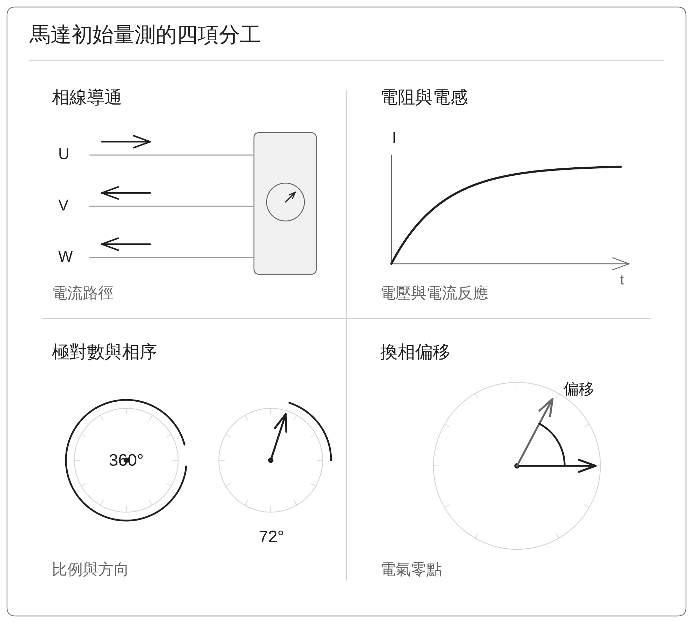

**圖文說明：** 四組圖形分別對應回路、電氣反應、角度比例與零點。各項實測結果及尚待確認的範圍，於後續各章說明。

# 2. 相線導通檢查

本章先說明如何利用正反向測試電壓確認電流回路，再用正常接線的實機數據說明判定依據與驗證範圍，分為兩頁。

## 投影片 02

**投影片標題：相線導通的測試與判定方式**

**左側樹狀清單**

- **背景與目的**
  - 背景：相線或接頭異常會中斷電流路徑
  - 目的：確認三相能否形成合理回路
- **測試與取樣**
  - U、V、W 各測正反向，同時觀察三相電流
  - 脈衝各 1 ms，取末端 100 µs，累積 8 組週期
- **判定依據**
  - 先量零點與雜訊，再設定電流門檻
  - 疑似單相開路時，確認其餘兩相仍可互通

**右側彙總技術示意圖**

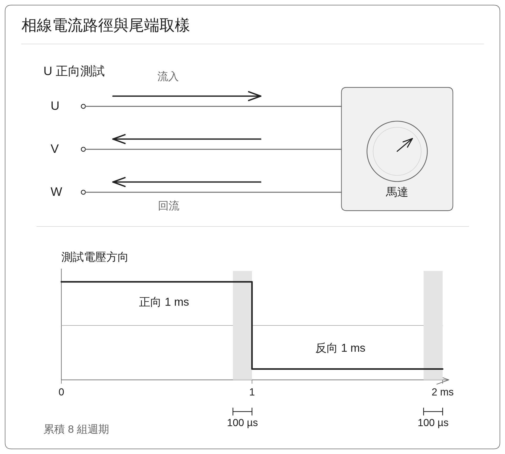

**圖文說明：** 上方以 U 正向測試表示流入與回流關係；反向測試時箭頭全部反轉。下方灰色區為每個脈衝末端的取樣窗。

## 投影片 03

**投影片標題：正常接線的相線檢查結果**

**左側樹狀清單**

- **背景與目的**
  - 背景：已取得一次正常接線的六條件數據
  - 目的：檢查反應幅度及本次驗證範圍
- **實測結果**
  - 三相反應約 0.144～0.153 A，約為門檻的 5 倍
  - 361 ms 完成，淨機械位移 +0.00275°
- **驗證範圍**
  - 正反方向與回流關係合理，正常接線通過
  - 逐相拔線、接觸不良及多相斷線仍待測試

**右側彙總技術示意圖**

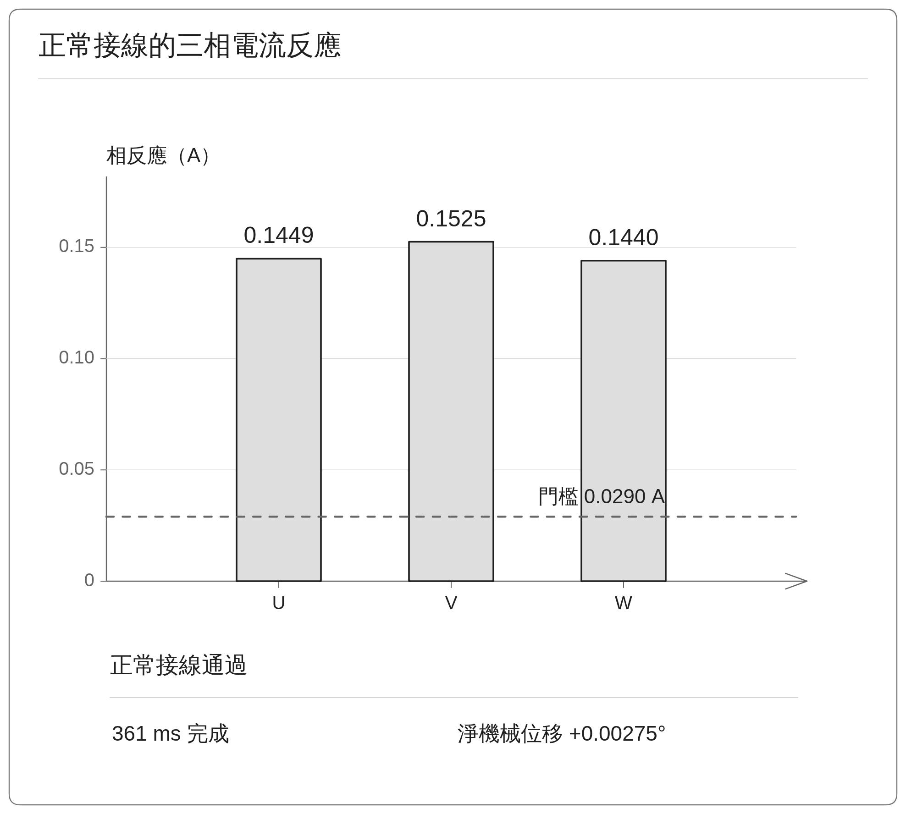

**圖文說明：** 柱高為六種測試條件中，各相平均電流絕對值的最大值。此值與全程瞬間峰值不同；淨位移也不代表過程中完全未移動。

# 3. 電阻與電感量測

本章依序說明電壓與電流模型、實際取樣方式，以及估算結果的解讀，分為三頁。結果頁保留線間值換算的前提，並區分目前估算與後續改善方向。

## 投影片 04

**投影片標題：電阻與電感如何影響電流反應**

**左側樹狀清單**

- **背景與目的**
  - 背景：電流控制需掌握電壓與電流的關係
  - 目的：區分 R、L 與等效電壓偏移的作用
- **模型與估算**
  - R 描述維持電流，L 描述電流變化所需的電壓
  - 同批資料估算 R/L，正負方向分別求偏移
- **成立前提**
  - 轉子接近靜止，降低轉動產生電壓的影響
  - 以 PWM 設定與直流供電推估端子電壓

**右側彙總技術示意圖**

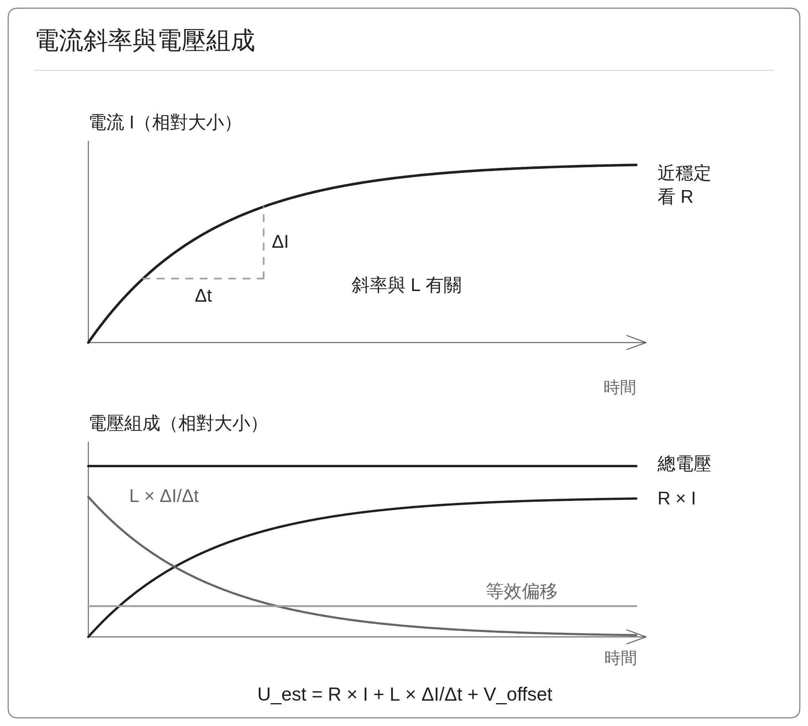

**圖文說明：** 曲線以固定 R、L 與偏移的理想模型呈現相對大小。PWM 為脈衝寬度調變，U_est 為推估端子電壓，V_offset 為模型求得的等效偏移；目前仍從同批資料同時估算 R/L。

## 投影片 05

**投影片標題：R/L 的電壓脈衝與取樣流程**

**左側樹狀清單**

- **背景與目的**
  - 背景：切換瞬間與雜訊會干擾 R/L 估算
  - 目的：取得可用的電壓、電流及變化率
- **測試波形**
  - UV／VW／WU：正、零、反、零差動電壓
  - 500／625 Hz、兩個強度，平均 32 週期再濾波
- **有效取樣**
  - 名目間隔 25 µs，切換後排除 200 µs
  - 使用 75 µs 時間窗取得平均值與電流變化率

**右側彙總技術示意圖**

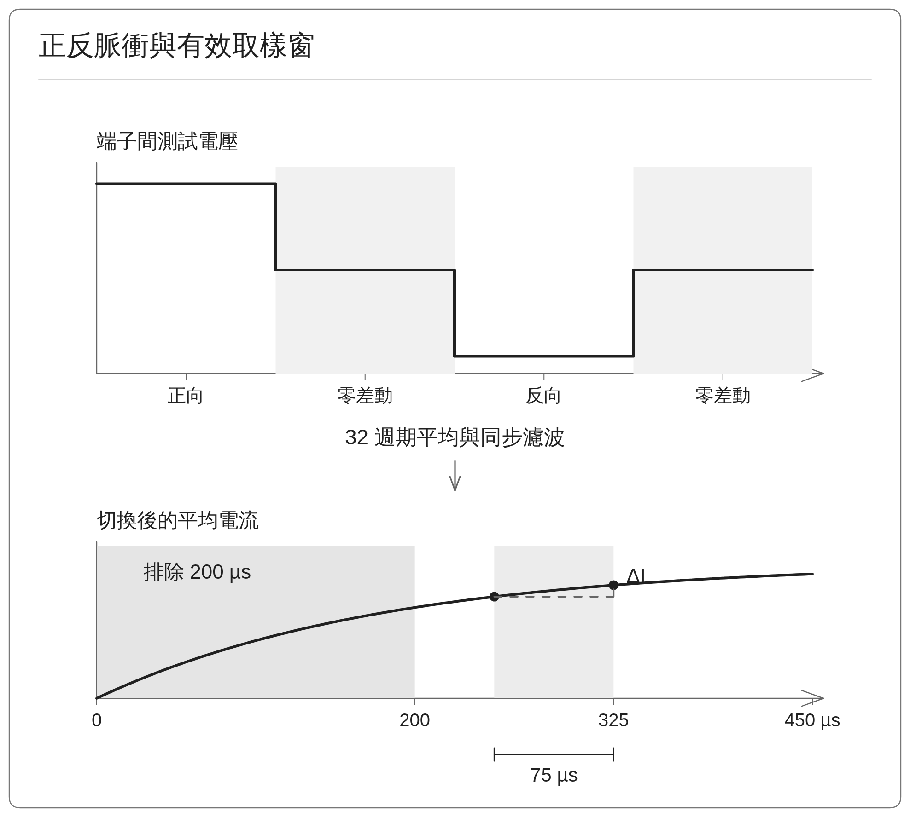

**圖文說明：** 零差動代表端子間平均電壓差歸零，第三相維持 PWM 中點，電流仍可衰減。500／625 Hz 為測試波形頻率；圖中 250～325 µs 示範一個有效時間窗。

## 投影片 06

**投影片標題：R/L 估算結果與後續驗證**

**左側樹狀清單**

- **背景與目的**
  - 背景：已有兩筆 R/L 結果，準確度待確認
  - 目的：比較模型參考值，界定採用前的驗證
- **結果判讀**
  - 兩筆線間平均值 ÷ 2：R 約 2.11～2.47 Ω
  - L 約 0.634～0.783 mH，量級接近模型參考
- **採用前確認**
  - 換算條件及電感方向待確認，目前尚未自動套用
  - R 偏高原因待查，後續先獨立驗證 R，再估算 L

**右側彙總技術示意圖**

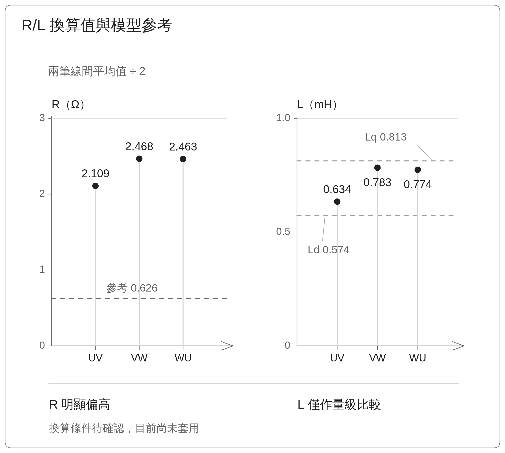

**圖文說明：** R ÷ 2 比較須符合對稱星形接法、第三相電流可忽略及一致量測邊界。L ÷ 2 僅作量級比較，不能直接認定為 Ld／Lq。模型值不是獨立量測真值；約 ±0.5 V 的等效偏移也尚未證實為 R 偏高的原因。兩筆同端子對 R 差異約 0.41%～0.83%。

# 4. 極對數與相序偵測

本章將共用的旋轉磁場測試整理為兩頁。第一頁建立比例與方向的辨識方式，第二頁說明四段結果及後續參數套用的條件。

## 投影片 07

**投影片標題：由轉動比例與方向辨識馬達配置**

**左側樹狀清單**

- **背景與目的**
  - 背景：控制角度需要機械角的倍率與方向
  - 目的：由磁場命令與編碼器追蹤辨識兩者
- **比例與方向**
  - 電氣轉角 360° 對應機械 72°，即為 5 極對
  - 同向為 Normal，反向為 Inverted
- **四段交叉確認**
  - 兩個起點各做正反向，先預轉 180° 再量測 360°
  - 跨圈角度先展開，並檢查轉子跟隨品質

**右側彙總技術示意圖**

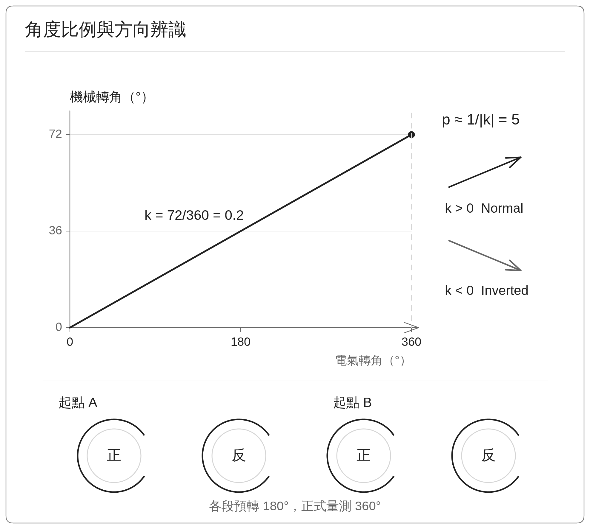

**圖文說明：** k 為機械轉角除以電氣轉角，p ≈ 1/|k|。360°／72° 為 5 極對的理想比例；預轉與正式量測的角度皆為電氣角度。

## 投影片 08

**投影片標題：四段結果支持 5 極對與 Normal 方向**

**左側樹狀清單**

- **背景與目的**
  - 背景：已取得同一次辨識中的四段旋轉資料
  - 目的：檢查極對數一致性與方向判定
- **本次結果**
  - 平均 4.988，判定 5 極對與 Normal 方向
  - 差異約 1.5%，低於此項 2% 門檻
- **套用與限制**
  - 停止後核對輸出與電流回授的相線對應
  - 變更後重校偏移，低速性能與保存待確認

**右側彙總技術示意圖**

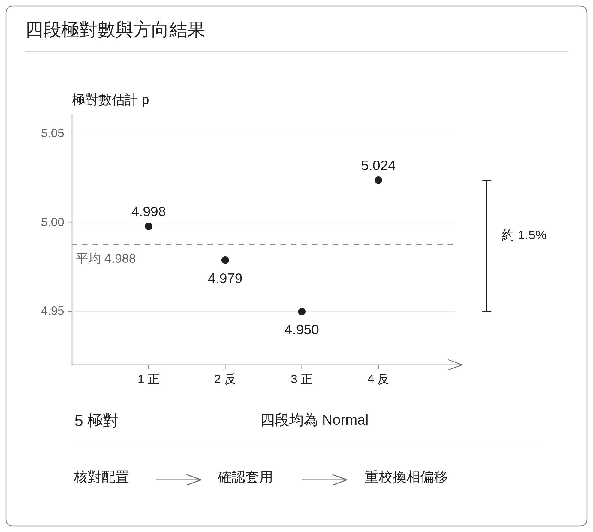

**圖文說明：** 四點來自同一次測試的四段資料。由已取位數字重算差異約 1.48%，以約 1.5% 表示。本組摘要尚無獨立套用與斷電保存的確認。

# 5. 換相偏移校正

本章分為角度基準、固定磁場流程與實測結果三頁。重點涵蓋偏移如何計算、何時取用編碼器角度，以及計算成功、RAM 套用與永久保存的差異。

## 投影片 09

**投影片標題：換相偏移建立編碼器與電氣零點的對應**

**左側樹狀清單**

- **背景與目的**
  - 背景：編碼器零點通常與馬達電氣零點不同
  - 目的：求出正常控制時需要扣除的偏移
- **建立角度基準**
  - 以固定電氣 0° 磁場對齊，取得編碼器機械角
  - 機械角乘極對數並折回一圈，得到電氣偏移
- **控制時使用**
  - 當前機械角乘極對數，扣除偏移後再折回一圈
  - 先確認倍率與方向，再驗證實際對齊品質

**右側彙總技術示意圖**

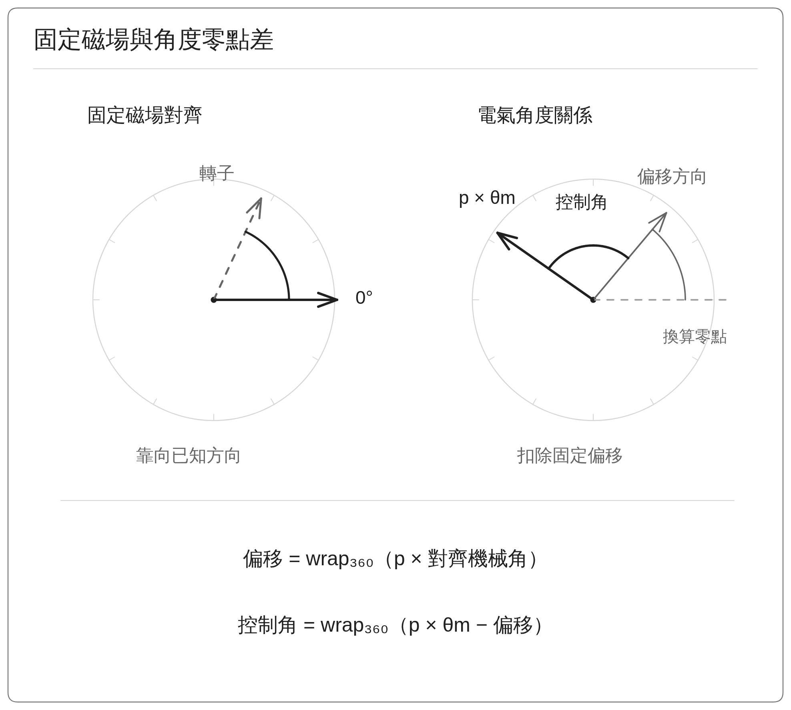

**圖文說明：** 右側三條方向線分別表示編碼器換算零點、偏移方向與 p × θm；偏移方向到 p × θm 的夾角即控制角。wrap₃₆₀ 將結果整理到 0° 至小於 360°，實際取角時點見下一頁。

## 投影片 10

**投影片標題：固定磁場流程與最終取角時點**

**左側樹狀清單**

- **背景與目的**
  - 背景：電氣零點由對齊後的編碼器讀值建立
  - 目的：說明穩定條件與最後取角時點
- **兩次對齊**
  - 90° 對齊並釋放，再進行 0° 對齊與釋放
  - 電流逐步調整，切換方向前先降回零
- **穩定與取角**
  - 轉速絕對值 ≤ 0.5 rpm、電流命令 ≥ 95%，持續約 150 ms
  - 最後釋放後取角，停止並確認配置後才套用

**右側彙總技術示意圖**

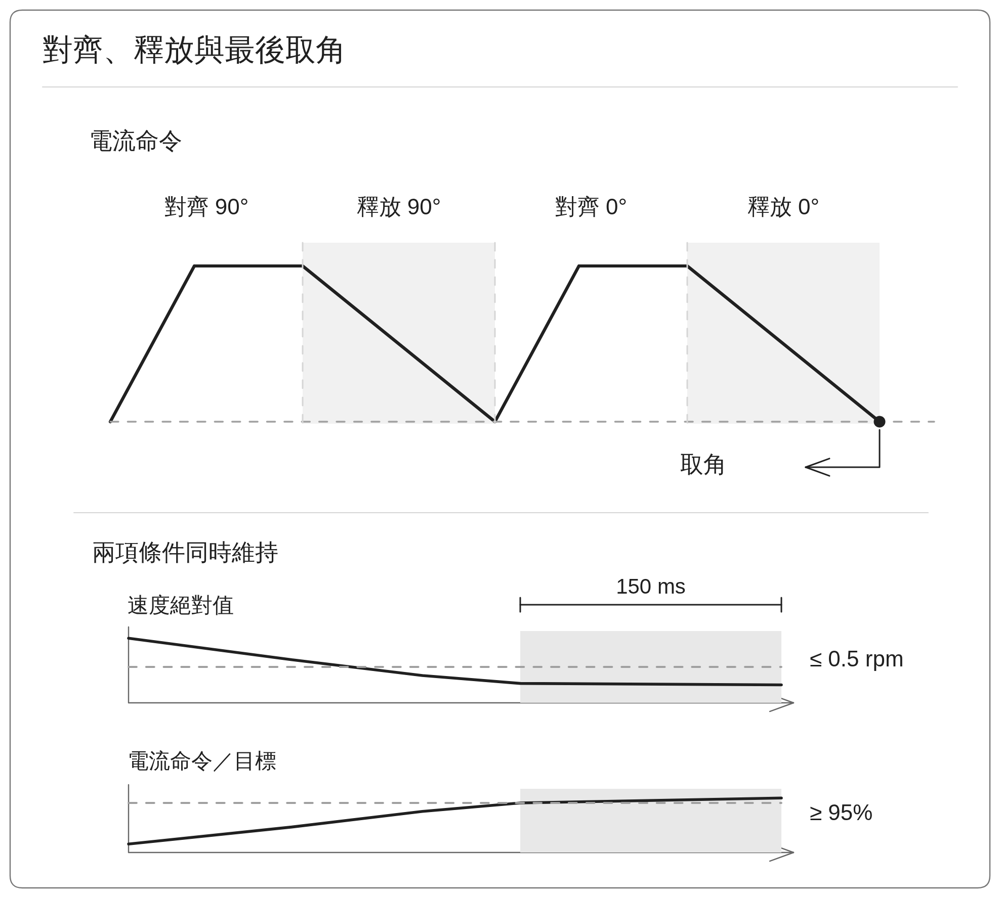

**圖文說明：** 穩定條件中的速度採絕對值，95% 比較的是電流命令與目標值。下方灰色區表示兩項條件同時成立的持續區間；實測電流追蹤品質需另外確認，流程失敗時拒絕新值。

## 投影片 11

**投影片標題：換相偏移結果與參數保存狀態**

**左側樹狀清單**

- **背景與目的**
  - 背景：固定磁場流程已完成並回傳偏移結果
  - 目的：核對角度計算、參數套用與保存狀態
- **本次結果**
  - 258.813° 機械角 × 5，折回後為 214.07° 電氣角
  - 6.305 s 完成，淨機械位移 −17.444°
- **套用與後續**
  - RAM 偏移已由 180.00° 更新為 214.07°
  - 重複性、釋放回彈及重新上電載入仍待確認

**右側彙總技術示意圖**

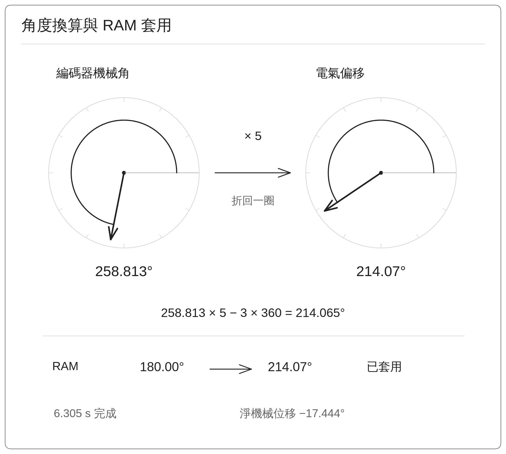

**圖文說明：** 258.813 × 5 = 1294.065，去掉三個完整電氣週期後為 214.065°，顯示為 214.07°。本次流程 PASS 並已套用 RAM，永久保存及對齊精度仍須分別驗證。
