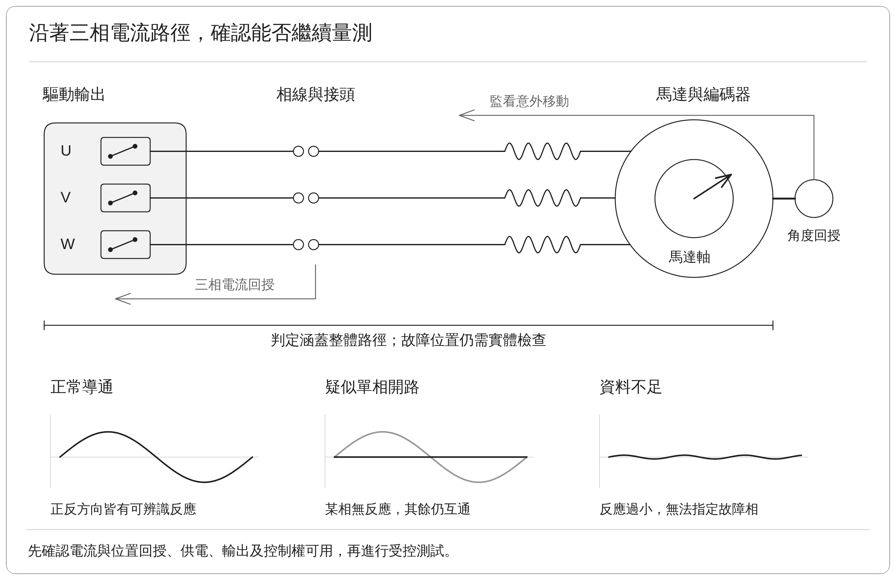
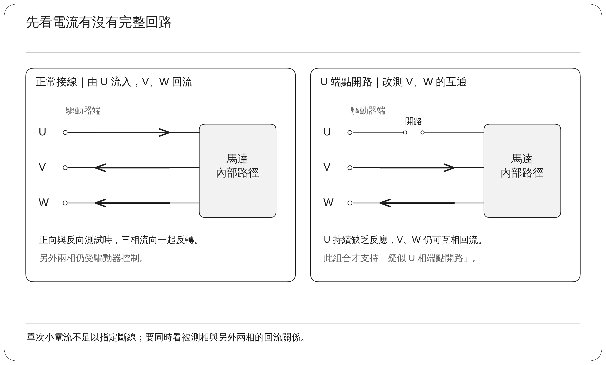
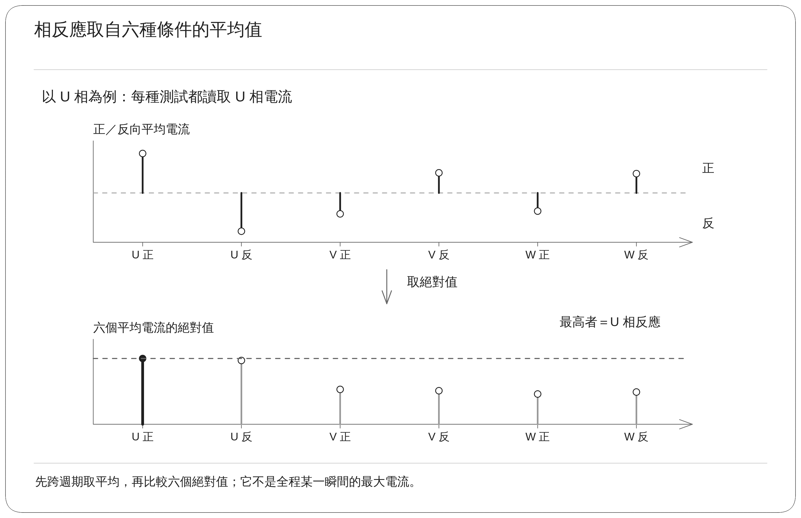
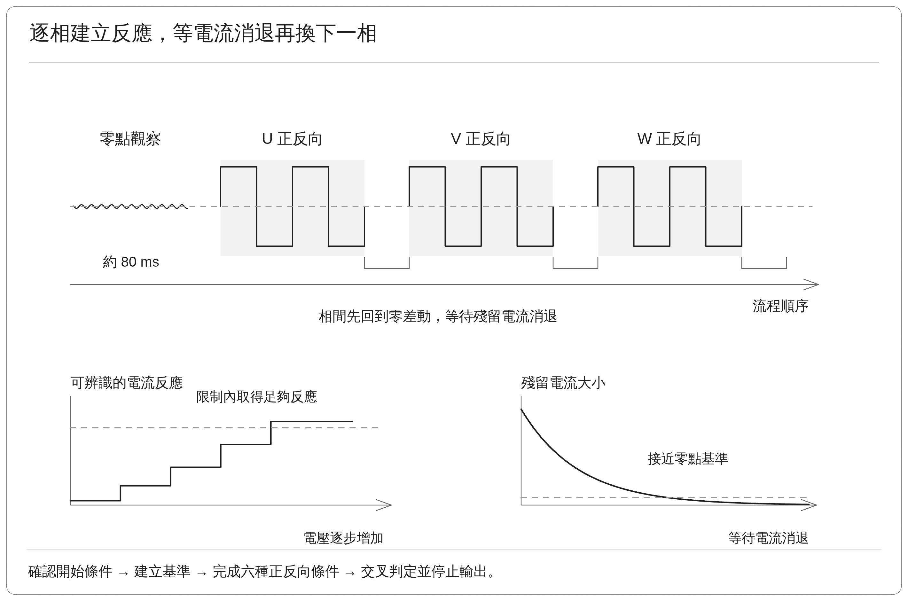
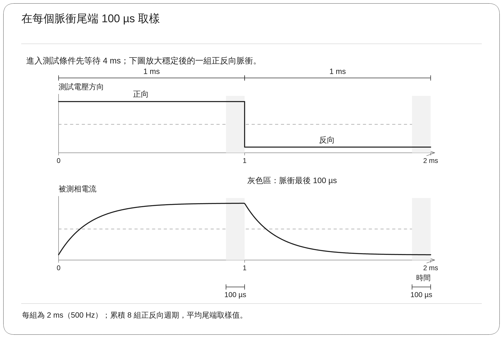
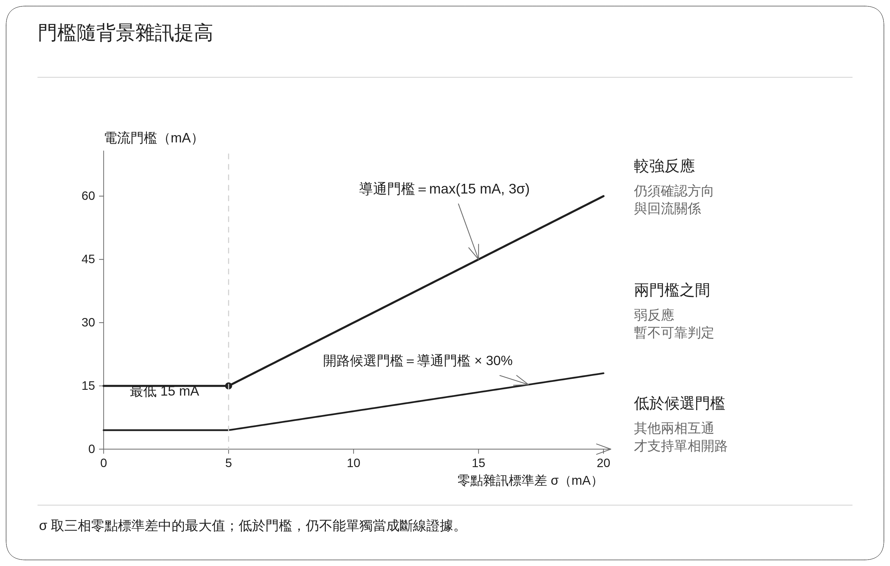
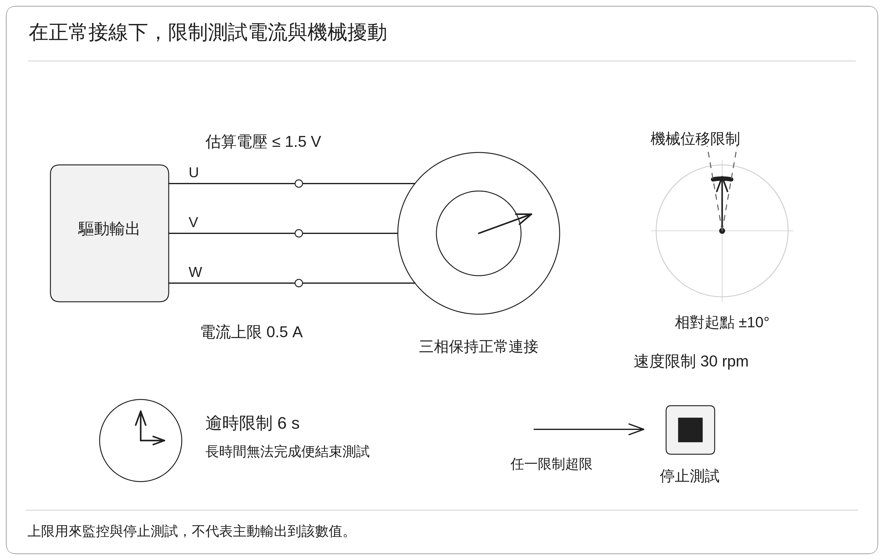
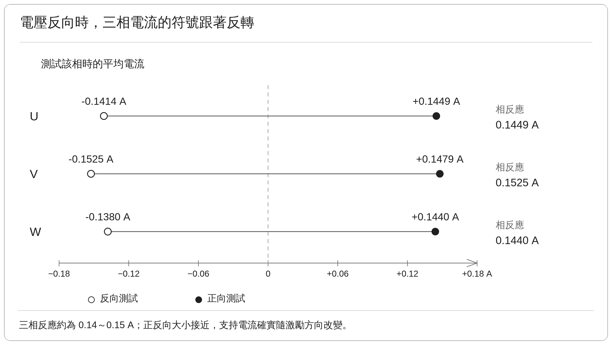
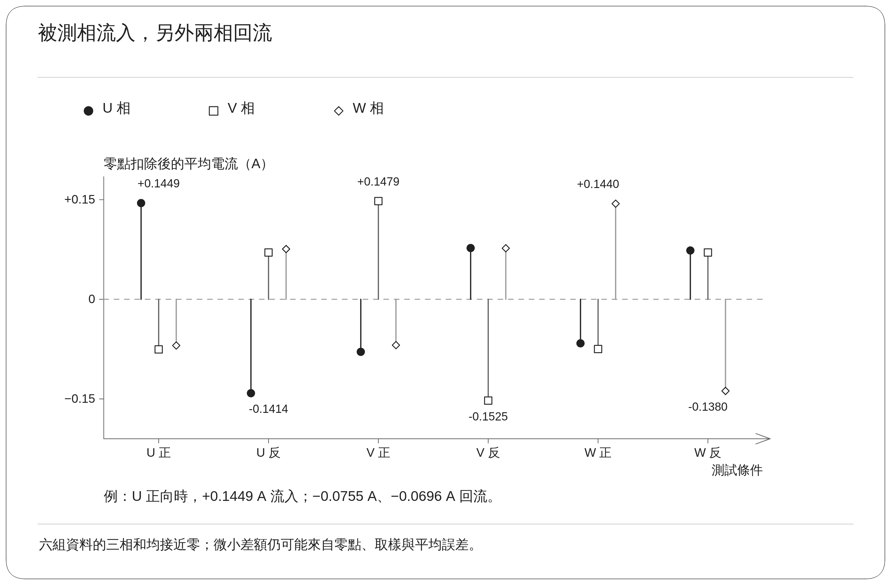
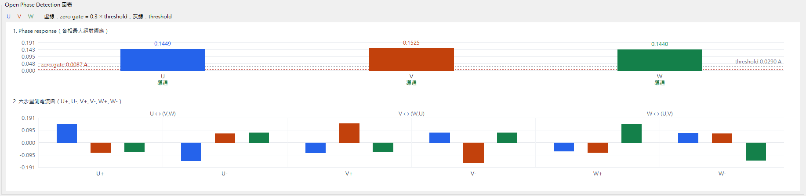

## 1. 功能用途

馬達透過 U、V、W 三條相線取得電流。若其中一條沒有接好、接頭鬆脫或線路中斷，後續的參數量測與轉動控制就可能失敗。**相線導通檢查先施加小幅度的測試電壓，確認三條相線能否形成合理的電流回路。**「開路」就是電流路徑中斷，無法依預期流動。

### 1.1 輸入、輸出與適用範圍

本文的測試平台為 Renesas RZ/T2M 馬達控制評估板（EVK），搭配三相永久磁鐵同步馬達及馬達端編碼器。編碼器是量測軸角度的感測器，在此用來監看測試期間是否發生非預期移動。

| 項目 | 內容 |
| --- | --- |
| 開始前需要 | 可用的電流回授、正常供電與輸出、有效的位置回授，以及可由測試流程取得的馬達控制權 |
| 主要觀察 | 六種正反向測試條件下，U、V、W 的電流反應 |
| 輸出結果 | 三相導通正常、疑似某一相開路，或資料不足而無法可靠判定 |
| 結果用途 | 決定是否具備繼續進行電氣量測與旋轉辨識的接線條件 |

判定範圍包含相線、接頭、馬達繞組與驅動輸出形成的整體路徑。若結果指出 U 相疑似開路，仍需進一步檢查實體連接，才能確認故障位於哪個接頭、線圈或功率元件。

圖中沿著驅動輸出、相線、接頭與馬達標示判定範圍；下方以電流反應的形狀說明三種判讀情境。

## 2. 量測原理

### 2.1 用正、反方向電流確認路徑

以測試 U 相為例，驅動器讓 U 相與另外兩相之間產生小電壓。接線正常時，電流由 U 相流入，再經 V、W 相返回。反向施加電壓時，電流方向也應反轉。

正反向都測的目的，是確認觀察到的反應確實隨測試電壓改變。只有單一方向的微小讀值，容易與感測器零點偏差或雜訊混淆。本文以流入馬達端子的電流為正，因此正常回路中，同時會看到流入與流出的電流。

測試 U 相時，V、W 維持相同輸出。兩者之間沒有刻意施加額外電壓差，但仍由驅動器控制，並未浮接；「浮接」是指端子未被主動固定在某個電位。

### 2.2 為何要查看全部三相電流

若 U 相開路，從 U 相施加測試時就難以形成回路。但改由 V 或 W 相施加測試，V、W 之間仍可能形成正常回路。**某相缺乏反應，加上其餘兩相仍能互通，才構成單相開路的判斷依據。**

| 觀察結果 | 判讀方式 |
| --- | --- |
| 三相均有足夠的正、反方向反應，且方向與回流關係合理 | 支持三相導通正常 |
| 某相在六種條件下都幾乎沒有電流，其餘兩相仍能互通 | 支持該相可能開路 |
| 全部反應都太小 | 可能涉及供電、輸出、感測或多處斷線，資料不足以指定某一相 |
| 正反向明顯不對稱，或電流波動過大 | 先判為量測不可靠，避免把量測異常當成接線故障 |

這種交叉檢查也說明了為何不能只看被測相的一個數值。三條相線共同形成回路，回流反應提供了額外的故障辨識資訊。

## 3. 實作

### 3.1 執行流程與各步驟目的

PC 測試工具透過 CON5 通訊介面提出量測要求，由韌體執行即時輸出、取樣與判定，再回傳結果。將即時工作留在控制板上，可避免 PC 通訊延遲干擾短脈衝的量測時序。

| 步驟 | 為什麼需要 | 實際處理 |
| --- | --- | --- |
| 確認開始條件 | 避免其他運動命令或無效回授干擾測試 | 確認馬達狀態、回授及測試限制可用 |
| 取得零點與雜訊 | 即使沒有測試電流，感測器也可能有小幅偏移 | 約 80 ms 觀察三相電流，建立基準與判定門檻 |
| 測試 U 相 | 建立 U 與另外兩相之間的導通證據 | 交替施加正、反電壓，逐步增加到可辨識的反應 |
| 等待電流消退 | 前一段殘留電流會影響下一段 | 降回零差動輸出，確認電流回到接近基準 |
| 測試 V、W 相 | 避免只測到局部路徑便做結論 | 依相同步驟完成另外兩相，合計六種條件 |
| 判定與結束 | 確認整組資料彼此一致 | 檢查反應大小、正反向對稱性及回流，再停止測試輸出 |

「零差動輸出」是指三個端子沒有刻意施加彼此不同的平均電壓；在流程中可由各相維持相同的 PWM 設定達成。PWM 是脈衝寬度調變，藉由調整功率開關每個週期的導通比例來控制平均輸出。

上方按流程順序排列零點觀察與三相測試；下方分別說明逐步建立反應，以及等待前一相的殘留電流消退。

### 3.2 脈衝與取樣設定

| 項目      | 實作設定        | 目的與解讀                       |
| ------- | ----------- | --------------------------- |
| PWM 載波  | 20 kHz      | 功率切換週期為 50 µs               |
| 控制更新間隔  | 25 µs       | 一個 PWM 週期內有兩次控制更新，不能與載波頻率混用 |
| 正、反向脈衝  | 各 1 ms      | 一組週期為 2 ms，相當於 500 Hz       |
| 開始取樣前等待 | 4 ms        | 略過進入測試條件時的過渡反應              |
| 每段取樣位置  | 脈衝最後 100 µs | 降低剛切換電壓時的干擾                 |
| 平均範圍    | 連續 8 組週期    | 降低單次雜訊造成的偏差                 |
| 小電流目標   | 最高約 0.15 A  | 取得足夠反應，同時限制測試造成的擾動          |
| 電壓增加量   | 每次 0.04 V   | 逐步建立反應，避免一開始就使用過大電壓         |

上述 0.15 A 是演算法希望取得的測試反應。第 4 節的 0.5 A 則是該次執行設定的電流上限，兩者用途不同。電壓、速度、位移與逾時也各有獨立限制。

### 3.3 判定門檻如何隨雜訊調整

要判斷一個電流反應是否可信，必須先知道未施加激勵時會有多少波動。本文的「激勵」指主動施加、用來觀察馬達反應的測試電壓。電流門檻依下式設定：

$$
I_{\mathrm{threshold}}=\max(0.015\ \mathrm{A},\ 3\sigma_{\mathrm{noise}})
$$

$\sigma_{\mathrm{noise}}$ 是三相零點雜訊標準差中的最大值。標準差可理解為讀值平常波動的大小。最低門檻為 15 mA，雜訊較大時便提高門檻，避免把波動當成導通。

每相的「相反應」定義為該相在六種條件下，平均電流絕對值的最大值。若相反應低於電流門檻的 30%，便列為開路候選；之後仍需確認另外兩相的回路。這個候選門檻不會取代完整判定。

正反向比較也會考慮兩次估算電壓的微小差異，再檢查電流是否反向且大小相近。相反應是經取樣平均的數值，而「全程最大相電流」取自過程中的電流峰值，兩者不應互相替代。

## 4. 實測數據

### 4.1 測試對象與執行條件

下列資料保存一組正常接線下的實機驗證：啟動相線檢查，使用 Renesas EVK 與 Tamagawa TSM3101N2001E020 馬達。此組資料用來確認正常路徑能否被辨識，沒有在測試中逐相拔除接線。

| 測試限制 | 設定值 | 意義 |
| --- | ---: | --- |
| 電流上限 | 0.5 A | 超限時停止，不代表會主動輸出到此電流 |
| 估算電壓上限 | 1.5 V | 限制端子間的測試電壓 |
| 機械位移限制 | 10° | 限制測試期間的軸移動 |
| 速度限制 | 30 rpm | 限制意外旋轉，rpm 表示每分鐘轉數 |
| 逾時限制 | 6 s | 長時間無法完成時結束測試 |

### 4.2 各相主要反應

| 相線 | 測試該相時的正向電流 | 測試該相時的反向電流 | 相反應 |
| --- | ---: | ---: | ---: |
| U | +0.1449 A | −0.1414 A | 0.1449 A |
| V | +0.1479 A | −0.1525 A | 0.1525 A |
| W | +0.1440 A | −0.1380 A | 0.1440 A |

三相的反應約在 0.14～0.15 A，正反向符號相反，大小也接近。這表示改變測試電壓方向時，三相確實產生相應的電流變化。

### 4.3 六種條件下的完整三相電流

此表保留回流資訊，數值四捨五入到小數點後四位。例如 U 正向測試時，U 為正、V 與 W 為負，符合電流由 U 流入並經其餘端子返回的預期。受零點、取樣及四捨五入影響，三相加總可能有小幅殘差。

| 測試條件 | U 相電流 | V 相電流 | W 相電流 |
| --- | ---: | ---: | ---: |
| U 正向 | +0.1449 A | −0.0755 A | −0.0696 A |
| U 反向 | −0.1414 A | +0.0704 A | +0.0757 A |
| V 正向 | −0.0791 A | +0.1479 A | −0.0690 A |
| V 反向 | +0.0772 A | −0.1525 A | +0.0769 A |
| W 正向 | −0.0663 A | −0.0749 A | +0.1440 A |
| W 反向 | +0.0735 A | +0.0704 A | −0.1380 A |

### 4.4 整體判定與圖表

| 項目 | 數值或狀態 |
| --- | ---: |
| 判定 | PASS，三相皆正常 |
| 開路標記 | 未標記任何相 |
| 電流判定門檻 | 0.0290 A |
| 開路候選門檻 | 0.0087 A |
| 測試電壓 | 約 1.040 V，由 PWM 設定與母線電壓估算 |
| 全程最大相電流 | 0.1674 A |
| 相對起點的機械位移 | +0.00275° |
| 完成時間 | 361 ms |

母線電壓是供應功率級的直流電壓。此處的 1.040 V 是依輸出設定推算的測試電壓，並非由馬達端電壓探棒直接量得。

三相主要反應約為 29 mA 判定門檻的 5 倍，配合正反向與回流檢查，支持這組正常接線測試通過。29 mA 是依零點雜訊調整後的實際門檻，解讀結果時應使用它，而非最低設定值 15 mA。

圖中上半部比較三相反應與門檻，下半部呈現六種條件下的三相電流。讀圖時先確認反應高於門檻，再查看正反方向及回流是否合理，判斷依據與上表一致。

## 5. 結果

### 5.1 已確認的能力與限制

這組實機驗證確認：正常接線下，系統能完成低電壓測試、取得合理三相電流，並判定導通正常。淨位移只有 +0.00275°，表示該次測試的起終點差異很小；這個數值本身沒有描述全程是否出現短暫擺動，因此仍需保留位移監控。

| 已確認 | 尚待驗證 |
| --- | --- |
| 正常接線下可完成三相判定 | U、V、W 各自開路時能否正確指出故障相 |
| 正反向與回流電流符合預期 | 接觸不良、多相斷線或感測異常時的分類能力 |
| 可回報實際門檻、電流與位移 | 不同馬達、線材及雜訊條件下的門檻適用性 |

PASS 表示這一次流程的判定條件成立。量產使用前，仍需補齊故障條件與重複測試，才能建立誤判率及適用範圍。

### 5.2 實作追溯資訊

正文描述的流程與門檻對照 `motor_measurement.c`；量測的啟停、限制與結果回傳位於 `con5_motor_test.c`。