## 1. 功能用途

控制器要準確調整馬達電流，需要知道施加電壓後，電流會如何變化。電阻 R 描述維持電流需要多少電壓，也與繞組發熱有關；電感 L 描述電流改變的難易程度，在其他條件相同時，電感越大，電流上升或下降通常越慢。

| 參數 | 對應的工程問題 | 控制上的用途 |
| --- | --- | --- |
| 電阻 R | 維持某個電流需要多少電壓？ | 估算電壓需求與損耗，協助設定電流控制 |
| 電感 L | 施加電壓後，電流會多快改變？ | 建立電流動態模型，協助設定控制反應速度 |

### 1.1 在馬達初始量測中的角色

R/L 量測屬於 Commutation Offset Detection 馬達初始量測系列的電氣特性辨識。相線檢查先確認電流路徑，R/L 再描述該路徑的電壓與電流關係；極對數、相序及換相偏移則處理轉動比例、方向與角度基準。

本文所記錄的版本使用 Renesas RZ/T2M 馬達控制評估板（EVK），對 UV、VW、WU 三組端子依序施加測試電壓。**目前實作從同批資料估算 R 與 L，輸出的是測試路徑的等效參數。**「等效」表示模型用這些數值描述所觀察到的整體反應，尚不能直接認定為單相繞組的固有參數。

第 5 節提出的「先把 R 驗證完成，再用可靠的 R 計算 L」是後續改善方案。本文保存的實測結果仍來自 R/L 同時估算流程。

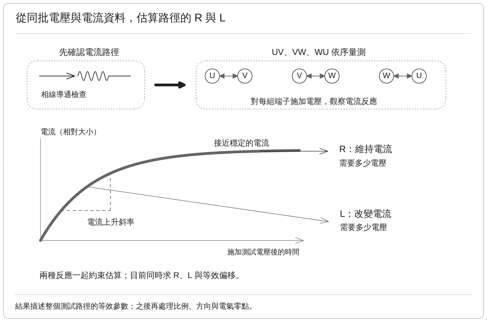

圖中以固定電壓作用後的電流上升形狀，說明動態變化與接近穩定的反應如何共同約束 R/L；目前估算仍使用同批資料。

## 2. 量測原理

### 2.1 將電壓分成三種作用

測試期間讓轉子盡量維持靜止，以降低反電動勢的影響。反電動勢是馬達轉動時產生的電壓；若明顯轉動，就不能只用電阻與電感解釋端子電壓。

在轉動影響可忽略的條件下，使用下式描述量測路徑：

$$
U_{\mathrm{est}}=R_{\mathrm{path}}I+L_{\mathrm{dir}}\frac{dI}{dt}+V_{\mathrm{offset}}
$$

| 符號 | 定義與意義 |
| --- | --- |
| $U_{\mathrm{est}}$ | 由 PWM 輸出設定及直流供電電壓估算的端子間電壓 |
| $I$ | 測試端子對的等效電流，實作定義見第 3.2 節 |
| $R_{\mathrm{path}}I$ | 維持電流、克服測試路徑等效電阻所需的電壓 |
| $L_{\mathrm{dir}}dI/dt$ | 改變電流所需的電壓，$dI/dt$ 表示電流隨時間的變化率 |
| $V_{\mathrm{offset}}$ | 模型額外估算的等效電壓偏移，正負電流方向分別求得 |

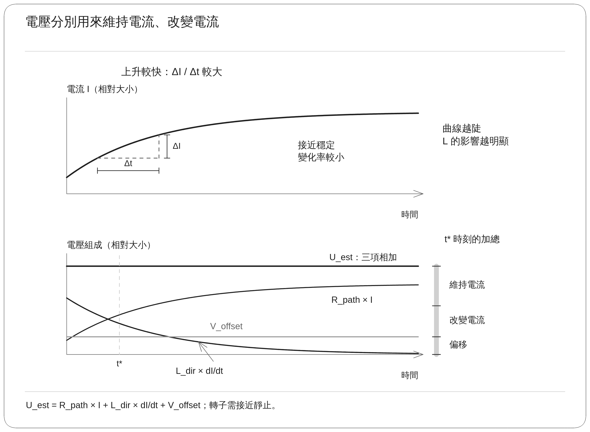

圖中曲線由固定 R、L 與偏移的理想模型建立，用來對照三種電壓作用。

電流接近穩定時，變化率很小，R 的作用較容易分辨。電流快速改變時，L 的作用較明顯。因此測試需要提供足夠且不同的電流反應，才能區分兩種影響。

### 2.2 用多組資料估算參數

實作採用回歸估算，也就是從多組電壓與電流資料，找出最能解釋整體反應的 R、L 與偏移值。這比只取單一瞬間的電壓除以電流，能更完整地考慮電流仍在變化的狀態。

能得到數值，不代表參數一定準確。若資料中的電流大小幾乎不變，或電流與變化率總以相同比例一起改變，演算法便很難分清 R 與 L 各自的作用。這種情況稱為「辨識條件不足」，需要改變測試方式或增加有效變化，不能只靠多取幾個相似的點解決。

正、負電流方向分開估算，可以容納驅動輸出在不同方向下的差異。各方向的模型都先通過品質檢查，再彙整成端子對的 R/L 結果。

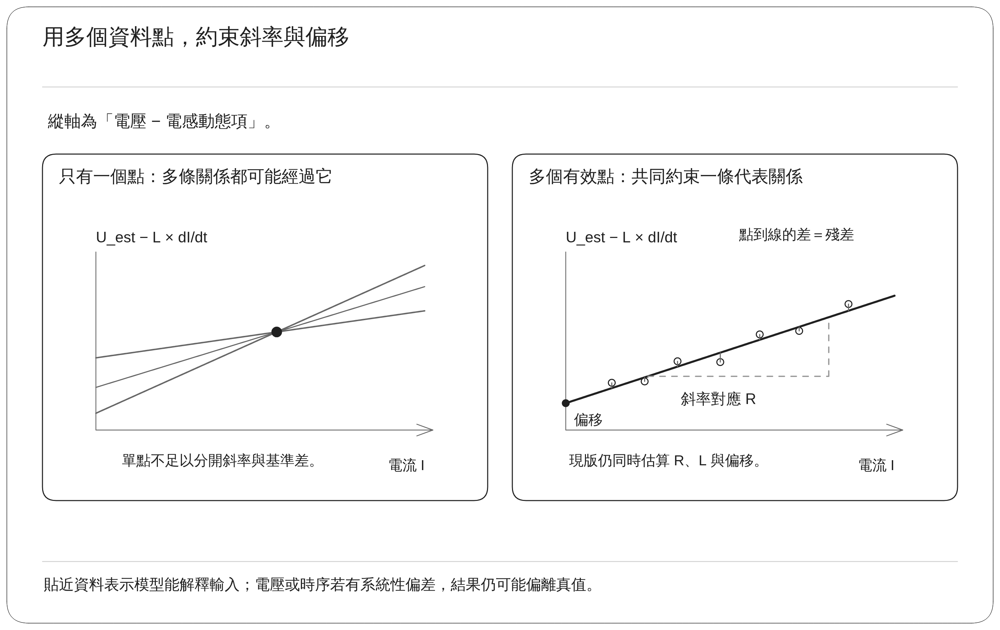

## 3. 實作

### 3.1 測試流程與端子輸出

PC 測試工具經由 CON5 通訊介面要求開始量測，韌體負責即時輸出、取樣、限制監控與計算。測試需要正常電流回授與可用的位置監控，但這套 R/L 方法不以已知極對數或換相偏移作為估算前提。

| 步驟 | 為什麼需要 | 實際處理 |
| --- | --- | --- |
| 確認開始條件與零點 | 避免接線異常、轉動或電流零點偏差污染資料 | 確認狀態與回授，取得尚未施加測試電壓時的三相電流基準 |
| 建立測試幅度 | 需要可辨識的反應，又不能超過設定限制 | 逐步增加電壓，觀察電流並限制電壓與電流 |
| 重複施加正反向電壓脈衝 | 取得不同方向與變化速度的資料 | 對每組端子執行正向、零差動、反向、零差動四段輸出 |
| 更換頻率與幅度 | 增加 R、L 可以被區分的資料條件 | 使用 500 Hz、625 Hz 與兩個主要電壓強度 |
| 整理與估算 | 降低雜訊與切換干擾 | 做週期平均、同步濾波、短時間窗計算與回歸 |
| 檢查品質並換下一組 | 避免單組失敗或殘留電流影響後續結果 | 確認資料品質，讓電流消退，再依序完成 UV、VW、WU |
| 回傳結果 | 保留診斷與比較資料 | 輸出估算值及品質資訊，不自動改寫馬達控制參數 |

以 UV 為例，U、V 分別提高與降低平均輸出，W 維持 50% 的 PWM 導通比例。PWM 是藉由調整功率開關導通時間來控制平均電壓的方法。**W 仍受驅動器控制，並未完全浮接。**

零差動段表示 U、V 暫時不施加正反向的平均電壓差。功率開關不一定全部關閉，電流仍可能透過功率級衰減；因此「零差動」不能直接理解成完全斷電。

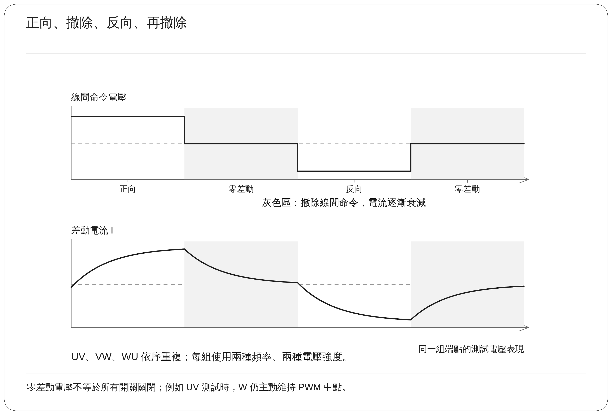

### 3.2 電壓與電流的取得方式

端子 A、B 的估算電壓為：

$$
U_{AB,\mathrm{est}}=(D_A-D_B)V_{\mathrm{dc}}
$$

$D_A$、$D_B$ 是經 PWM 硬體刻度量化後的導通比例，$V_{\mathrm{dc}}$ 是直流母線電壓，即供應功率級的直流電壓。採用實際設定的導通比例，可避免只用理想命令值造成額外差異；但此方法仍未直接量測馬達端電壓。

電流先扣除各相零點，再取兩相差值的一半：

$$
I_{AB}=\frac{(I_A-I_{A,0})-(I_B-I_{B,0})}{2}
$$

$I_{A,0}$、$I_{B,0}$ 是各相的零點基準。當電流主要由 A 流入、B 流出，兩相大小相近且方向相反時，這個差值可代表該路徑的電流。同時仍觀察第三相電流，確認實際反應是否符合端子對量測的假設。

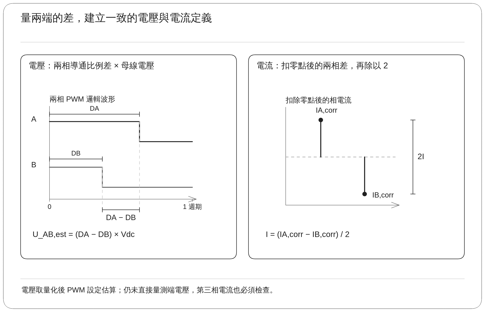

由於缺少馬達端電壓的直接量測，功率元件壓降、切換延遲、線材接點與取樣誤差，都可能進入估算結果。這些影響需要透過獨立驗證加以區分。

### 3.3 為何要平均、濾波及避開切換瞬間

| 資料處理 | 實作設定 | 目的 |
| --- | --- | --- |
| 名目取樣 | 每 25 µs 取得一筆 | 追蹤短時間內的電流變化 |
| 週期平均 | 同一週期位置累積 32 個週期 | 降低隨機雜訊，保留可重複的波形 |
| 電壓與電流同步濾波 | 對相鄰兩筆資料做相同的平均處理 | 降低半個 PWM 週期交替出現的波動，避免只濾電流造成相對時序偏差 |
| 切換後排除 | 略過前 200 µs | 減少開關切換與電流換向造成的非穩定影響 |
| 短時間窗估算 | 使用 75 µs 的時間窗 | 用窗內平均電壓、平均電流與電流改變量建立模型 |
| 有效區間選擇 | 使用施加正反電壓的區段，避開過零與零差動衰減段 | 降低低電流非線性與不同導通路徑對模型的干擾 |

取時間窗的好處，是不用讓單一相鄰點的差值承擔整個電流變化率。若電流讀值有微小雜訊，直接微分可能將它放大；時間窗估算可降低這類影響，但仍需保留足夠的電流變化。

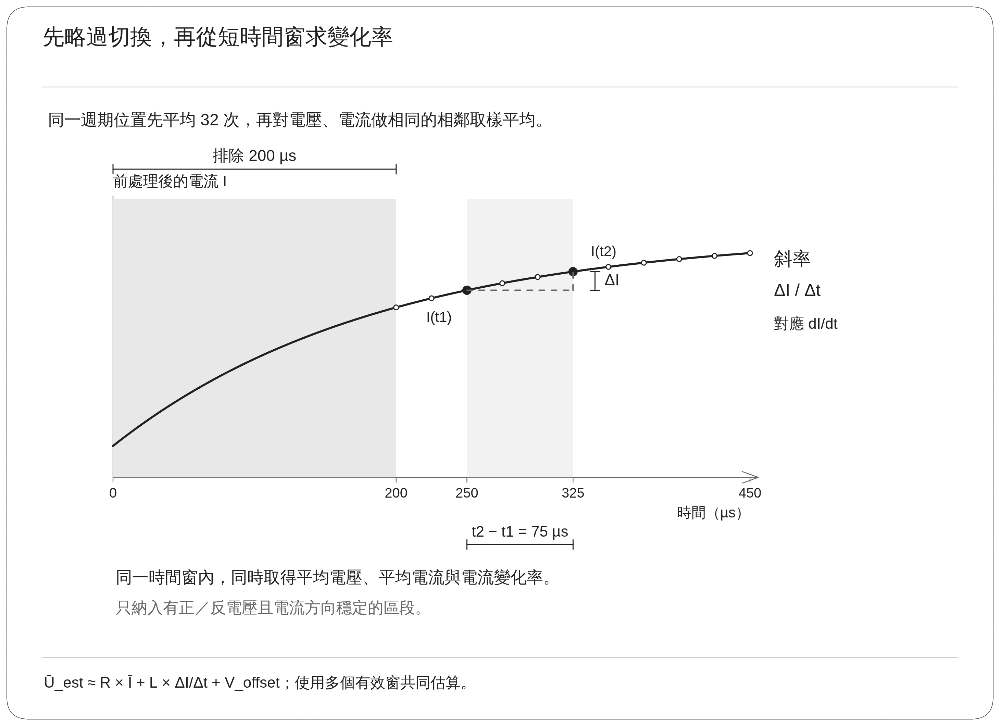

品質檢查包含有效資料數、電流跨度、電壓穩定性、模型剩餘誤差及參數不確定程度。剩餘誤差是模型無法解釋的差距；參數不確定程度則描述目前資料能否清楚區分 R 與 L。通過這些檢查表示資料在既定模型內可接受，仍需外部量測確認絕對精度。

### 3.4 線間參數與馬達控制參數的關係

| 名稱 | 定義與使用限制 |
| --- | --- |
| 線間路徑電阻 | 該測試端子對所見的等效電阻，可能包含繞組、線材、接點及功率級的增量影響 |
| 單相電阻 | 單一相繞組的電阻，需要知道接法與量測邊界才能換算 |
| 線間方向等效電感 | 特定端子對、轉子位置與測試電壓、頻率與施加方向等條件下的電感 |
| Ld、Lq | 分別沿轉子磁場方向、以及與其垂直方向定義的電感，是馬達控制模型的參數 |

在對稱星形接法、第三相電流可忽略，且量測邊界一致的條件下，可用兩相串聯理解線間電阻：

$$
R_{LL}\approx2R_{\mathrm{phase}}
$$

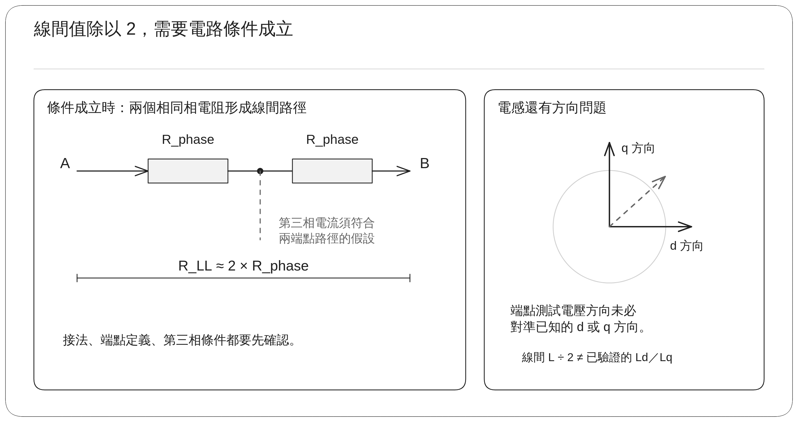

電感還涉及轉子方向與繞組磁場耦合。UV、VW、WU 是三個測試端子方向，無法僅由名稱對應到 d 軸或 q 軸；把線間電感除以 2，也不足以確認得到 Ld 或 Lq。

## 4. 實測數據

### 4.1 測試對象、比較基準與資料範圍

測試對象為 Renesas EVK 搭配 Tamagawa TSM3101N2001E020 馬達。比較基準採用此型號的專案模型設定：R = 0.626 Ω、Ld = 0.574 mH、Lq = 0.813 mH、極對數為 5。這些是模型參考值，尚非對受測實體馬達進行獨立儀器量測後得到的基準真值。

本文保存兩筆完整的端子對估算結果：

| 資料 | 取得方式與時間（UTC+8） | 使用範圍 |
| --- | --- | --- |
| 結果 A | 2026-09-24 13:48:12 由控制器讀回的既有結果 | 可比較數值，但完整啟動條件與測試時間未在此次連線中取得 |
| 結果 B | 2026-09-24 13:48:28 重新啟動，約 13:48:30 取得結果 | 可連結以下測試限制與執行統計 |

| 結果 B 的條件或統計 | 數值 |
| --- | ---: |
| 電流上限 | 0.8 A |
| 估算電壓上限 | 1.5 V |
| 機械位移限制 | 0.25° |
| 速度限制 | 2 rpm |
| 逾時設定 | 30 s |
| 完成時間 | 約 2.251 s |
| 全程最大相電流 | 約 0.178 A |
| 相對起點的機械位移 | 約 −0.00273° |
| 控制參數套用 | 未自動套用 |

表中的上限是該次命令設定，不代表實際輸出曾達到上限。25 µs 的取樣間隔及 200 µs 的排除時間屬於韌體設定；這組測試尚未完成外部儀器對實際取樣與電壓切換時序的獨立確認。

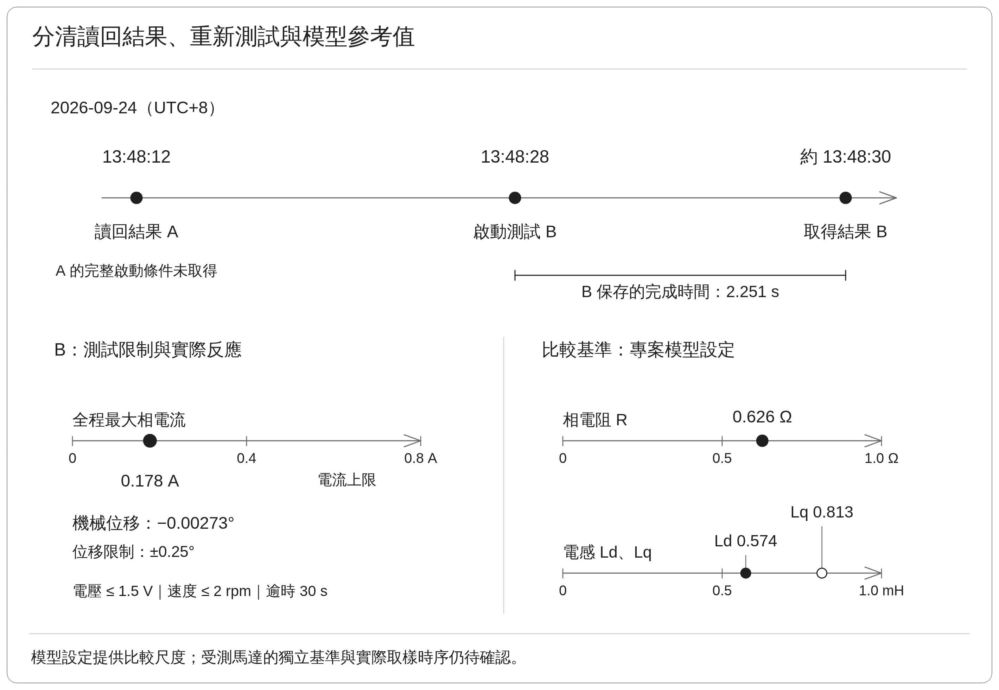

### 4.2 電阻 R 結果

先保留演算法輸出的線間值，再計算兩筆平均及有條件的相等效比較值，避免不同定義的數字混在一起。

| 端子對 | A：線間值 | B：線間值 | 線間平均值 | 平均值 ÷ 2 | 換算值／0.626 Ω |
| --- | ---: | ---: | ---: | ---: | ---: |
| UV | 4.2272 Ω | 4.2098 Ω | 4.2185 Ω | 2.109 Ω | 3.37 倍 |
| VW | 4.9159 Ω | 4.9570 Ω | 4.9365 Ω | 2.468 Ω | 3.94 倍 |
| WU | 4.9129 Ω | 4.9387 Ω | 4.9258 Ω | 2.463 Ω | 3.93 倍 |

平均與換算使用完整精度資料後才四捨五入，直接用表內已截短的數字重算，末位可能略有差異。

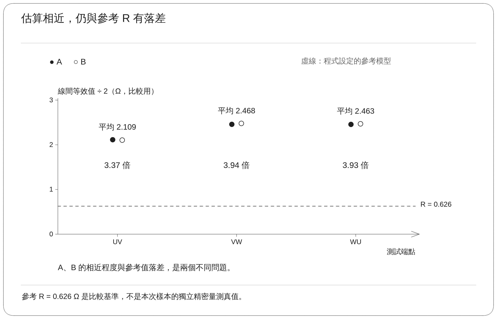

同一端子對的 A、B 差異約為其平均值的 0.41%～0.83%，顯示這兩筆估算接近。然而，換算值約為模型參考值的 3.4～3.9 倍，現階段無法據此採用為已驗證的相電阻。兩筆數據相近只描述這兩筆結果，不足以建立跨溫度、跨馬達或長期測試的重複性。

### 4.3 電感 L 結果

| 端子對 | A：線間值 | B：線間值 | 線間平均值 | 平均值 ÷ 2 |
| --- | ---: | ---: | ---: | ---: |
| UV | 1.2527 mH | 1.2832 mH | 1.2680 mH | 0.634 mH |
| VW | 1.5455 mH | 1.5879 mH | 1.5667 mH | 0.783 mH |
| WU | 1.5613 mH | 1.5337 mH | 1.5475 mH | 0.774 mH |

換算值落在模型的 Ld = 0.574 mH 與 Lq = 0.813 mH 之間，表示數值量級具有初步合理性。由於尚未確認量測方向、接法與外部量測對照，這項接近程度不能證明電感已量準，也不能直接指定哪一組就是 Ld 或 Lq。

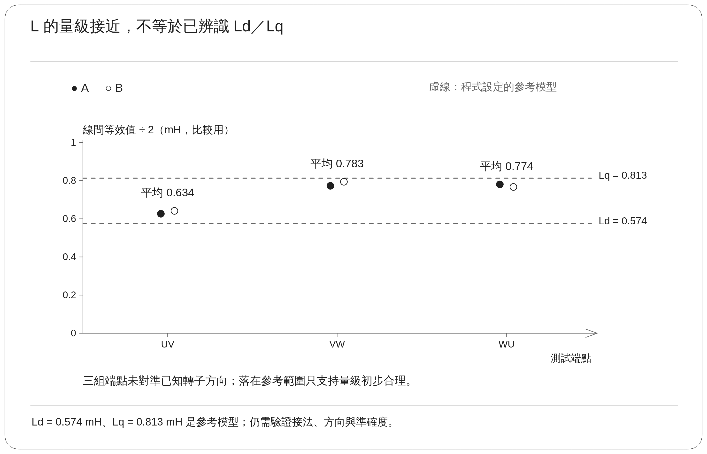

### 4.4 等效電壓偏移約 ±0.5 V 的意義

結果 B 在正、負電流方向下的回歸偏移如下：

| 端子對 | 正向偏移 | 負向偏移 |
| --- | ---: | ---: |
| UV | +0.537 V | −0.547 V |
| VW | +0.509 V | −0.463 V |
| WU | +0.476 V | −0.493 V |

六個數值的絕對值平均約為 0.504 V，因此可概略稱為正反方向約 ±0.5 V 的等效電壓偏移。正負號表示電流方向對應的偏移方向，並非統計信賴區間，也不是電壓量測儀器的誤差規格。

這個偏移是模型為了描述估算電壓與電流反應的關係，一併求出的補償項。它可能包含功率元件壓降、PWM 切換、取樣時序或未建模特性的綜合影響。由於沒有直接量測馬達端電壓，尚不能把它單獨歸因為某個元件或驅動器的固定電壓誤差。

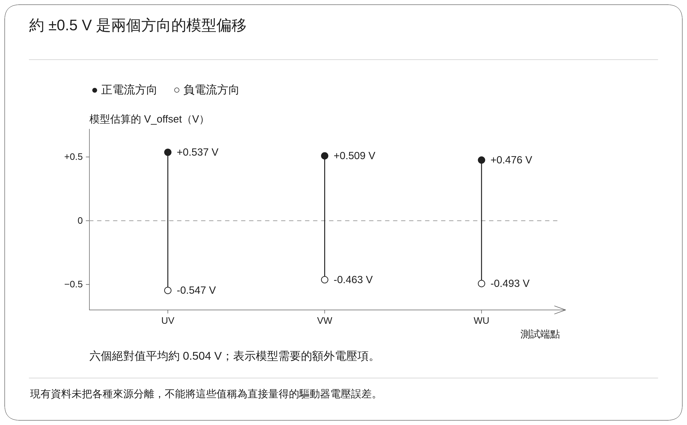

### 4.5 小電流跨度為何使 R 容易受到誤差影響

這兩筆估算用於辨識 R 的有效電流跨度約 0.040～0.044 A。「跨度」是所採用資料中電流變化的範圍，與全程最大相電流 0.178 A 是不同概念。

暫以對稱星形接法及參考相電阻 0.626 Ω 估算，線間電阻約為 1.252 Ω。當電流只變化 0.04 A 時，電阻所帶來的可辨識電壓差約為：

$$
\Delta U_R\approx1.252\ \Omega\times0.04\ \mathrm{A}=0.050\ \mathrm{V}
$$

想辨識的電壓變化約 50 mV，偏移項量級則約 500 mV，兩者約差 10 倍。這表示估算需要妥善處理偏移，才能從小訊號中分辨電阻。

**偏移量大本身不足以證明 R 必然算錯。** 若偏移在取用的區間內確實為常數，且估算正確，取電壓差時常數可抵消。真正影響斜率的是偏移隨電流或切換狀態改變、時序不一致等未被模型解釋的差異。

例如兩個量測點之間若還殘留 50 mV 的未建模電壓差，在 0.04 A 的電流跨度下，可能造成：

$$
\Delta R\approx\frac{0.050\ \mathrm{V}}{0.04\ \mathrm{A}}=1.25\ \Omega
$$

這是線間電阻對誤差的敏感度示例，並非已確認的故障成因。R 偏高的實際來源仍需用獨立電壓、電流與電阻量測逐項釐清。

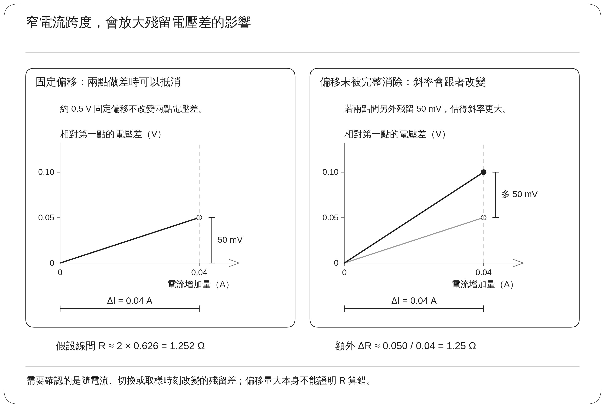

## 5. 結果

### 5.1 已完成與待確認事項

目前已完成三組端子的受控測試電壓測試、資料整理、R/L 回歸及品質判定，也保存了兩筆可比較的實機估算結果。這些結果可用於分析量測方法，但尚不足以直接更新正式馬達控制模型。

| 項目    | 目前結論                    | 尚待確認                |
| ----- | ----------------------- | ------------------- |
| 流程完整性 | 可完成 UV、VW、WU 三組估算       | 不同受測條件下的成功率與失敗分類    |
| 電阻    | A、B 結果接近，但與條件式參考比較有明顯差距 | 接法、量測邊界、輸出模型與獨立電阻對照 |
| 電感    | 條件式換算後的量級接近模型範圍         | 方向定義、繞組耦合及 Ld／Lq 換算 |
| 電壓與時序 | 使用 PWM 推估及名目同步取樣        | 馬達端電壓與實際取樣時序的獨立確認   |
| 參數使用  | 此組測試未自動套用 R/L           | 準確度確認後的套用與驗收條件      |

軟體顯示估算有效，代表數值通過程式的資料品質條件。它與經儀器對照後確認準確，是不同層級的驗證。

### 5.2 後續改善方式與驗收方向

先改善 R 的測試條件，使電流接近穩定，再以多個電流大小及正反方向取得清楚的電壓差。確認馬達接法與量測端點後，可用四線式電阻量測作對照；四線式量測將施加電流與量測電壓的接線分開，有助於降低測試線電阻的影響。同時記錄繞組溫度、接點與線材條件，避免比較不同的量測邊界。

R 驗證完成後，L 可保留快速電壓切換方式，先固定已確認的 R，再從剩餘電壓及電流變化估算：

$$
L\approx\frac{U_{\mathrm{est}}-RI-V_{\mathrm{offset}}}{dI/dt}
$$

這是用來解釋計算關係的概念式。實作仍應使用多點或時間窗資料，避開電流變化率接近零的區間，並確認電壓與電流時序一致。若目標是輸出 Ld／Lq，還需要已知轉子方向與對應的測試電壓的施加方式與方向。

驗收時應分別回答「是否能重複得到接近結果」及「與相同定義的獨立量測相比是否準確」，再依控制需求制定容許誤差。上述改善尚未由本篇的 A、B 結果完成驗證。

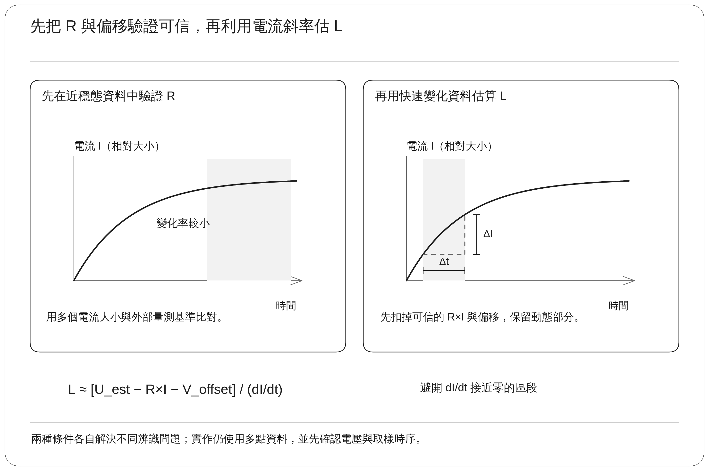

### 5.3 實作追溯資訊

資料處理及回歸方式對照 `motor_measurement_rl.c`，馬達參考模型位於 `r_motor_targetmotor_cfg.h`。