> **報告版本：v0.2.1｜2026-10-02｜第 3、4 章精簡與圖表重繪**

## 1. 功能用途

控制器要調整馬達電流，必須先知道施加電壓後，電流會變成多大、又會改變得多快。電阻 R 與電感 L 分別幫助我們理解這兩件事。

| 參數 | 想了解的問題 | 對控制器的幫助 |
| --- | --- | --- |
| 電阻 R | 維持一定的電流，需要多少電壓？ | 估算電壓需求與發熱損耗，協助設定電流控制 |
| 電感 L | 電壓改變後，電流需要多久才會跟著改變？ | 協助設定電流控制的反應速度；其他條件相同時，L 越大，電流通常改變得越慢 |

### 1.1 量測項目說明

確認相線接通後，還需要知道電流會如何反應，才能進一步調整控制器。因此，R/L 量測接在相線檢查（Phase Detection）之後，是 Commutation Offset Detection 馬達量測系列的一部分。

這套流程使用 Renesas RZ/T2M 馬達控制評估板（EVK），規劃依序測試 UV、VW、WU 三組端子；**本週報告的資料範圍是 UV 端子的正向測試**。測試時施加不同大小的電壓，同時記錄電流：電流平穩後的大小用來估算 R，電壓切換後的變化速度用來估算 L。

目前得到的 R 與 L，是用來描述**測試兩端所看到的整體反應**。除了馬達繞組，導線、驅動器及電壓估算方式也可能影響結果，因此還不能直接把它們當成單相繞組本身的數值。

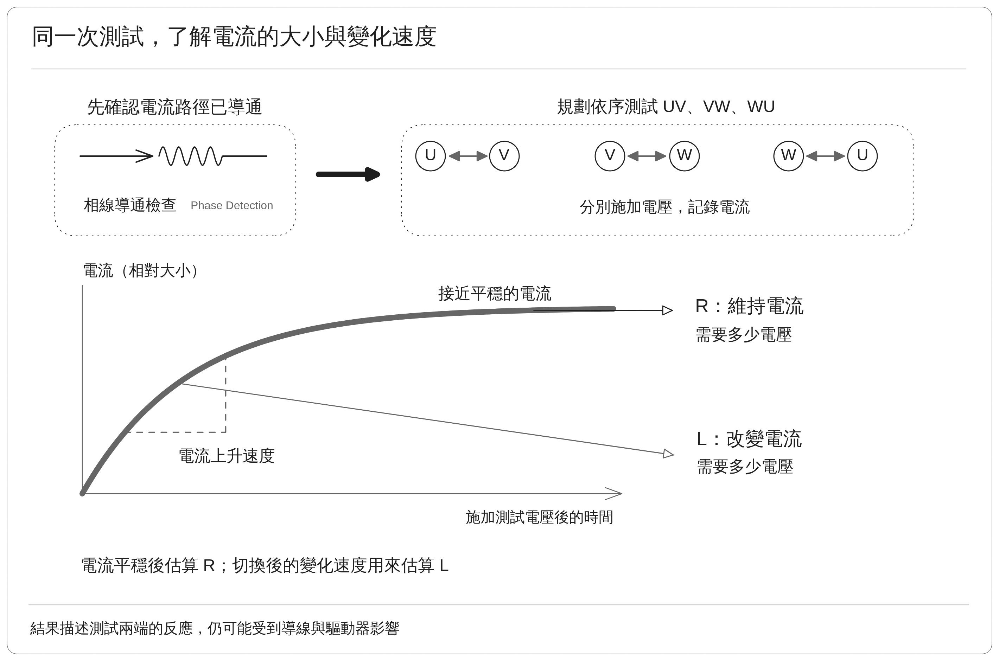

圖中以電流逐漸上升、最後接近平穩的形狀，說明同一次測試如何提供 R 與 L 所需的兩種資訊。

## 2. 量測原理

### 2.1 電壓與電流關係

同樣是施加電壓，維持電流與改變電流需要觀察的現象不同。先分清這兩種作用，才能選對估算 R 與 L 的資料。

測試時讓轉子盡量保持不動，因為馬達轉動也會產生電壓，稱為「反電動勢」。當轉動的影響很小時，可先用下式描述測試兩端的電壓與電流：

$$
U\approx RI+L\frac{dI}{dt}+U_0
$$

| 符號或項目 | 如何理解 |
| --- | --- |
| $`U`$ | 施加在測試兩端的估算電壓；目前由驅動器的輸出設定與供電電壓計算，並非直接量到的端子電壓 |
| $`I`$ | 流過測試路徑的電流；UV 測試的計算方式見第 3.2 節 |
| $`R`$、$`RI`$ | R 是由這次測試估出的兩端電阻；RI 表示維持電流時，與電阻有關的電壓需求 |
| $`L`$、$`L\,dI/dt`$ | L 描述在目前轉子位置與測試方向下，電流改變的難易程度；$`dI/dt`$ 就是電流每秒改變多少 |
| $`U_0`$ | 計算中另外加入的一個電壓量，讓算出的電壓更接近這批資料；其來源尚未分開確認，不能直接當成驅動器的固定電壓損失 |

後文以簡單的 R、L 表示測試兩端的估算值；需要換算為每相數值時，會另外註明。$`U_0`$ 也只描述本次測試涵蓋的電壓與電流範圍，目前並未量到正、負電流兩個方向。

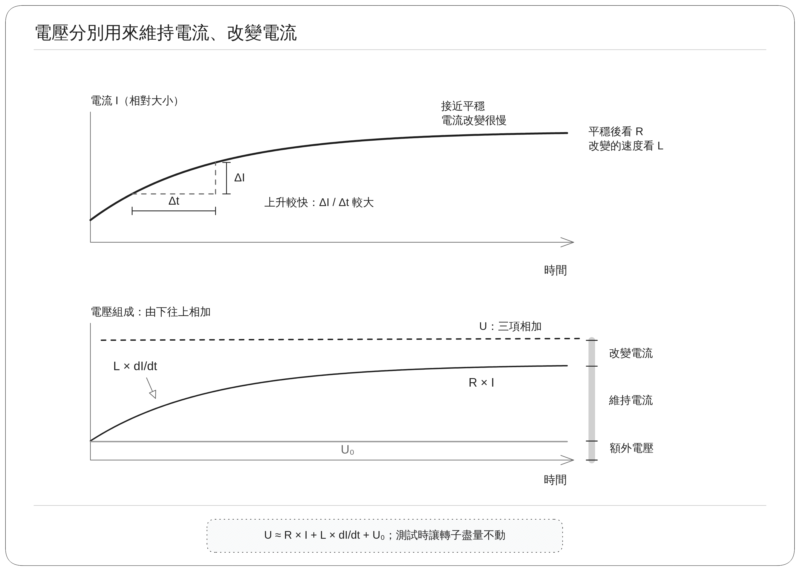

圖中，電流快速改變時，要考慮 L 的影響；電流接近平穩後，$`dI/dt`$ 很小，便較容易看出 R 與電流大小的關係。下方的電壓圖由下往上相加，依序為 $`U_0`$、維持電流所需的 RI，以及改變電流所需的 $`L\,dI/dt`$；其中 $`U_0`$ 的實際原因仍待核對。

### 2.2 電阻 R 估算

剛切換電壓時，電流仍在變化，這時也會受到電感影響。為了估算 R，必須等每次設定電壓後的電流保持平穩，再比較不同電壓下的電流大小。

目前的電壓設計為五段上升與下降變化，依序為 **0.92 → 1.08 → 1.24 → 1.08 → 0.92 V**，共有三種設定電壓分別為 **0.92, 1.08 與 1.24**。這裡的電壓變化「上升、下降」是把正向電壓調大、調小，電流方向並沒有反轉。

| 觀察資料           | 意義            | 用途                        |
| -------------- | ------------- | ------------------------- |
| 電壓固定、電流已平穩的區段  | 不同電流各需要多少電壓   | 估算 R 與額外電壓項 $`U_0`$         |
| 電壓剛切換後的短暫反應    | 電流多快接近新的平穩值   | 估算反應速度，再換算 L              |
| 降壓後回到先前相同電壓的區段 | 相同電壓是否得到接近的電流 | 檢查測試前後有沒有明顯變化，或是否還沒等到電流平穩 |

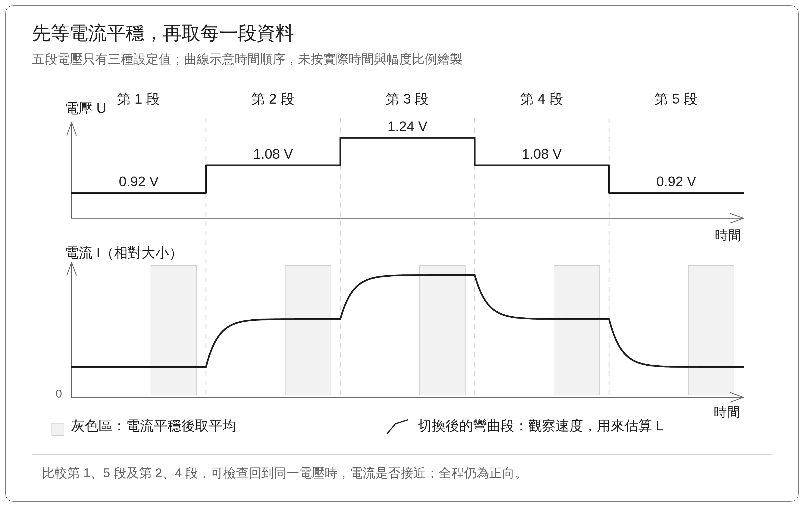

上圖顯示電壓切換時，電流會先彎曲變化，再逐漸平穩。灰色區標示用來估算 R 的資料；回到 0.92 V 與 1.08 V 時，也能比較前、後兩次的平穩電流。曲線是原理示意，未包含起始緩升與結束降壓的完整過程。

電流平穩後，$`dI`$ 變化速度接近零，因此關係可簡化為：

$$
U\approx RI+L\frac{dI}{dt}+U_0 \approx RI+U_0
$$

R 可以理解為：**電流增加時，需要跟著增加多少電壓**。例如，在其他影響相同的情況下，電流每增加 1 A，需要多加 3 V，對應的電阻就是 3 Ω。

計算時，先將整段電壓資料取平均。0.92 V 與 1.08 V 各有兩段資料，1.24 V 則有一段資料；整理後得到三組電壓與電流。根據這三組資料找出最貼近它們的一條直線。直線的傾斜程度給出 R，另外加上的電壓量則是電壓偏移補償 $`U_0`$。

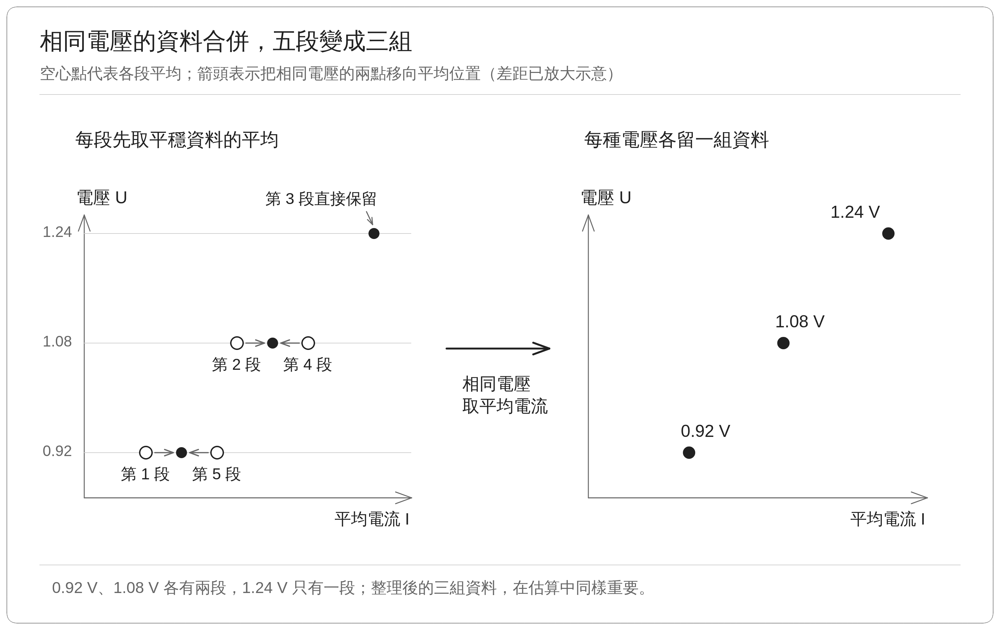

上圖先取各段合格且平穩的電壓、電流平均，再將相同測試電壓區段的資料合併。空心點沿箭頭移向實心的平均點，最後只留下三組比較點；三種電壓在估算中具有相同的重要性。

**$`U_0`$ 的用途，是補上單靠 RI 還無法描述的電壓差。** 把這條直線延伸到電流為零的位置時，得到的電壓就是 $`U_0`$；若沒有實際量到零電流附近，則不能把它當成零電流時真正存在的端子電壓。R 與 $`U_0`$ 仍可能受到驅動器、導線、取樣及電壓估算方式影響。

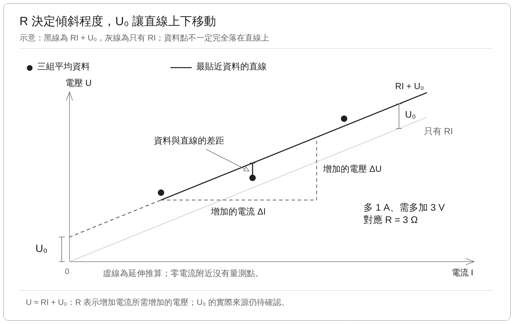

上圖中直線的傾斜程度對應 R，延伸到零電流處可讀出 $`U_0`$；資料點與直線之間的距離，則表示計算與資料還差多少。另外以灰線表示只有 RI 時的關係；加上固定的 $`U_0`$，整條線就向上移動相同高度。橫向增加量是 $`\Delta I`$，縱向增加量是 $`\Delta U`$，讓 R 的意義可以直接從圖上比較。

如果 0.92～1.08 V 與 1.08～1.24 V 算出的 $`R_\Delta`$ 不同，就表示這段電壓與電流的關係還不能完全用同一條直線描述。目前使用的三種電壓 **0.92, 1.08 與 1.24**，是多次測試後找到能讓電流保持平穩、差距足夠，且通過目前資料檢查的一組設定。

### 2.3 電感 L 估算

即使電流最後到達相同大小，也可能一個很快、一個很慢。因此，估算 L 時不能只看最後的電流值，還要觀察切換電壓後，電流如何一步步接近新的平穩值，再配合這次切換的電阻來計算。

以 1.08 → 1.24 V 為例，電壓提高後，電流會逐漸上升。依目前設定，工具記錄切換後 2 ms 的反應，略過前 200 μs，再用保留的資料觀察變化速度；此處定義時間 $`t`$ 為略過前 200 μs後的**第一筆資料**開始算起。當測試過程，於區段間的電流平穩值以 $`I_f`$ 表示。。

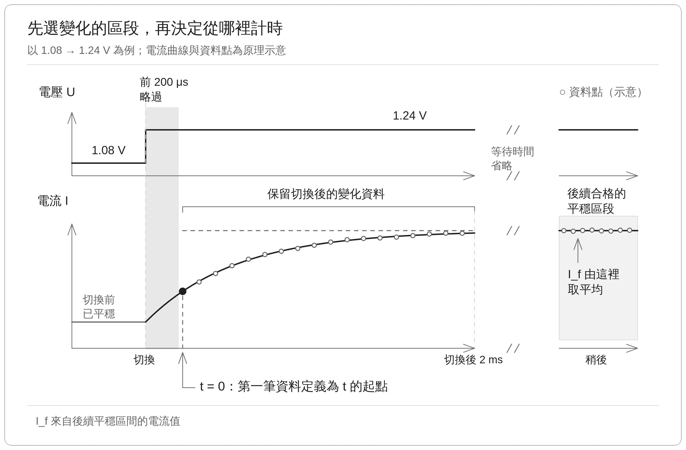

電流通常先改變得較快，越接近新的平穩值，變化就越慢。用下式找出最接近保留資料的曲線，便能估算時間常數 $`\tau`$：

$$
I(t)=I_f+A e^{-t/\tau}
$$

這個式子可以讀成：「當下電流 = 最終的平穩值 + 還沒消失的差距」。$`A`$ 是**曲線在 $`t=0`$ 時，當下電流與 $`I_f`$ 的差值**。加壓時，起點低於 $`I_f`$，所以 A 為負；降壓時，起點高於 $`I_f`$，所以 A 為正。

當 $`\tau`$ 越大，當下電流與最終的平穩值差距縮小得越慢。如下圖曲線示意，從 $`t=0`$ 經過一個 $`\tau`$ 後，與 $`I_f`$ 的差距剩下起點的約 **36.8%**，也就是完成約 **63.2%** 的變化，接著經過兩個、三個 $`\tau`$，差距分別縮小到約 13.5%、5.0%。

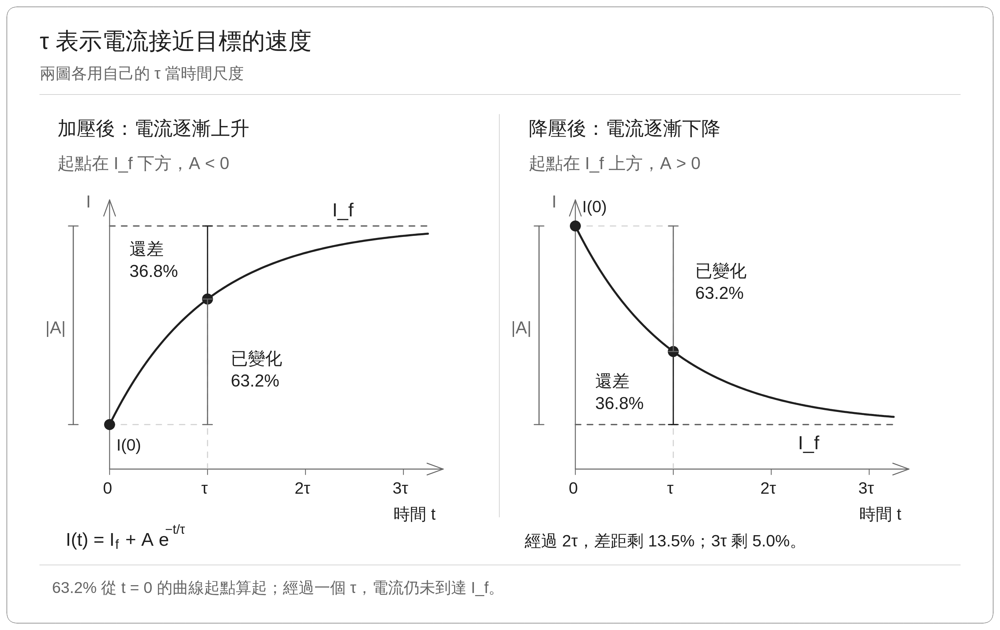

反應速度同時與 R、L 有關，所以只知道 $`\tau`$ 還不夠。以兩個平穩的電壓測試區間為例，透過將電壓切換前、後的平穩電壓相減，得到 $`\Delta U`$；再將平穩電流相減，得到 $`\Delta I`$。兩者相除，得到這個兩個平穩區間的電阻 $`R_\Delta`$：

$$
R_\Delta=\frac{\Delta U}{\Delta I},\qquad
L=R_\Delta\tau
$$

若 $`U_0`$ 在這次切換前、後大致相同，相減時便能消去它。在這個小區間內，若 R、L 可以近似看成固定值，電流又符合上述逐漸接近平穩的曲線，就能用 $`L=R_\Delta\tau`$ 換算。**在 $`R_\Delta`$ 相同的前提下，電流與最終的平穩值差距縮小得越慢、$`\tau`$ 越大，L 也越大。**

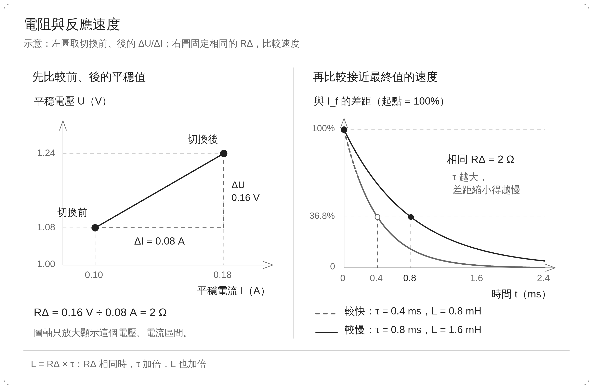

## 3. 實作方式

PC 測試工具透過 CON5 啟動測試；板端負責輸出電壓、記錄電流與監控限制，PC 測試工具收齊資料後再檢查、計算及保存。操作介面已整合為單循環 R/L 流程，仍可讀取舊紀錄。

### 3.1 實作問題與修改方向

為了在短時間內估算 R、L，舊版反覆施加「正、零、反、零」的電壓脈衝，每段約 0.4～0.5 ms，記錄電流的上升、回落與反向變化。再將多次重複的波形對齊後取平均，根據電流大小及變化速度，同時估算 R、L。

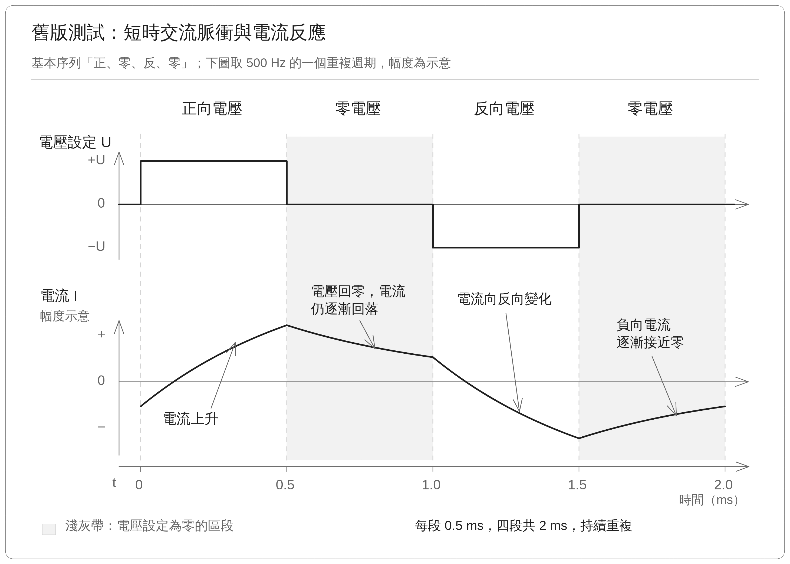

**舊版短時交流脈衝測試持續無法取得可用的 R、L 結果。** 這種方式需要在很短的時間內分辨 R、L 對電流的影響；這種短時交流脈衝做法可避免轉子發生位移與速度尖峰，但缺少平穩的電壓與電流訊號區間，導致 R 估測不準確。

因此，本次改為在同一個電流方向下調整電壓：先用電流平穩後的資料估算 R，再利用切換後的反應估算 L，讓兩者所需的資料更容易分開觀察。

### 3.2 升降壓取資料

為了避免把電流感測器原本的些微偏差算進量測結果，測試開始時先取得各相的**電流零點，也就是電流應接近零時的平均讀值**，作為後續扣除的基準。

程式先將 U、V、W 三相的 PWM 都設為 **50%**，維持 **80 ms**，再以其中最後約 **10 ms** 的各相電流平均值作為零點。三相設定相同，理想上 U–V 兩端的平均電壓差為 **0 V**。

目前的電壓設計為五段變化，依序為 **0.92 → 1.08 → 1.24 → 1.08 → 0.92 V**，測試與初始時先取得電流零點，再緩升至 0.92 V，再完成後續的升降壓循環。每段電壓測試區間須連續平穩 **250 ms** 才進入下一段；等待達 **700 ms** 仍未符合條件，就中止測試。  

- 五段平穩資料用於估算 R。
- 四次切換後的短暫反應用於估算 L。

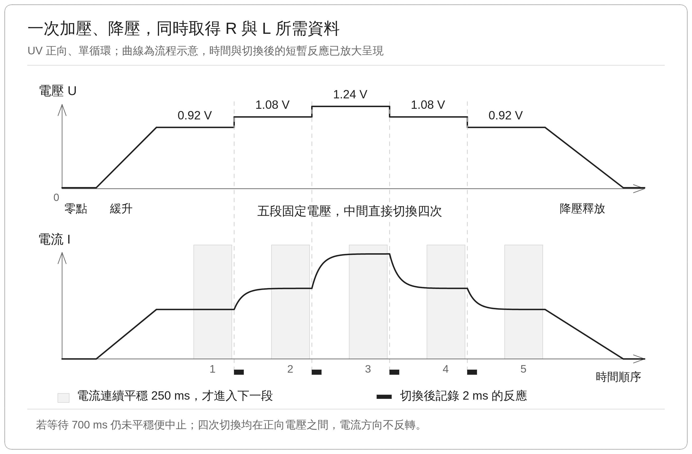

開始與結束採緩慢升降壓，中間四次直接切換。灰色區是電流平穩後的資料，黑色短條是切換後的記錄區段。

### 3.3 實際電壓與電流估算

以下說明以 U–V 兩相為例。

**PWM 的導通比例（duty），可以理解為一個切換週期內，相端子接到供電正端的時間比例。** 以比例狀態來看，$`D_U=52.25`$% 表示 U 相端子有 52.25% 的時間接到正端，其餘時間接到負端；$`D_V`$ 則是 V 相的相同比例。

$`V_{dc}`$ 是供電正、負端之間的電壓。相對於直流負端，U、V 端子的平均電壓分別約為 $`D_U \times V_{dc}`$、$`D_V \times V_{dc}`$，兩者相減便得到測試於兩相間施加的電壓：

$$  
U\approx(D_U-D_V) \times V_{dc}  
$$

例如 $`V_{dc}=24\ \mathrm{V}`$、$`D_U=52.25`$%、$`D_V=47.75`$% 時，兩端的平均電壓分別為 12.54 V、11.46 V，相減得到 **1.08 V**。

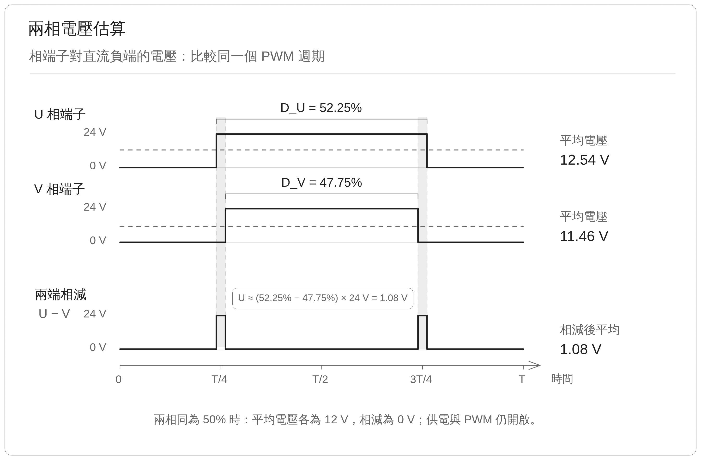

電流方面，$`I_U`$、$`I_V`$ 是各自扣除電流零點後的讀值，以流入馬達為正、流出為負。當電流主要由 U 流入、V 流出時，兩者大小應接近、正負相反，因此將 V 相讀值反向後，與 U 相取平均：

$$  
I=\frac{I_U-I_V}{2}  
$$

例如： $`I_U=+0.10\ \mathrm{A}`$、$`I_V=-0.10\ \mathrm{A}`$，得到 $`I=0.10\ \mathrm{A}`$。

### 3.4 結果評估

取得電壓與電流資料後，需要先確認哪些區段適合計算。R 使用電流平穩後的資料，L 則使用切換電壓後的短暫反應。

切換電壓後，程式每 **25 μs** 記錄一筆資料，持續至切換後 **2 ms**。計算時先略過前 **200 μs**，減少切換初期的影響，再將相鄰兩筆取平均，形成每 **50 μs** 一筆的資料。電壓與電流使用相同的兩個時間點，讓平均後的數值仍能互相對應。

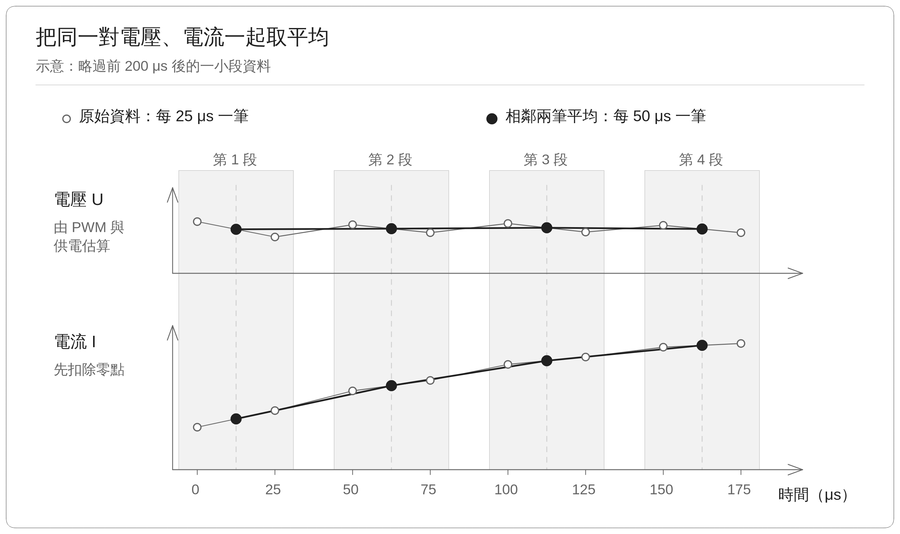

電流平穩期間，程式每 **10 ms** 整理一次統計，持續觀察電流與測試狀態。若電流平穩、供電無明顯波動，再計算結果：

- **估算 R：** 三種設定電壓都需要有合格的平穩資料，才能比較不同電壓下的電流。
- **估算 L：** 同一電壓區間的加壓與降壓反應都需要合格，才能比較兩個方向的結果。
    

若有多組電壓區間可用，會比較各組在切換前、後的平穩電流差，優先採用加壓與降壓時都有較明顯電流變化的一組。目前馬達繞組為星形接法、三相對稱及等效模型成立的前提下，將兩端 R、L 各除以 2，顯示每相估算值。

## 4. 實驗結果

本次實驗進行重複的信號可靠度測試 (對應 3.2 節的期望訊號) 與 R/L 的結果估算。專案的官方預設值為每相 **R = 0.626 Ω、Ld = 0.574 mH、Lq = 0.813 mH**，尚未以獨立儀器確認為這顆馬達的實際數值。

### 4.1 訊號源確認 與 結果評估

為了確認訊號源的相同設定能否穩定取得資料，因此調整不同電壓與升降壓等參數後，以一組候選設定進行重複驗證。

重複測試實驗中，實際訊號來源的 25 段電壓平穩區間全部合格，兩端 R 落在 3.1663～3.1689 Ω，最大差距約占平均值 0.082%；五次也都至少有一組 L 資料可用。仍有 2 次切換反應因供電波動而排除。

整合後的測試得到每相 R = 1.5812 Ω，約為預設 0.626 Ω 的 2.53 倍。
- **目前已證實結果數據於重複測試可固定**
- **但是否接近真正的繞組電阻，仍需實際由硬體量測核對。**

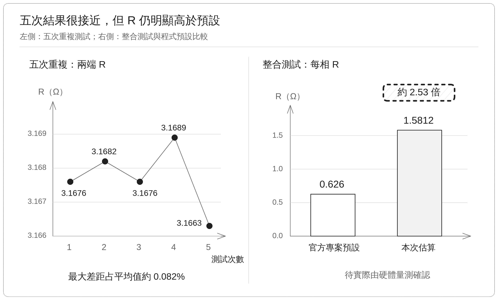

### 4.2 R 偏高待確認

關於 R 偏高的來源，需要先比較兩個相鄰電壓區間的結果：電壓同樣增加測試的步階**0.16 V** 時，電流增加的幅度是否接近。
- 目前 **0.92 → 1.08 V** 算出的 $`R_\Delta`$ 為 **4.164 Ω**
- 目前 **1.08 → 1.24 V** 則為 **2.621 Ω**
兩者差值占平均值約 **45.50%**。這表示電壓較高時，相同的加壓幅度帶來了更多電流，整段資料為非線性狀態，還不能完全用固定的電阻描述。下一步會在相同的三種電壓設定下，量測 **U–V 平均端電壓與電流**，和目前由 PWM 估算的電壓及電流感測讀值比較。

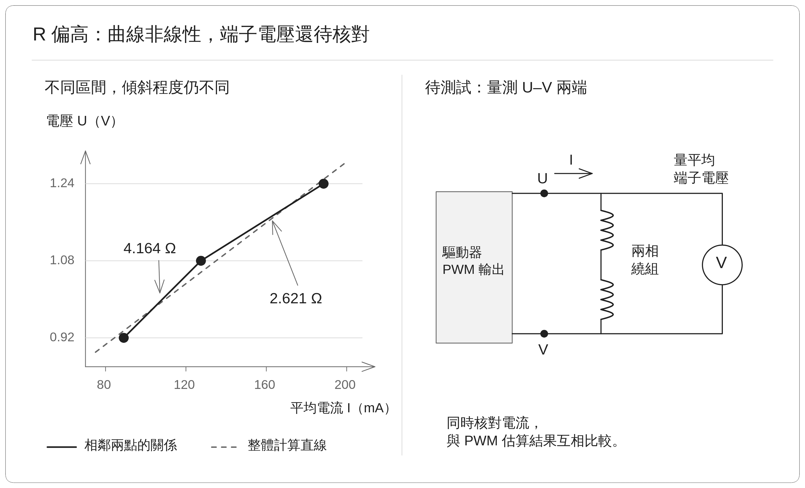

### 4.3 L 已能估算，但加壓與降壓仍有差異

目前已能從切換後的電流反應估算 L。本次採用 **1.08 ↔ 1.24 V** 的資料。加壓時，每相 L 為 **0.8115 mH**；降壓時為 **0.6181 mH**，兩者平均為 **0.7148 mH**。兩方向的差值占平均值約 **27.1%**，表示目前雖然能算出結果，加壓與降壓的估算仍有明顯差距。

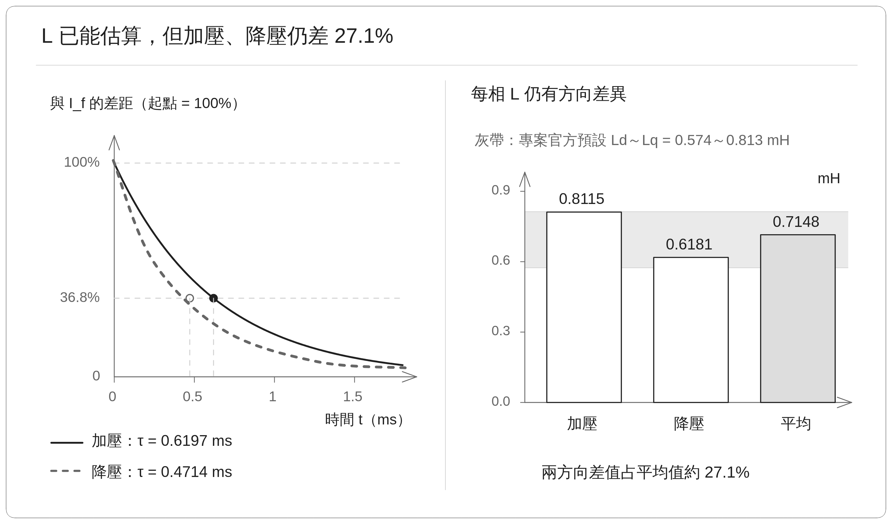

上圖左側顯示**電流距離最後平穩值還剩下多少差距**。曲線越快接近零，表示電流越快接近平穩。本次加壓曲線下降較慢，代表加壓後需要較長時間才能接近新的平穩值。上圖右圖將加壓、降壓及平均 L 放在一起比較。灰帶來自專案內官方預設的 $`L_d`$、$`L_q`$，做為測試結果參考。

此外，L 是由每次切換的 $`R_\Delta`$ 與反應時間一起換算。電壓估算若影響了 $`R_\Delta`$，也會影響 L。後續待確認 R 的準確度後再評斷 L。