## 1. 功能用途

控制器需要把馬達軸的實際轉角，換算成控制磁場所使用的角度。這個換算要先確定兩件事：**馬達軸轉一圈對應多少個磁場週期，以及磁場命令與軸角度的正方向是否一致。**

| 功能    | 解決的問題             | 例子                    |
| ----- | ----------------- | --------------------- |
| 極對數偵測 | 確認機械轉動與電氣週期之間的比例  | 5 極對代表軸轉一圈，經過 5 個電氣週期 |
| 相序偵測  | 確認目前相線配置與編碼器的方向關係 | 磁場命令正向移動時，編碼器角度是否也增加  |

### 1.1 基本名詞與功能範圍

機械角度是馬達軸真正旋轉的角度，一圈為 360°。電氣角度是描述磁場週期的角度，每經過一組 N、S 磁極便完成一個週期。極對數 (Pole Pair) 是這種磁極配對的數量；它與 U、V、W 三組繞組所代表的「三相」不同。

編碼器是量測軸位置的感測器。相序辨識 (Phase order) 比較三相輸出所形成的旋轉方向與編碼器角度方向，觀察到的是接線、機械安裝及編碼器方向共同形成的關係。方向相反時，仍需檢查配置，才能進一步區分原因。

這兩項功能是 Commutation Offset Detection 馬達量測系列的一部分。它們先建立機械角度與電氣角度的比例與方向關係，後續的換相偏移校正才能建立正確的電氣零點。測試平台為 Renesas RZ/T2M 馬達控制評估板（EVK），搭配 Tamagawa TSM3101N2001E020 馬達及馬達端編碼器。

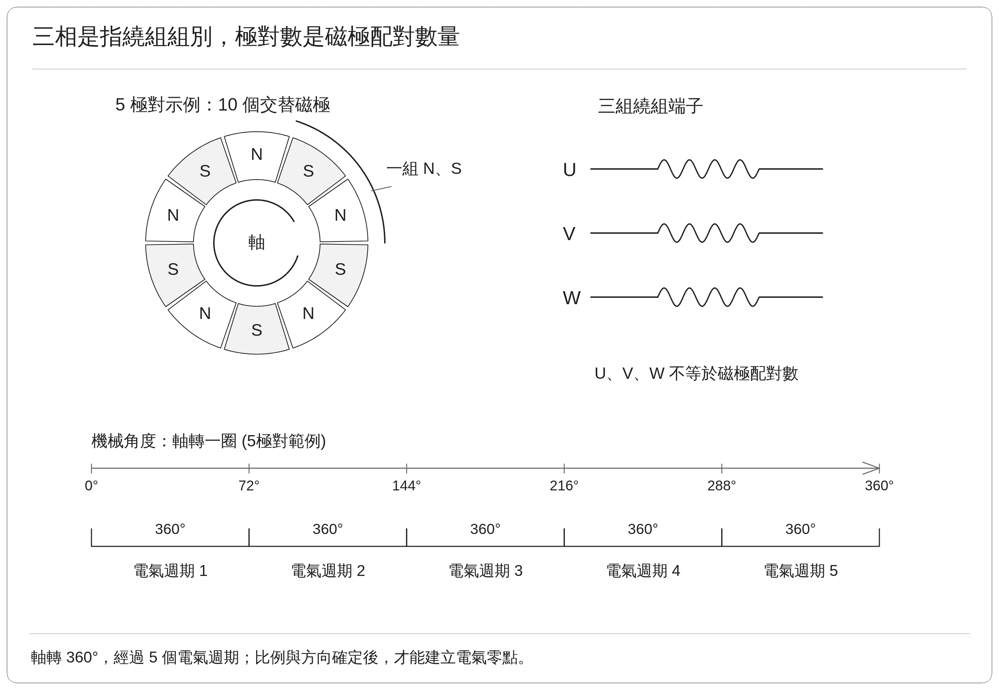

## 2. 量測原理

### 2.1 用旋轉磁場建立可比較的命令與回授

驅動器慢慢改變三相輸出，建立方向持續移動的磁場。若轉子能穩定跟隨，就可以比較「命令磁場轉了多少」與「編碼器量到軸轉了多少」，依此估算對應的比例及方向。

此處採用開迴路旋轉的方式，讓磁場依預定軌跡移動，編碼器與電流回授仍用於觀察跟隨品質及保護。

實際測試上，命令角度描述的是控制器安排的磁場方向。低電壓輸出、摩擦及負載都可能使實際的轉子位置短暫落後命令角度，因此計算極對數的比例關係必須搭配跟隨品質檢查。

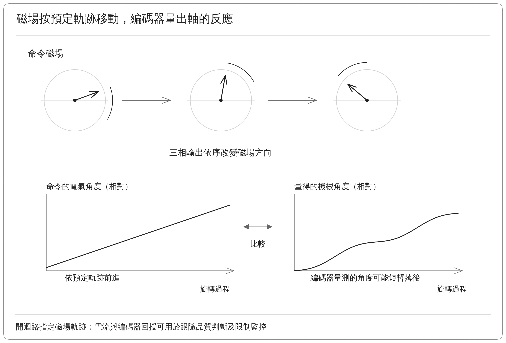

圖中使用兩條相對角度曲線說明命令與跟隨反應；辨識時比較兩者比例，並檢查落後或中斷是否在允許範圍內。

### 2.2 極對數由轉動比例求得

在轉子跟隨正常時：

$$
p\approx\left|\frac{\Delta\theta_e}{\Delta\theta_m}\right|
$$

| 符號 | 意義 |
| --- | --- |
| $`p`$ | 極對數 |
| $`\Delta\theta_e`$ | 命令磁場的電氣轉角 |
| $`\Delta\theta_m`$ | 編碼器量得的機械轉角 |

兩個角度必須使用相同單位。例如磁場轉過 360°，軸轉過約 72°，便得到：

$$
p\approx\frac{360^\circ}{72^\circ}=5
$$

實際計算極對數時，使用整段測試過程中的量測資料，來估算求得機械角對電氣角的斜率 $`k`$，即每增加一單位電氣角度，機械角度平均改變多少，再取 $`p\approx1/|k|`$。這可降低單一開始點或結束點雜訊對結果的影響。

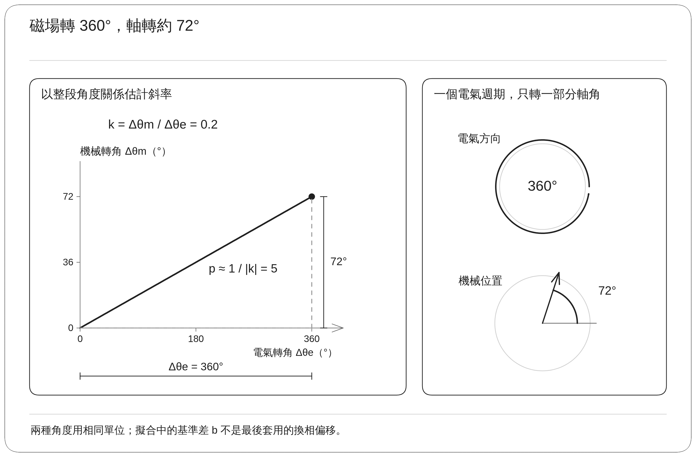

### 2.3 相序由方向關係判斷

| 關係                    | 斜率符號 | 結果                |
| --------------------- | ---- | ----------------- |
| 磁場正轉時編碼器增加，磁場反轉時編碼器減少 | 正    | Normal，兩者方向定義一致   |
| 磁場正轉時編碼器減少，磁場反轉時編碼器增加 | 負    | Inverted，兩者方向定義相反 |

正常的正轉段與反轉段，實際運動方向本來就相反。但在兩段之中，機械角與電氣角的變化量會同時換號，因此比值仍為正，可定義為方向關係一致。

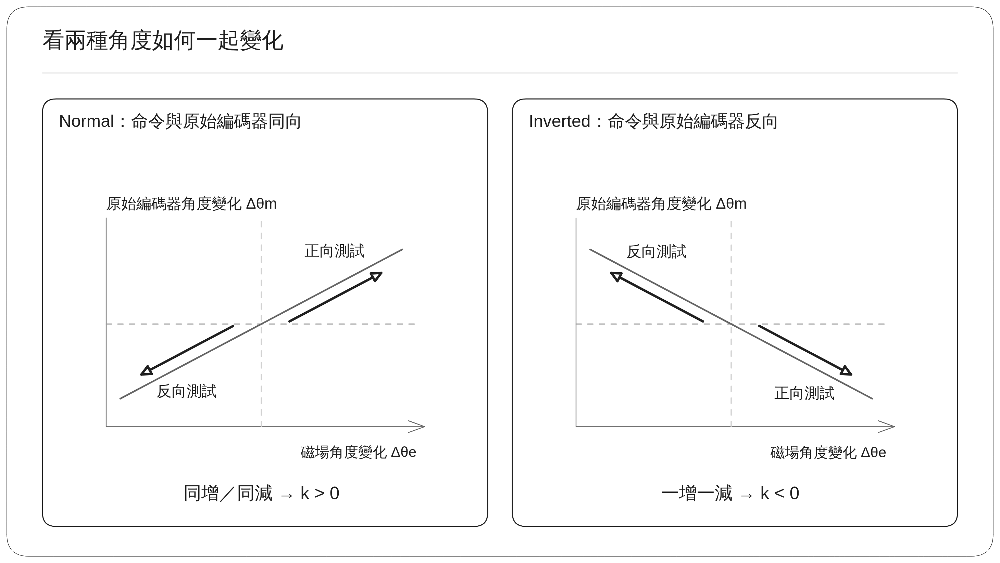

## 3. 實作

### 3.1 四段正反向轉動測試

PC 測試工具透過 CON5 通訊介面啟動測試，由韌體產生旋轉磁場，同步記錄命令電氣角度與編碼器位置，並檢查轉子的跟隨情況。開始前，電流與位置回授必須有效，編碼器資料須持續更新，也要確認軸的轉動範圍沒有被機械限制阻擋。

**（一）四段轉動量測**

「四段轉動」指的是**四個轉動測試用來估算比例的正式量測區間**。流程先完成一組正向轉動、反向轉動量測，再將停止後的命令磁場位置移動 90° 電氣角度，建立另一組起始條件，接著再完成一次正向轉動、反向轉動量測。四段轉動的命令方向依序為正、反、正、反。

正常流程先做一次固定磁場對齊，讓轉子在已建立的磁場下穩定。之後，每段都依序經過**預轉、正式量測、減速至停止**：預轉沿該段方向移動約 180° 電氣角度，以減少靜止摩擦與起步瞬間的影響；正式量測再轉過 360° 電氣角度，這一段的資料才用於估算比例；結束後逐步減速，銜接下一個動作。

| 流程       | 磁場與轉子的動作                     | 目的或量測範圍            |
| -------- | ---------------------------- | ------------------ |
| 確認回授     | 確認電流接近基準，編碼器資料有效且持續更新        | 排除殘留電流與無效位置資料      |
| 初始對齊     | 建立固定方向磁場，等待轉子穩定              | 降低任意停留位置對起步的影響     |
| 第 1 段：正向 | 正向預轉 → 正向正式量測 → 減速停止         | 正式量測的命令電氣轉角為 +360° |
| 第 2 段：反向 | 反向預轉 → 反向正式量測 → 減速停止         | 正式量測的命令電氣轉角為 −360° |
| 更換磁場起點   | 從第 2 段停止後的磁場位置，再移動 +90° 電氣角度 | 建立另一組起始條件          |
| 第 3 段：正向 | 正向預轉 → 正向正式量測 → 減速停止         | 正式量測的命令電氣轉角為 +360° |
| 第 4 段：反向 | 反向預轉 → 反向正式量測 → 減速停止         | 正式量測的命令電氣轉角為 −360° |
| 彙整與釋放    | 檢查四段轉動測試結果，逐步降低輸出並確認停止       | 通過品質檢查後形成有效結果      |

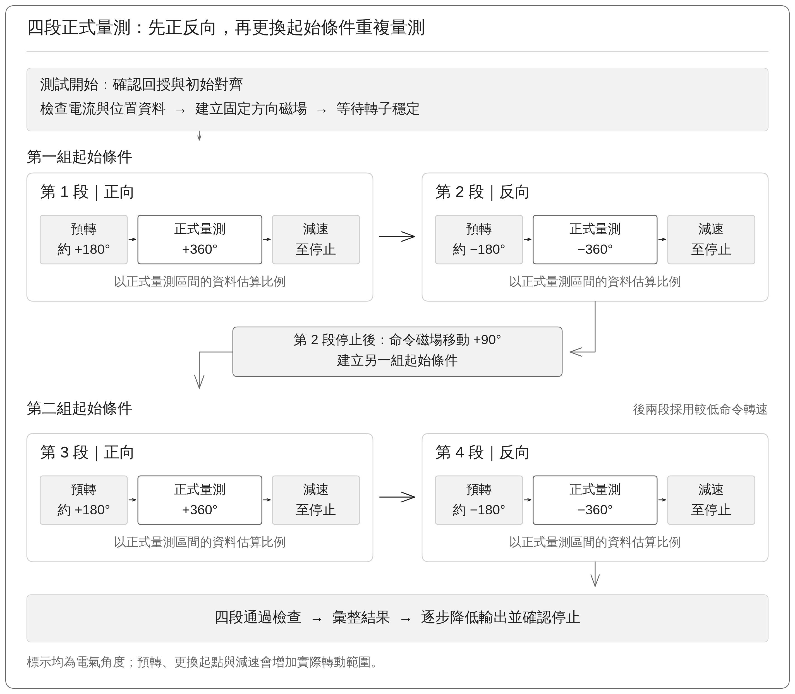

圖中的 180°、90° 與 360° 都是**電氣角度**。以 5 極對馬達為例，90° 電氣角度理想上對應 18° 機械轉角，每段正式量測的 360° 則對應 72° 機械轉角。預轉、更換起點與減速仍會帶來額外位移，因此正式量測的轉角不能直接當成整個流程需要的機械行程。目前實作也在後兩段降低命令轉速，檢查較低速時的比例是否仍一致。

**（二）局部區段的跟隨檢查**

辨識比例的前提是轉子能跟隨旋轉磁場。即使量測起點與終點看起來符合比例，中途仍可能發生卡住後再追趕。因此，整體測試需要持續取得整段資料，觀察各區間的轉動，而不能只記錄起終點。

下圖以 5 極對、Normal 方向關係的正向量測說明。左右兩例的命令磁場都轉過 +360°，機械角也都增加 +72°，從起終點得到的比例同樣是 5。左圖的機械角隨命令持續增加；右圖在命令仍前進時，機械角卻暫時停在同一位置，形成水平區段，之後再快速增加而追上。**相同的總轉角，可能包含不同的跟隨過程。**

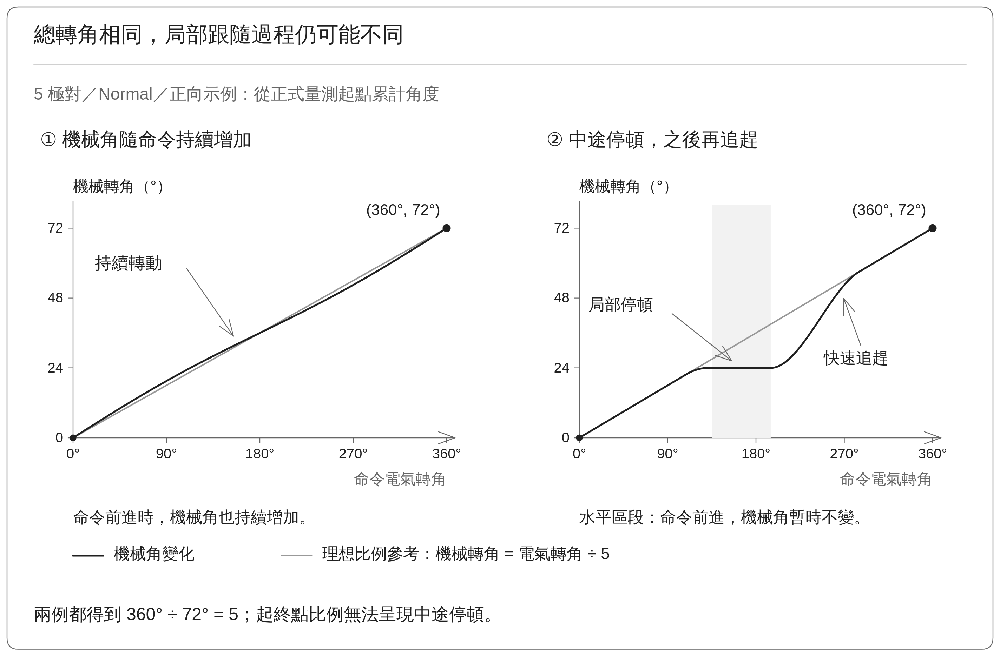

圖中的角度都以開始量測起點為零點；灰線表示此例的理想比例參考。局部斜率、角度殘差及週期波動的判定方式接續於 3.3 說明。在進行這些比較之前，編碼器的跨圈讀值必須先依 3.2 接續為連續角度。

### 3.2 連續角度建立

編碼器的單圈位置以 0° 到未滿 360° 表示。軸持續正轉時，讀值可能由 359° 變成 0°；持續反轉時，則可能由 0° 變成 359°。這是單圈讀值跨越零點，不代表軸突然轉了接近一整圈。以下角度均為**編碼器的機械角度**。

**（一）先求相鄰位移，修正跨圈差值**

系統先計算本次讀值減去前次讀值，再修正跨圈造成的差值。這個判斷以前後兩筆有效資料之間的實際位移小於半圈為前提：差值小於 −180° 時加回 360°；大於 +180° 時減去 360°；其餘差值保持原值。

| 讀值變化 | 直接相減 | 修正後的機械位移 | 解讀 |
| --- | ---: | ---: | --- |
| 358° → 359° | +1° | +1° | 沒有跨圈，保留差值 |
| 359° → 0° | −359° | −359° + 360° = +1° | 正向跨越零點，仍增加 1° |
| 1° → 0° | −1° | −1° | 沒有跨圈，保留差值 |
| 0° → 359° | +359° | +359° − 360° = −1° | 反向跨越零點，仍減少 1° |

若差值恰好為半圈，便無法只靠這兩筆讀值判定方向；實作會拒絕這種不明確的資料。資料失效、更新中斷或超出合理速度範圍的跳變，也會先判為異常。

**（二）累加修正後的位移，接續成連續角度**

以第一筆有效位置作為初值，之後將每次修正後的位移累加，便得到連續機械角度。這個處理稱為**角度展開**，結果可以大於 360° 或小於 0°，用來保留跨圈後的累積位置：

$$
\theta_{m,\text{連續}}[n]
=\theta_{m,\text{連續}}[n-1]+\Delta\theta_{m,\text{修正}}[n]
$$

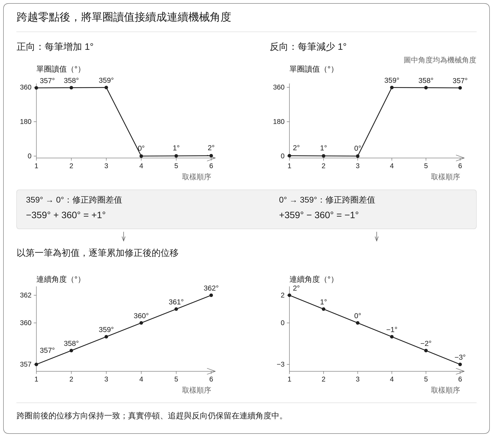

圖上方是單圈讀值，下方是由同一批資料累加出的連續角度。左側正轉的 357°、358°、359°、0°、1°、2°，接續成 357°、358°、359°、360°、361°、362°；右側反轉的 2°、1°、0°、359°、358°、357°，則接續成 2°、1°、0°、−1°、−2°、−3°。每個點都依原取樣順序對應，因此可以直接核對跨圈前後的位移符號。

連續角度建立後，系統才能正確計算整段機械轉角、運動方向，以及機械角對命令電氣角的斜率。角度展開只接續跨圈的數值表示：**真實停頓時，累加角度仍會停住；追趕或反向時，也會保留原本的變化。** 3.1 所示的局部跟隨現象因此仍會出現在資料中，再由 3.3 的品質檢查判斷。

### 3.3 轉動結果評估策略

角度資料即使能算出接近整數的極對數，也可能混入卡住、突然追趕或回授異常。因此，系統先確認**每一段是否足以估算比例**，再檢查**四段轉動測試是否得到一致的比例與方向關係**，兩者都成立後才形成辨識結果。

**（一）先確認資料有效，而且轉子確實移動**

系統持續檢查編碼器資料是否有效、是否按時更新，以及角度有沒有不合理的跳變。每段量測也必須累積足夠資料與機械轉角，避免把靜止時的小幅雜訊誤當成轉動。資料不足、轉角過小，或相對該段主要轉動方向出現過量的異常回退時，該段不接受估算。

**（二）比較整段趨勢、局部斜率與角度殘差**

先把命令電氣角度放在橫軸、編碼器量得的連續機械角度放在縱軸，便能看見轉子如何跟隨旋轉磁場。系統用一段 360° 電氣角度的全部資料，估算一條代表平均轉動比例的直線，稱為**整段趨勢線**：

$$
\hat\theta_m=a+k\theta_e
$$

其中，$`\theta_e`$ 是命令電氣角度，$`\hat\theta_m`$ 是趨勢線預估的機械角度；$`k`$ 為估計斜率，$`a`$ 為這段資料的截距。系統另外將資料分成四個 90° 區間，比較各區間的局部斜率與整段斜率，避免前半段卡住、後半段追趕的情況被平均值掩蓋。

**斜率檢查轉動比例，角度殘差則檢查量測點偏離趨勢線多少。** 對同一個電氣角度，將實際量得的機械角度減去趨勢線的預估值：

$$
r_m=\theta_m-\hat\theta_m
$$

圖中的垂直差距就是 $`r_m`$。例如 A 點的命令角度為 130°，量測值為 26.8°、趨勢線預估值為 26.0°，殘差便是 +0.8°。將每個位置的差距畫出來，就得到下方的殘差曲線；原本向上傾斜的趨勢線，則變成殘差圖中的零線。殘差為正表示量測點在趨勢線上方，為負表示在下方，並不代表馬達正轉或反轉。

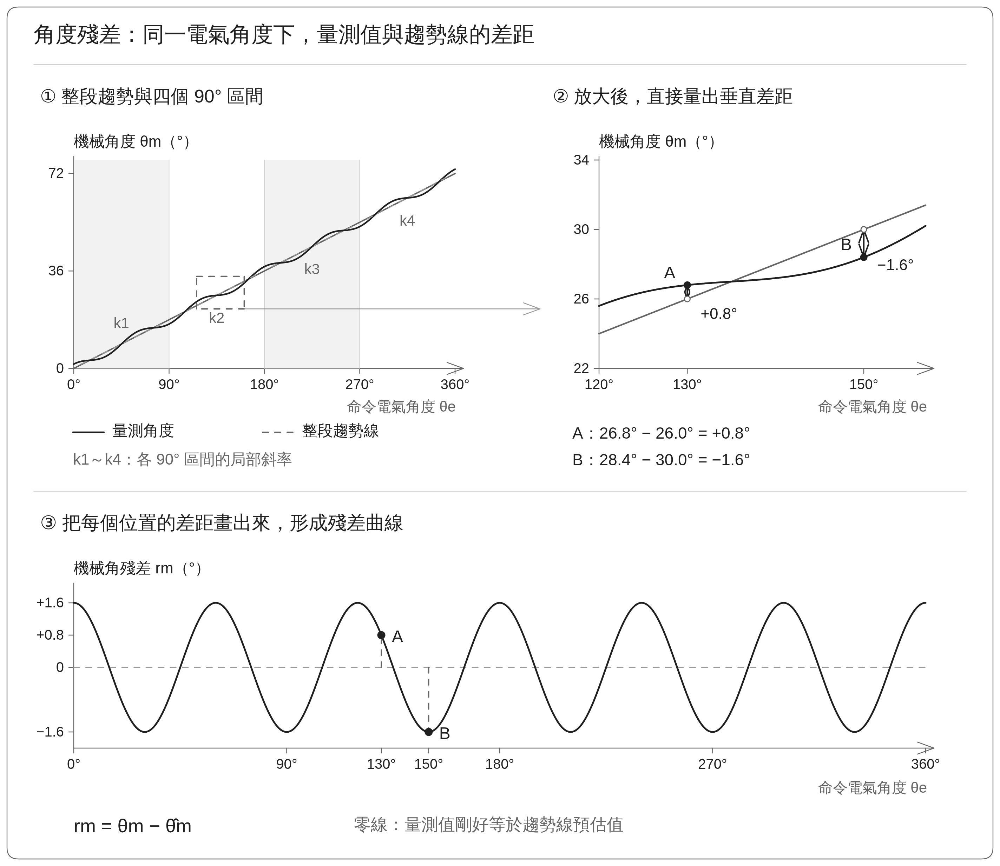

圖中 A、B 標記在角度圖與殘差圖中各自代表同一筆資料。曲線由示例公式計算，用於說明差距的定義；示例數值不作為驗收門檻。圖的縱軸使用機械角度，韌體則將殘差換算為電氣角度，並以均方根誤差（RMS，表示整段誤差的整體大小）等指標進行品質判定。

若局部斜率與整段的正負號相反，就直接判為跟隨異常。一般線性檢查通過時，即可接受本段；若方向一致，但局部比例或殘差未符合要求，則進入下一項週期波動檢查。

**（三）以 60° 扇區辨別重複偏差與剩餘誤差**

低速、低電壓測試時，角度偏差可能每隔 60° 電氣角度重複一次。此時，即使殘差沒有接近零，也不一定代表轉子失去跟隨。系統需要確認：**這些差距是否在固定位置重複，以及排除共同偏差後，還剩下多少不一致。**

這裡的 60° 扇區是為了比較週期波動；前一項的 90° 區間則是為了比較局部斜率，兩者用途不同。扇區位置從各段量測起點起算，反向測試也依轉過角度的大小分段。

圖左上將一圈 360° 分為六個扇區，黑點依序位於 10°、70°、130°、190°、250° 與 310°。它們都在各自扇區開始後的 10°，因此可以放在一起比較；這個扇區內的位置以 $`\varphi`$ 表示。

圖右上把六個扇區的橫軸都改成 0°～60°。若波動可重複，各扇區的殘差曲線便會接近同一個形狀。這個共同偏差記為 $`b(\varphi)`$，各筆資料偏離共同偏差的差距，才是**剩餘誤差** $`\varepsilon`$：

$$
r_m=b(\varphi)+\varepsilon
$$

例如，在 $`\varphi=10^\circ`$ 時，某筆殘差為 +1.1°，共同偏差為 +0.8°，剩餘誤差就是 +0.3°。實作會以相同相對位置分組，重新估算共同斜率與各組偏差，再檢查剩餘誤差；圖中的曲線是這個分組關係的示例。

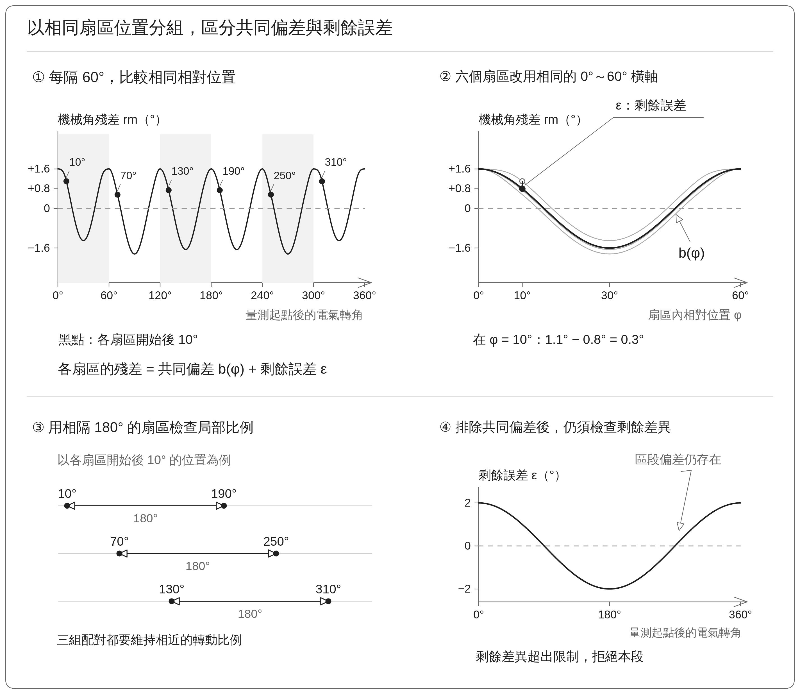

重新估算後，局部比例改用相隔 180° 的三對扇區交叉檢查。圖左下以同樣的 10° 相對位置標出 10°／190°、70°／250°、130°／310° 三組配對；實際運算會彙整各相對位置的多筆資料，而不只比較這六個點。較長的角度間隔可降低短區段波動對斜率的影響。

共同偏差的幅度、剩餘誤差、局部比例與跨扇區一致性仍各有允許範圍。圖右下表示排除共同偏差後，某區段仍明顯偏離；若超出限制，就不能視為可接受的週期波動。本段通過後，還須接續四段轉動測試結果的一致性檢查。

**（四）四段轉動測試都通過後，再確認共同結果**

| 檢查內容    | 判定方式                      | 為什麼需要                       |
| ------- | ------------------------- | --------------------------- |
| 方向關係一致  | 四段轉動斜率的正負號必須相同            | 正轉、反轉及更換起點後，命令與回授仍應維持同一方向關係 |
| 極對數估計接近 | 四段轉動差異指標不得超過 2%           | 避免比例只在某個方向或起點成立             |
| 平均值接近整數 | 取最接近的整數作為候選，再檢查平均值與候選值的差距 | 避免將不合理的比例直接四捨五入成極對數         |

其中，四段轉動差異指標為：

$$
S=\frac{p_{\max}-p_{\min}}{\bar p}\times100\%
$$

$`p_{\max}`$、$`p_{\min}`$ 分別是四段轉動測試的極對數估計之最大值與最小值，$`\bar p`$ 是四段轉動測試平均值。目前要求 $`S\leq2\%`$；這個門檻衡量的是**同一次測試內四段轉動結果的分散程度**，不是單段角度殘差的門檻，也不代表絕對誤差小於 2%。

### 3.4 極對數與方向判讀

通過 3.3 的品質檢查後，系統將四段量測彙整為兩項結果：**極對數表示角度換算的倍率；方向判定表示磁場命令與編碼器角度的正負關係。** 兩者共同描述轉動關係，但尚未給出電氣零點。

**極對數：從四段轉動測試估計形成一個整數結果**

系統先計算四段轉動測試極對數估計之平均值，再確認它足夠接近某個整數。例如平均值為 4.988，且已通過一致性與整數接近檢查時，結果可判為 5 極對，表示機械軸轉一圈對應五個電氣週期；反過來，一圈 360° 電氣角度理想上對應 72° 機械轉角。

**方向判定：看命令與回授是否一起換號**

此處實作使用編碼器原始計數建立連續機械角度。方向判定比較的是這個角度與命令磁場的變化方向，其依據為四段轉動共同的斜率符號：

| 辨識結果 | 磁場正向移動時 | 磁場反向移動時 | 四段轉動測試斜率 |
| -------- | ------- | ------- | -------- |
| Normal | 編碼器角度增加 | 編碼器角度減少 | 全部為正     |
| Inverted | 編碼器角度減少 | 編碼器角度增加 | 全部為負     |

例如，5 極對馬達在 Normal 關係下，正向量測的角度變化約為「電氣角 +360°、機械角 +72°」；反向則約為「電氣角 −360°、機械角 −72°」。兩段的機械角／電氣角比值都是 +0.2，因此**方向關係一致不等於四段轉動都朝同一方向旋轉**。Inverted 則是命令與回授一正一負，比值約為 −0.2，而極對數仍為 5。

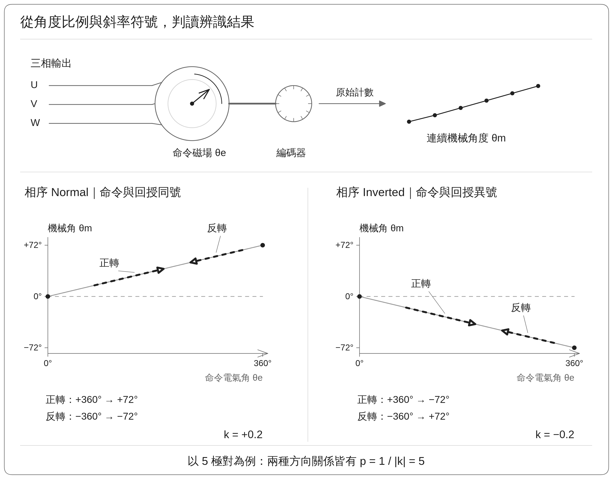

圖中以 5 極對為例，把正轉與反轉沿同一條角度關係線標示；線的陡緩決定比例，正負斜率決定 Normal 或 Inverted。

這個方向結果反映相線配置、機械安裝與編碼器原始方向共同形成的關係，不能單憑 Inverted 就認定某兩條相線接錯。若四段轉動方向關係不一致，或未通過品質檢查，本次辨識便沒有有效結論。通過辨識後，後續換相偏移量測才負責找出電氣零點的位置。

## 4. 實測數據

### 4.1 一次完整測試內的四段轉動結果

本節使用 Renesas EVK 與上述測試馬達的一次四段旋轉辨識結果。四段轉動包含正轉、反轉、更換磁場起點後再正轉與反轉，並非四次彼此獨立的完整測試。

| 量測段 | 磁場測試方向 | 極對數估計 | 機械角／電氣角的估計斜率 | 方向判定 |
| --- | --- | ---: | ---: | --- |
| 第 1 段 | 正向 | 4.998 | +0.2001 | Normal |
| 第 2 段 | 反向 | 4.979 | +0.2008 | Normal |
| 第 3 段 | 正向 | 4.950 | +0.2020 | Normal |
| 第 4 段 | 反向 | 5.024 | +0.1990 | Normal |

| 彙整項目      |           保存數值 | 解讀               |
| --------- | -------------: | ---------------- |
| 四段轉動極對數平均 |          4.988 | 接近整數 5           |
| 四段轉動差異指標  |          1.48% | 描述同一次測試內的比例分散程度  |
| 最終極對數判定   |              5 | 可供後續參數套用         |
| 最終方向判定    |         Normal | 磁場與編碼器的方向關係一致    |
| 機械轉動量     |       約 72.23° | 接近磁場轉一圈時的理論機械轉動量 |
| 5 極對的理論值  | 360° ÷ 5 = 72° | 作為量級與比例比較基準      |
由表內四捨五入後的極對數重算，平均約為 4.988，差異指標約為 1.48%。

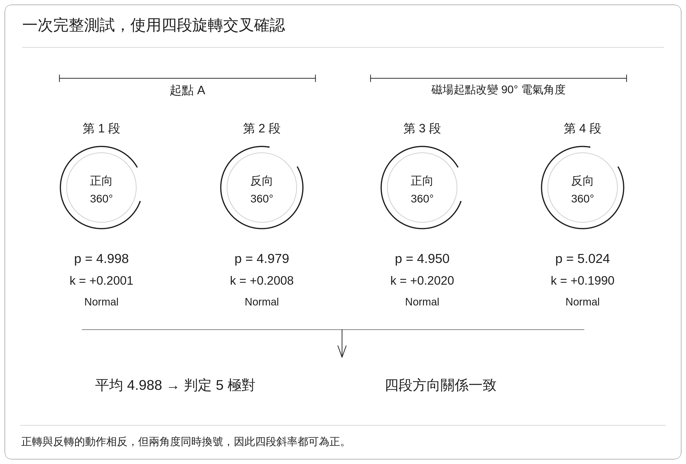
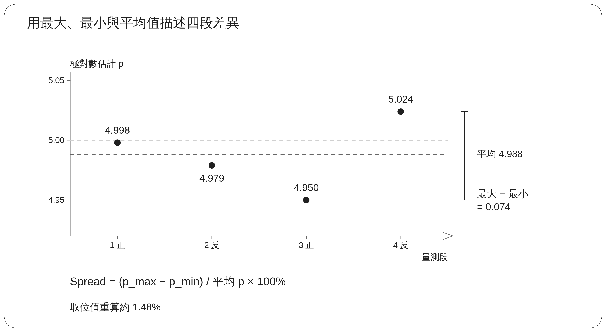

### 4.2 極對數與方向圖

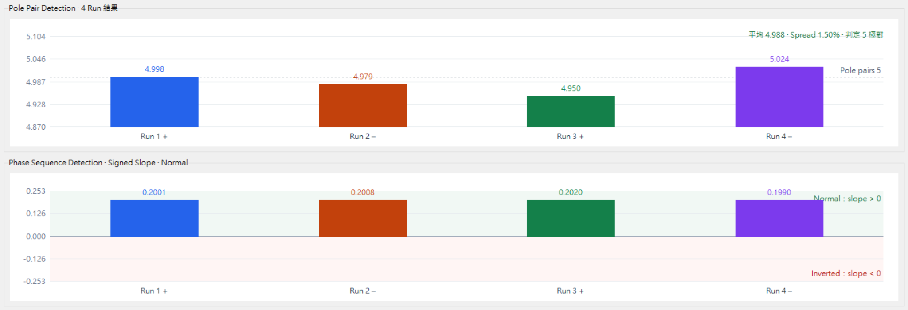

上半部的參考虛線為 5 極對，四段轉動估計均在其附近。下半部的斜率全部為正，表示無論磁場正轉或反轉，編碼器都以一致的方向關係跟隨。

## 5. 結果

### 5.1 目前能支持的結論

這組四段轉動測試支持受測馬達為 **5 極對**，且在該次相線配置與編碼器方向下，辨識結果為 **Normal**。四段轉動資料提供同一次流程內的方向及比例一致性檢查。

| 驗證事項              | 目前狀態              |
| ----------------- | ----------------- |
| 正反向與兩組磁場起點的比例辨識   | 已取得四段轉動測試接近 5 的結果 |
| Normal 方向辨識       | 此組資料通過            |
| 多次完整執行的一致性        | 尚未有足夠統計           |
| Inverted 配置及修正後行為 | 尚待實機驗證            |
| 此組結果是否成功套用        | 結果摘要未附獨立套用確認      |
| 斷電後參數是否保留         | 尚未提供驗證            |

### 5.2 後續驗證與功能銜接

後續應改變起始位置並重複完整測試，觀察最終極對數、方向與失敗原因是否一致。再建立方向相反的配置，確認系統能辨識 Inverted，並驗證修正後的輸出與回授方向一致。

### 5.3 實作追溯資訊

共用旋轉流程、角度展開與品質檢查對照 `motor_measurement_rotation.c`，參數套用與方向管理位於 `con5_motor_test.c` 及 `motor_commissioning_map.c`。

