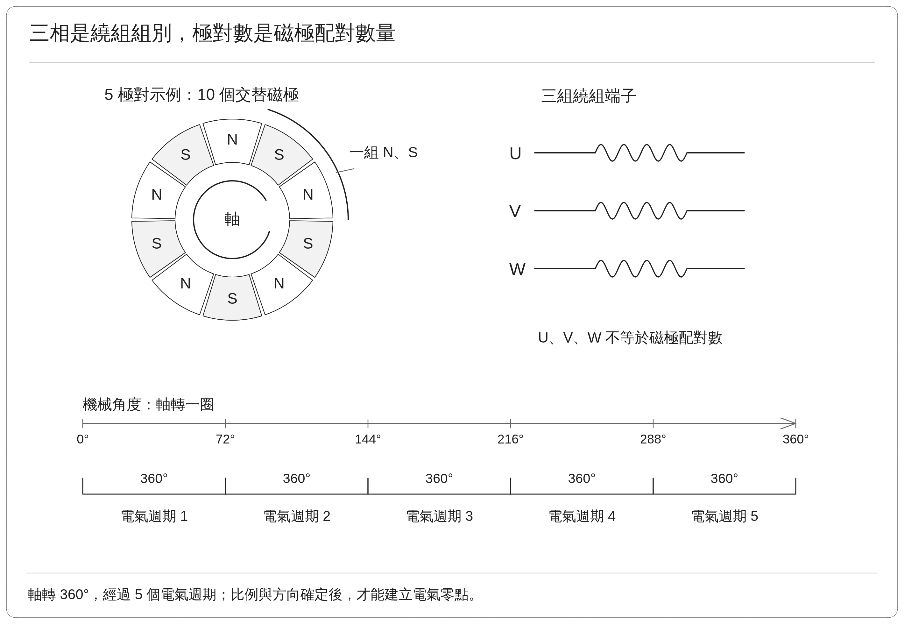
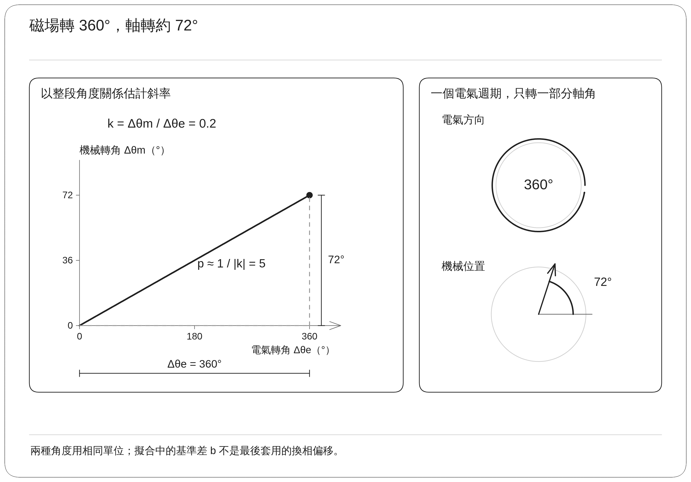
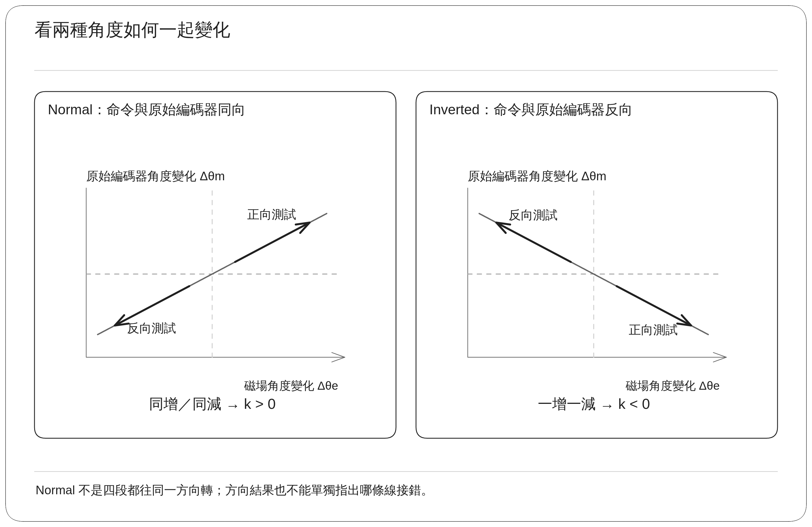
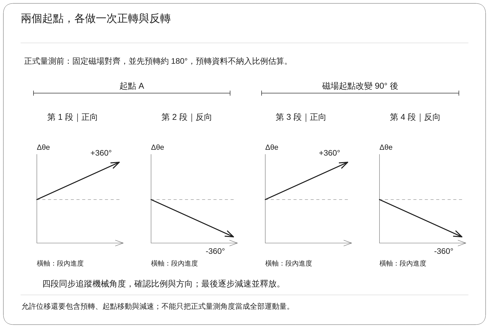
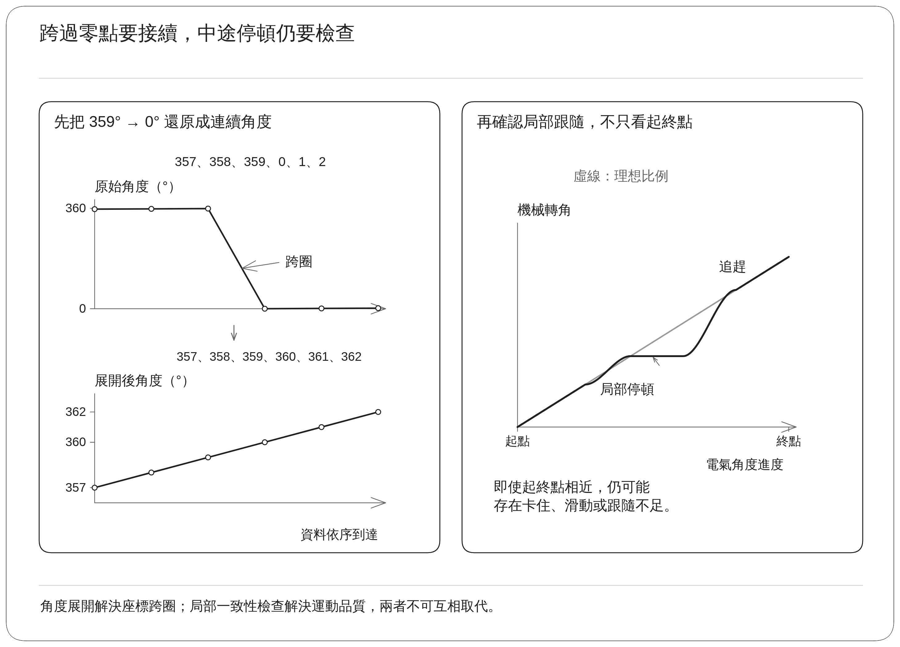
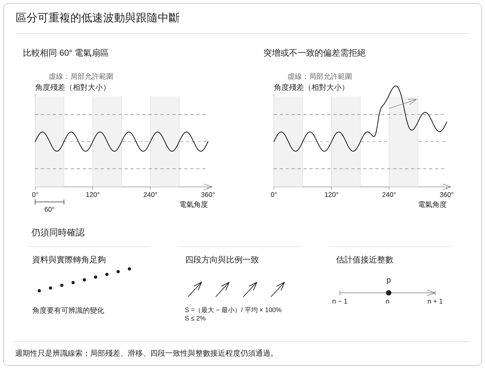
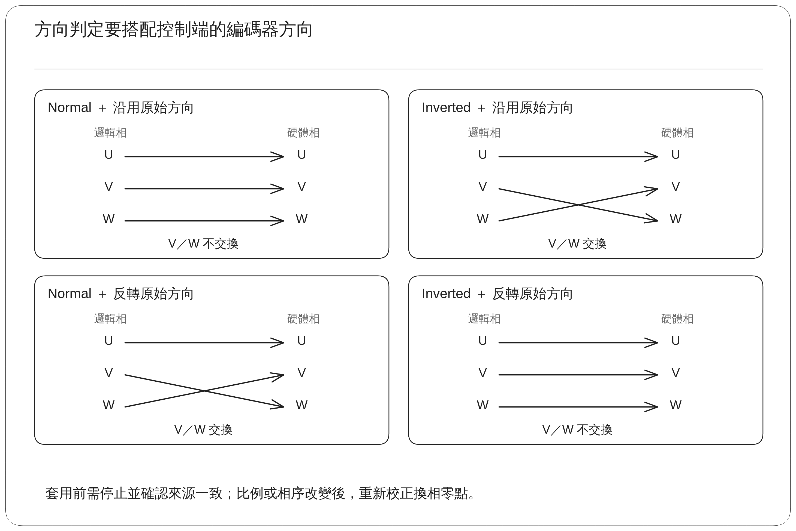
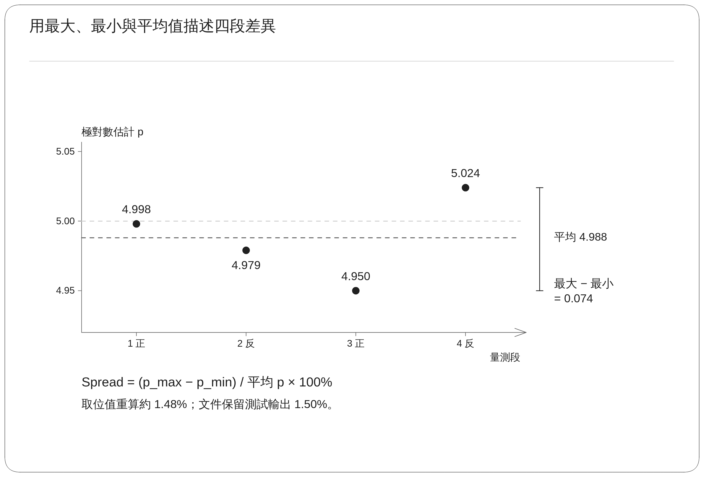
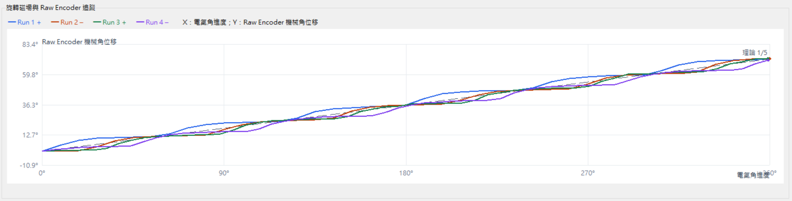

## 1. 功能用途

控制器需要把馬達軸的實際轉角，換算成控制磁場所使用的角度。這個換算要先確定兩件事：**軸轉一圈對應多少個磁場週期，以及磁場命令與軸角度的正方向是否一致。**

| 功能 | 解決的問題 | 例子 |
| --- | --- | --- |
| 極對數偵測 | 確認機械轉動與電氣週期之間的比例 | 5 極對代表軸轉一圈，經過 5 個電氣週期 |
| 相序偵測 | 確認目前相線配置與編碼器的方向關係 | 磁場命令正向移動時，編碼器角度是否也增加 |

### 1.1 基本名詞與功能範圍

機械角度是馬達軸真正旋轉的角度，一圈為 360°。電氣角度是描述磁場週期的角度，每經過一組 N、S 磁極便完成一個週期。極對數是這種磁極配對的數量；它與 U、V、W 三組繞組所代表的「三相」不同。

編碼器是量測軸位置的感測器。本文的相序辨識比較三相輸出所形成的旋轉方向與編碼器角度方向，觀察到的是接線、機械安裝及編碼器方向共同形成的關係。方向相反時，仍需檢查配置，才能進一步區分原因。

這兩項功能是 Commutation Offset Detection 馬達初始量測系列的一部分。它們先建立比例與方向，後續的換相偏移校正才能建立正確的電氣零點。測試平台為 Renesas RZ/T2M 馬達控制評估板（EVK），搭配 Tamagawa TSM3101N2001E020 馬達及馬達端編碼器。

上方分開標示磁極配對與三組繞組；下方以 5 極對為例，將一圈機械角度對照五個電氣週期。

## 2. 量測原理

### 2.1 用旋轉磁場建立可比較的命令與回授

驅動器慢慢改變三相輸出，建立方向持續移動的磁場。若轉子能穩定跟隨，就可以比較「命令磁場轉了多少」與「編碼器量到軸轉了多少」，得到比例及方向。

此流程採用開迴路旋轉激勵，意思是磁場依預定軌跡移動，不先依賴待辨識的極對數與換相偏移來完成正常轉矩控制。編碼器與電流回授仍用於觀察跟隨品質及保護，開迴路並不表示可以省略這些回授。

命令角度描述的是控制器安排的磁場方向。低電壓輸出、摩擦及負載都可能使轉子短暫落後，因此比例計算必須搭配跟隨品質檢查。

圖中使用兩條相對角度曲線說明命令與跟隨反應；辨識時比較兩者比例，並檢查落後或中斷是否在允許範圍內。

### 2.2 極對數由轉動比例求得

在轉子跟隨正常時：

$$
p\approx\left|\frac{\Delta\theta_e}{\Delta\theta_m}\right|
$$

| 符號 | 意義 |
| --- | --- |
| $p$ | 極對數 |
| $\Delta\theta_e$ | 命令磁場的電氣轉角 |
| $\Delta\theta_m$ | 編碼器量得的機械轉角 |

兩個角度必須使用相同單位。例如磁場轉過 360°，軸轉過約 72°，便得到：

$$
p\approx\frac{360^\circ}{72^\circ}=5
$$

實作使用整段資料求得機械角對電氣角的斜率 $k$，即每增加一單位電氣角度，機械角度平均改變多少，再取 $p\approx1/|k|$。這可降低單一開始點或結束點雜訊對結果的影響。

### 2.3 相序由方向關係判斷

| 觀察到的關係 | 斜率符號 | 辨識結果 |
| --- | --- | --- |
| 磁場正轉時編碼器增加，磁場反轉時編碼器減少 | 正 | Normal，兩者方向定義一致 |
| 磁場正轉時編碼器減少，磁場反轉時編碼器增加 | 負 | Inverted，兩者方向定義相反 |

正常的正轉段與反轉段，實際運動方向本來就相反。但在兩段之中，機械角與電氣角的變化量會同時換號，因此比值仍為正。四段都判為 Normal，指的是方向關係一致，而非四段都往同一機械方向旋轉。

## 3. 實作

### 3.1 四段正反向測試

PC 測試工具透過 CON5 通訊介面下達要求，韌體負責磁場輸出、連續角度追蹤與品質檢查。開始前需要有效電流與位置回授，並確認測試所需的轉動範圍沒有被機械限制阻擋。若轉子無法跟隨，就無法利用命令與回授比例辨識極對數。

| 階段 | 為什麼需要 | 實際處理 |
| --- | --- | --- |
| 確認起點 | 排除殘留電流或無效位置資料 | 確認電流接近基準，編碼器資料有效且持續更新 |
| 固定磁場對齊 | 降低任意停留位置對起步的影響 | 建立固定方向磁場，等待轉子穩定 |
| 預先轉動 | 減少靜止摩擦與起步瞬間對正式估算的干擾 | 每段正式量測前，先轉過約 180° 電氣角度 |
| 第 1、2 段量測 | 比較兩個旋轉方向 | 分別正向、反向各量測 360° 電氣角度 |
| 更換磁場起點 | 檢查比例是否過度依賴單一起始狀態 | 將磁場起點移動 90° 電氣角度 |
| 第 3、4 段量測 | 再檢查另一組起始狀態下的結果 | 再完成正向與反向量測 |
| 彙整與釋放 | 確認資料一致性並停止激勵 | 檢查四段比例與方向，形成結果後降低輸出 |

表中 180°、90° 與 360° 都是電氣角度。對 5 極對馬達而言，90° 電氣角度理想上對應 18° 機械角度。實際流程還包含對齊、預轉與換向，因此不能只用正式量測的淨位移估計整段測試所需的活動空間。

### 3.2 連續角度如何建立

編碼器單圈角度從接近 360° 跨到 0° 時，軸可能仍在持續正轉。若直接相減，就會產生接近 −360° 的假跳變。因此實作先把跨圈讀值接續成連續角度，再用它計算位移、方向與斜率。這種處理稱為角度展開。

圖中以 357°、358°、359°、0°、1°、2° 的角度範例說明跨圈接續；右側呈現局部停頓後追趕的跟隨情境。

辨識過程使用馬達端尚未套用既有方向修正的編碼器讀值，避免舊的設定先把方向反轉，掩蓋正在量測的實際關係。資料也必須保持更新；位置停留不變，可能是軸未動，也可能是通訊未更新，兩者需要區分。

### 3.3 品質檢查與低速波動處理

| 檢查項目 | 要排除的情況 | 處理原則 |
| --- | --- | --- |
| 資料量與實際轉角 | 軸幾乎沒動，卻從小幅雜訊算出比例 | 資料或轉動量不足時不接受估算 |
| 整段與局部比例 | 某一段卡住或突然追趕，導致單一平均值誤導 | 比較整段及局部區間的跟隨關係 |
| 異常反向與滑移 | 轉子沒有連續跟上命令 | 出現超出容許範圍的反向或跟隨中斷時拒絕結果 |
| 四段比例與符號 | 結果過度依賴方向或起點 | 四段方向須一致，比例差異須在允許範圍內 |
| 接近整數 | 得到不符合磁極配對數量的結果 | 通過品質檢查後，才接受接近的整數極對數 |

低速、低電壓測試可能出現每隔一段電氣角度就重複的轉動波動。可核對的實作包含以 60° 電氣扇區比較相同位置反應的處理，用來區分可重複的週期性偏差與真正的跟隨中斷。扇區是把一個電氣週期分成數段的表示方式。

這項處理仍保留局部比例及殘差限制。殘差是量測角度與估計關係的差距；若差距過大，或出現不一致的滑移，就不能因為波形「看起來有週期」而接受。

四段差異的計算方式為：

$$
S=\frac{p_{\max}-p_{\min}}{\bar p}\times100\%
$$

$\bar p$ 是四段極對數估計的平均值。核對版本的此項門檻為 2%，但通過這一項仍須同時滿足前述跟隨品質與整數接近程度。差異小描述的是同一次測試內的一致程度，不能代替絕對精度或多次完整測試。

圖中以相對殘差形狀說明可重複波動與跟隨中斷的差異；2% 是四段差異指標的門檻，不是上方局部殘差的角度門檻。

### 3.4 辨識結果如何套用

辨識與套用是兩個步驟。辨識先回答馬達看起來有幾組磁極、方向如何；套用則更新控制器之後實際採用的參數。

| 功能 | 套用前的確認 | 套用內容與後續動作 |
| --- | --- | --- |
| 極對數 | 量測有效、馬達已停止，結果仍對應目前配置 | 更新運行中的極對數，接著確認相序及換相偏移 |
| 相序 | 辨識的極對數與目前設定一致，方向資料有效 | 依量得方向及既有編碼器極性，決定是否調整 V／W 的軟體對應 |
| 換相偏移 | 比例與方向關係確定 | 重新建立電氣零點，之後再驗證正常轉動 |

編碼器極性是控制器對編碼器正負方向的設定。若既有極性已經反轉，是否交換 V／W 必須一併考慮，不能只看到 Inverted 就再做一次不加判斷的反轉。

軟體相序修正需一致處理輸出與對應的電流回授。只改其中一端會使控制器以不一致的座標解讀資料。可核對的實作提供共同對應機制，使用時應沿用該機制。

更改極對數、相序或編碼器方向後，舊換相偏移可能已不適用。參數管理會要求重新確認相關校正。運行中的參數放在 RAM，也就是斷電後通常不會保留的工作記憶體；永久保存需要另外的儲存及重新上電驗證。

## 4. 實測數據

### 4.1 一次完整測試內的四段結果

本節保存 Renesas EVK 與上述測試馬達的一次四段旋轉辨識結果。四段包含正轉、反轉、更換磁場起點後再正轉與反轉，並非四次彼此獨立的完整測試。

這組結果摘要沒有列出完整電壓、電流、速度與逾時設定，也未附精確執行版本，因此以下數值用於說明已觀察到的辨識表現。實機重現時仍需補齊當次設定，不應套用其他日期測試的限制值。

| 量測段 | 磁場測試方向 | 極對數估計 | 機械角／電氣角的估計斜率 | 方向判定 |
| --- | --- | ---: | ---: | --- |
| 第 1 段 | 正向 | 4.998 | +0.2001 | Normal |
| 第 2 段 | 反向 | 4.979 | +0.2008 | Normal |
| 第 3 段 | 正向 | 4.950 | +0.2020 | Normal |
| 第 4 段 | 反向 | 5.024 | +0.1990 | Normal |

| 彙整項目 | 保存數值 | 解讀 |
| --- | ---: | --- |
| 四段極對數平均 | 4.988 | 接近整數 5 |
| 四段差異指標 | 1.50% | 描述同一次測試內的比例分散程度 |
| 最終極對數判定 | 5 | 可供後續參數套用 |
| 最終方向判定 | Normal | 磁場與編碼器的方向關係一致 |
| 摘要列示的機械轉動量 | 約 72.23° | 接近磁場轉一圈時的理論機械轉動量 |
| 5 極對的理論值 | 360° ÷ 5 = 72° | 作為量級與比例比較基準 |

由表內四捨五入後的極對數重算，平均約為 4.988，差異指標約為 1.48%。本文保留驗證摘要列示的 1.50%；完整精度的底層數值未一併列出，末位差異不影響「約 1.5%」的解讀。

72.23° 是驗證摘要另列的機械轉動量，其跨段彙整算法未在摘要中說明。它可用來與理論 72° 比較，但不能聲稱 $360/4.988$ 就等於 72.23°。以整段斜率估算的比例，也不必然等於只取起終點轉角所得的比例。

### 4.2 極對數與方向圖

上半部的參考虛線為 5 極對，四段估計均在其附近。下半部的斜率全部為正，表示無論磁場正轉或反轉，編碼器都以一致的方向關係跟隨。

### 4.3 旋轉追蹤圖

橫軸表示每段磁場轉動進度，縱軸是便於比較而整理的機械轉角。正反向資料以各段進度統一呈現，所以反向曲線也朝右上方延伸，實際反轉動作並沒有改變。

曲線整體接近 5 極對的理論關係，但局部仍有停頓與波動。這支持平均轉動比例的辨識，尚不能據此認定馬達已達到平順低速運轉，或完成速度控制性能驗證。

## 5. 結果

### 5.1 目前能支持的結論

這組四段測試支持受測馬達為 **5 極對**，且在該次相線配置與編碼器方向下，辨識結果為 **Normal**。四段資料提供同一次流程內的方向及比例一致性檢查。

| 驗證事項 | 目前狀態 |
| --- | --- |
| 正反向與兩組磁場起點的比例辨識 | 已取得四段接近 5 的結果 |
| Normal 方向辨識 | 此組資料通過 |
| 多次完整執行的一致性 | 尚未有足夠統計 |
| Inverted 配置及修正後行為 | 尚待實機驗證 |
| 此組結果是否成功套用 | 結果摘要未附獨立套用確認 |
| 斷電後參數是否保留 | 尚未提供驗證 |

因此這組 PASS 表示辨識結果通過；要確認控制器已使用新參數，仍需讀回運行設定。若要確認永久保存，還需檢查重新上電後的設定。

### 5.2 後續驗證與功能銜接

後續應改變起始位置並重複完整測試，觀察最終極對數、方向與失敗原因是否一致。再建立方向相反的配置，確認系統能辨識 Inverted，並驗證修正後的輸出與回授方向一致。

每次更新比例或方向後，依 [04_Commutation_Offset_換相偏移校正](04_Commutation_Offset_%E6%8F%9B%E7%9B%B8%E5%81%8F%E7%A7%BB%E6%A0%A1%E6%AD%A3.md) 重新建立電氣零點，再以實際啟動與低速運轉確認控制行為。只完成比例及方向辨識，尚未完成編碼器精度校正或齒槽轉矩補償；後者是用額外轉矩抵消馬達隨位置變化的磁性阻力。

### 5.3 實作追溯資訊

共用旋轉流程、角度展開與品質檢查對照 `motor_measurement_rotation.c`，參數套用與方向管理位於 `con5_motor_test.c` 及 `motor_commissioning_map.c`。

