## 1. 功能用途

編碼器能告訴控制器「馬達軸現在轉到哪裡」，但編碼器安裝時的 0°，通常不會剛好對應馬達磁場的電氣 0°。控制器需要知道這兩個零點的關係，才能在轉子轉動時，安排合適方向的三相電流。

**換相偏移校正，就是找出編碼器角度與電氣零點之間的固定差值。** 校正後，控制器會在角度換算時扣除這個差值，讓編碼器讀值對應到正確的磁場位置。若這個對應不準確，同樣的電流可能產生較少的轉矩，也可能讓馬達發熱或轉動不平順。

### 1.1 比例、方向與零點

要讓零點校正有意義，角度的換算比例與正反方向必須先確定。可以把編碼器想成裝在馬達軸上的角度尺；使用這把尺時，控制器需要依序知道三件事：**一圈要換算成幾個磁場週期、角度增加代表哪個方向，以及尺上的哪個位置對應電氣零點。**

極對數提供換算比例；相序與編碼器方向的確認，建立正反方向的關係；本篇的換相偏移校正，則在這些關係確定後找出零點。因此，開始前應先完成接線檢查，並確認極對數與方向配置。

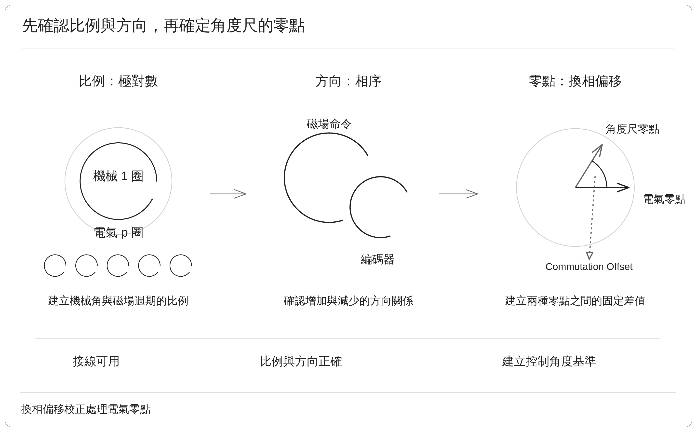

圖由左至右分別表示比例、方向與零點。前兩項確定後，右側的零點差才有一致的換算依據。

### 1.2 機械角度與電氣角度

了解換相偏移前，先要知道角度數字使用哪一種刻度。機械角度看的是馬達軸轉了多少；電氣角度看的是磁場經過了多少個週期。以下用一顆 **5 極對馬達**作為例子，說明這兩種刻度與換相偏移的關係。

| 名稱 | 用來描述什麼 | 怎麼理解 |
| --- | --- | --- |
| 機械角度 | 馬達軸的位置與轉動量 | 軸轉一圈為 360° |
| 電氣角度 | 磁場週期中的位置與變化 | 5 極對馬達的軸每轉 72°，便經過一個 360° 電氣週期 |
| 換相偏移 | 編碼器零點與控制器電氣零點之間的固定差值 | 先把編碼器讀值換成電氣角度，才能比較兩個零點的差距 |

對 5 極對馬達而言，機械角度乘以 5，就是對應的電氣角度。這一步讓兩把角度尺使用相同的刻度；接著扣除換相偏移，才能讓零點也對應起來。

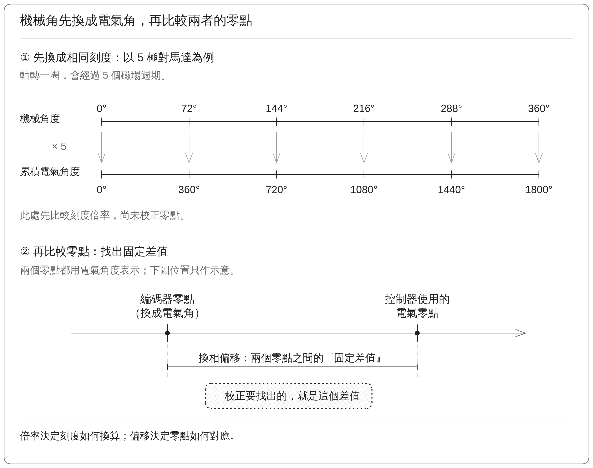

圖上方的兩把刻度尺一一對應：機械 72° 對應電氣 360°，機械 360° 則對應累積電氣 1800°。下方以兩個零點之間的距離，表示尚待量出的換相偏移。這個差值用來修正角度換算的基準。

## 2. 量測原理

知道換相偏移代表什麼之後，接著要了解如何把它量出來。方法是先用固定磁場建立已知方向，再將對應的編碼器讀值換算成零點差值。

### 2.1 固定磁場建立已知方向

要量出兩個零點的差距，需要建立一個已知的方向。驅動器建立方向固定的磁場，讓轉子受磁力牽引，逐漸靠近這個方向。若以電氣 0° 作為固定磁場方向，而轉子也確實對齊，此刻的編碼器讀值就提供了「電氣 0° 在角度尺上哪裡」的位置。

不過，摩擦、外部負載或機械阻擋，都可能讓轉子提早停住。**位置讀值穩定，只能說明轉子沒有明顯移動；還需要確認它能可靠地靠近磁場方向。**

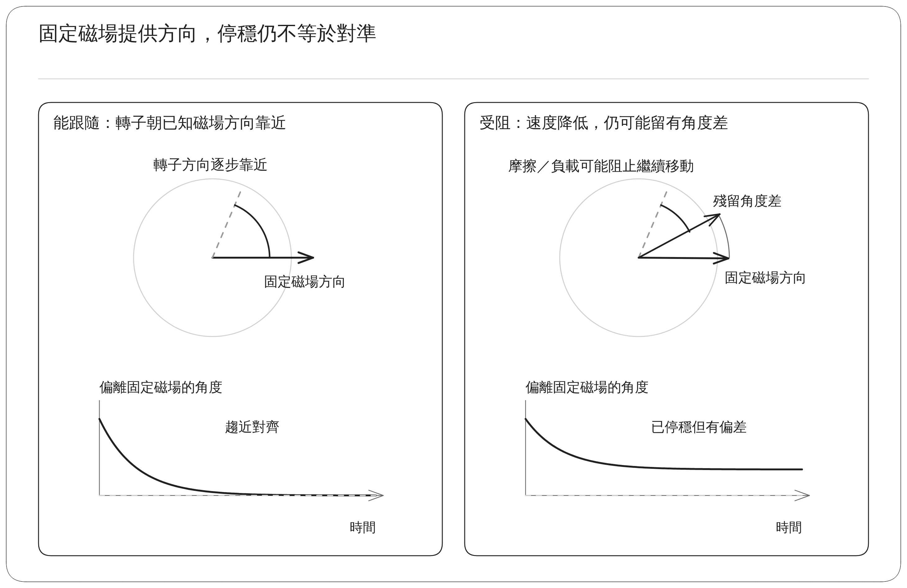

左圖的轉子逐漸靠近固定磁場，下方的角度差也趨近零；右圖的轉子雖然停住，卻仍與磁場方向留有差距，下方曲線便停在零以上。固定磁場提供已知方向；要用它建立可靠的零點，轉子還必須能靠近並穩定停留在這個方向。

### 2.2 計算零點位置

轉子對齊電氣 0° 時，編碼器的讀值通常仍不是 0°。這一步要找出應扣除的固定偏移，讓控制器能把這個對齊位置換算成電氣 0°。

以下使用一個假設範例：馬達有 **5 極對**，正反方向已確認；轉子確實對齊電氣 0° 後，編碼器讀到 **100° 機械角度**。圖與內文都沿用這個位置，分成兩步說明。

**① 算出要記下的固定偏移**

先把編碼器的機械角度乘以極對數，換成電氣角度：

$$
100^\circ\times5=500^\circ
$$

電氣角度每隔 360° 就回到相同的磁場方向，因此可以去掉完整圈數，只保留一圈內的位置。500° 包含一個完整的 360°，以及剩下的 140°：

$$
500^\circ-360^\circ=140^\circ
$$

所以，本例要記下的**換相偏移為 140° 電氣角度**。「去掉完整圈數、保留一圈內的位置」稱為折回一圈；它是在整理角度的表示方式，馬達軸的位置並沒有因此改變。

**② 核對同一個位置是否換算為電氣 0°**

現在仍使用機械角度 100°，先乘以 5，再扣除剛才記下的 140° 偏移：

$$
100^\circ\times5-140^\circ=360^\circ
$$

360° 正好是一個完整的電氣週期，折回一圈後就是 0°。因此，同一個對齊位置得到 **0° 電氣角度**，與建立磁場時的基準一致。

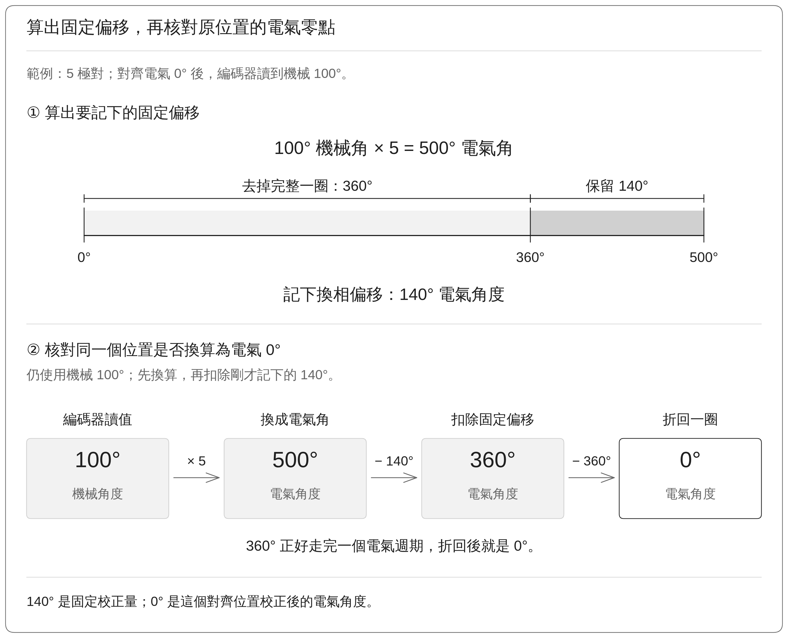

圖上半部將 500° 拆成「完整一圈 360°」與「保留的偏移 140°」；下半部用同一個機械讀值，依序換算、扣除偏移，再折回 0°。**140° 是固定的校正量，0° 則是這個位置校正後的電氣角度。**

此後讀到新的編碼器角度，也都沿用這個固定偏移，依序完成倍率換算、扣除偏移與折回一圈。

## 3. 實作

實際馬達會受到起始位置、摩擦與負載影響，因此需要一套固定流程，讓對齊、等待與讀取角度有明確的先後順序。以下依序說明校正動作、穩定條件、取角時點與結果處理。

### 3.1 流程的四個動作

為了降低任意起始位置對校正的影響，流程先讓轉子靠近一個已知方向，再帶到用來建立零點的方向。兩次對齊各搭配一次釋放，共形成四個動作。

實際操作時，由測試工具啟動校正，控制器負責建立磁場、讀取編碼器並回報結果。開始前，電流與編碼器資料必須有效，極對數與方向已確認，軸也要有足夠的活動空間。

流程先把轉子帶到 90° 電氣方向附近，再轉向最後需要的 0° 基準。兩次對齊之間先降低電流，讓磁場方向能在電流命令歸零後切換。以下將四個動作標為 A、B、C、D，後續圖面沿用相同標記。

| 動作       | 磁場與電流如何變化               | 這一步的目的                 |
| -------- | ----------------------- | ---------------------- |
| A：對齊 90° | 保持 90° 電氣方向，逐步增加電流並等待穩定 | 先重新定位，降低任意起始位置對最後對齊的影響 |
| B：釋放 90° | 方向保持不變，將電流命令逐步降回零       | 銜接下一個磁場方向              |
| C：對齊 0°  | 改為 0° 電氣方向，再逐步增加電流並等待穩定 | 建立最後的零點基準              |
| D：釋放 0°  | 保持 0° 電氣方向，將電流命令逐步降回零   | 結束對齊，準備讀取角度與計算結果       |

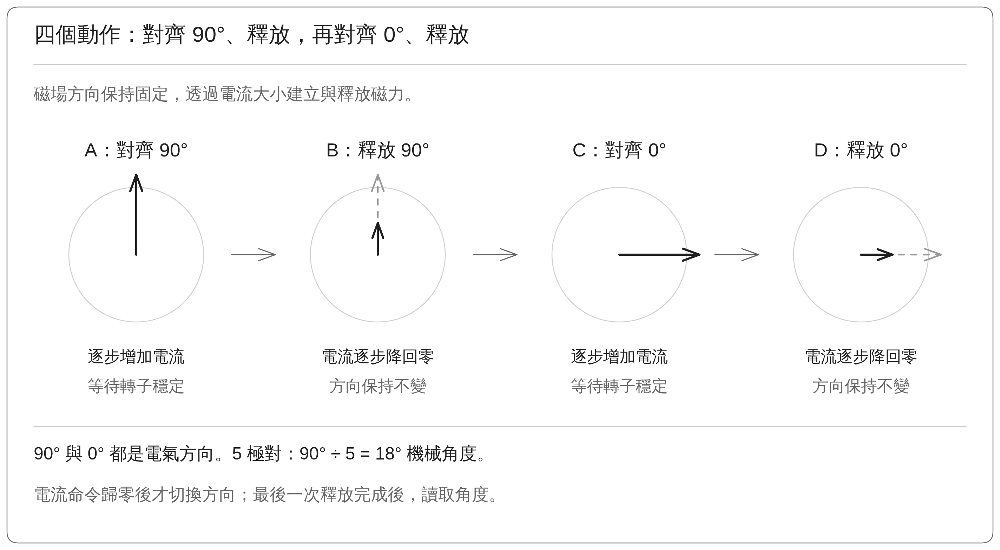

圖中向上與向右的箭頭分別表示 90°、0° 電氣方向；釋放時箭頭縮短，表示電流逐漸降低，方向仍保持不變。**這裡的 90° 是電氣方向差。** 對 5 極對馬達而言，90° 電氣方向差理想上對應約 18° 機械角度；實際位移還會受到起始位置與跟隨情況影響。

### 3.2 轉子穩定判斷

轉子仍在移動，或磁力尚未充分建立時，位置讀值都可能繼續變化。因此，每次對齊都需要確認狀態已穩定，才能進入釋放。

對齊時，電流逐步增加，以減少突然拉動轉子的情況。若轉子移動過快，系統會先降低電流。當準備結束 A 或 C 的對齊動作時，會同時確認「轉得夠慢」與「電流命令已接近目標」，並維持一小段時間。表中的 rpm 表示每分鐘轉數。

| 確認項目 | 目前條件 | 用意 |
| --- | --- | --- |
| 轉子移動已很小 | 經處理的轉速在 −0.5 到 +0.5 rpm 之間 | 避免仍在明顯轉動時結束對齊 |
| 對齊電流命令已建立 | 命令達到目標的至少 95% | 避免磁力尚未建立到預定程度就結束 |
| 狀態持續成立 | 上述兩項同時成立約 150 ms，即 0.15 s | 排除只在某個瞬間碰巧符合的情況 |

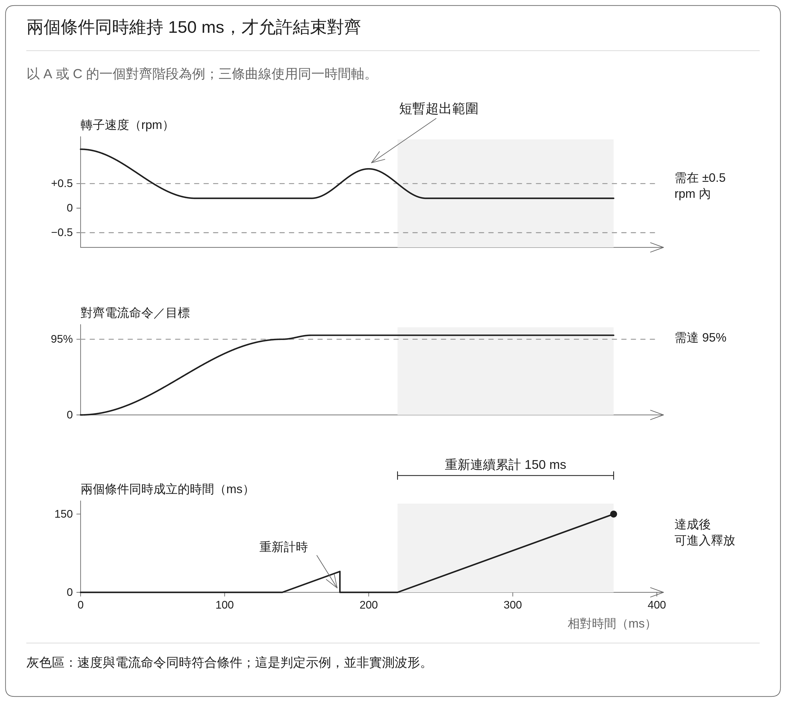

圖中的三條曲線使用同一條時間軸。上方是轉速，中間是電流命令，下方是兩個條件同時成立的累計時間。轉速短暫超出範圍時，下方計時歸零；灰色區表示重新連續符合 150 ms，之後才允許進入釋放。這張圖用來說明判定方式。

對齊目標電流取「馬達額定電流」與「測試電流上限的 80%」之中較小者。上述 95% 檢查的是**電流命令**；實際電流是否準確跟上，仍需用同時取得的回授資料確認。全程也會監看電流、速度、位移、時間與回授狀態，發生異常時結束測試。

### 3.3 取得角度結果

即使對齊時已經穩定，轉子仍可能在電流降低後移動。要理解最後的校正值，就必須先知道系統在哪個時點讀取角度。

目前實作在 **D：釋放 0° 結束後，才讀取當時的編碼器角度**，接著計算換相偏移。因此，必須把「C 階段靠磁場保持的位置」與「D 結束時真正讀到的位置」分清楚。

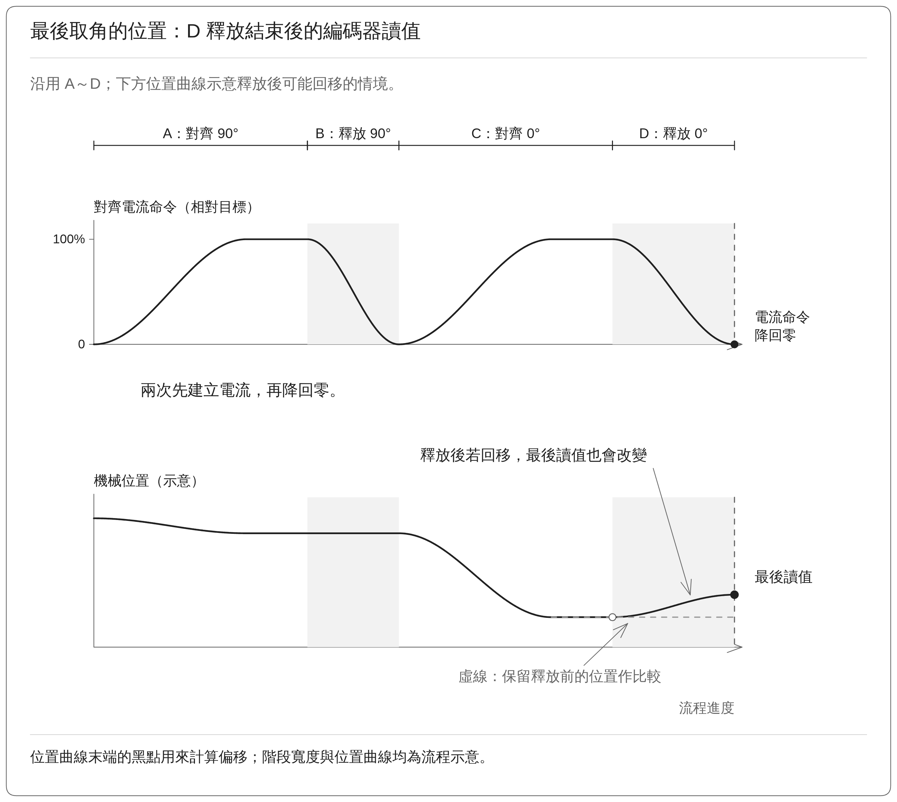

轉子在電流降低後，可能因外力、摩擦或磁極與齒槽之間的吸引力而移動。因此，應比較釋放前後角度，確認最後讀到的位置仍足以代表原本要建立的零點。

### 3.4 完成或中止後，如何處理結果

新的偏移會影響控制器之後如何判讀馬達位置，因此必須先確認校正完整結束，才能用它更新原設定。

角度換算完成後，控制器先停止輸出，再確認流程狀態。如果條件正常，便使用新的偏移；若中止或失敗，則不接受這次的新值，保留測試前的設定。

保留設定的用意，是避免不完整的測試結果覆蓋原值。但若極對數、方向或安裝關係已經改變，先前的偏移仍需重新校正。控制器目前使用的偏移放在工作記憶體（RAM）。要讓新值在斷電後仍能使用，還需要完成儲存，並確認重新開機後能正確載入。

## 4. 實測數據

上述說明了「應該如何校正」，以下為實際測試條件與結果，再核對計算、觀察轉動過程，最後確認新值的使用與保存狀態。

### 4.1 一次完整校正得到什麼結果

要解讀一次校正，需先知道測試條件，以及每個數字代表什麼。下面整理已保存的一次完整結果，作為計算與曲線判讀的依據。

此處測試使用 Renesas RZ/T2M 馬達控制評估板（EVK），搭配 Tamagawa TSM3101N2001E020 馬達與馬達端編碼器，由 PC 測試工具透過 CON5 通訊介面啟動。流程依序完成 A～D 四個動作。

| 項目        |     數值或狀態 | 如何解讀               |
| --------- | --------: | ------------------ |
| 執行結果      |      PASS | 該次流程完成，控制器目前已使用新偏移 |
| 校正前偏移     |   180.00° | 測試前使用的電氣角度校正值      |
| 校正後偏移     |   214.07° | 本次算出的電氣角度校正值       |
| 最終編碼器角度   |  258.813° | 計算偏移所對應的機械角度       |
| 極對數       |         5 | 機械角換成電氣角的倍率        |
| 相對起點的機械位移 |  −17.444° | 起點到終點的淨位移          |
| 完成時間      |   6.305 s | 包含對齊、等待穩定與釋放       |
| 保存的最大相電流  |   0.357 A | U、V、W 相電流的峰值統計     |
| 對齊目標電流    |   0.400 A | 對齊時希望建立的電流命令       |
| 測試電流上限    |     0.5 A | 本次電流限制設定           |
| 最大轉速絕對值   | 47.73 rpm | 對齊移動過程中的速度峰值大小     |

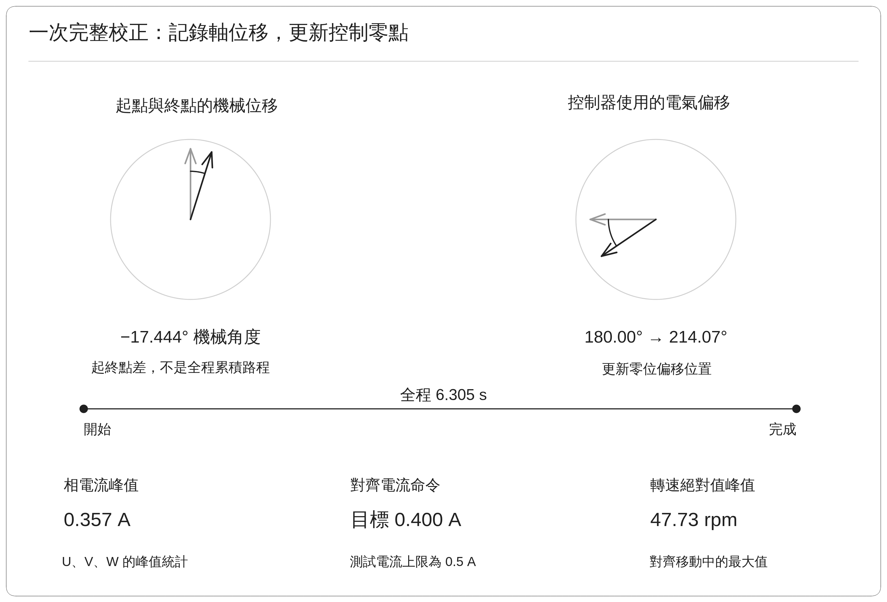

圖左側的 −17.444° 描述「軸移動了多少」，右側描述控制器的角度基準從原先的 180.00° 改為新量測出的偏移植 214.07°。前者是機械位移，後者是電氣偏移，不能直接視為同一個角度變化。

### 4.2 結果說明

為了確認表中的偏移與編碼器讀值能對應起來，可以依照前述換算方式重新計算。將最終機械角度 258.813° 乘以 5 極對：

$$
258.813^\circ\times5=1294.065^\circ
$$

其中包含三個完整的電氣週期。去掉完整圈數，便得到偏移：

$$
1294.065^\circ-3\times360^\circ
=214.065^\circ\approx214.07^\circ
$$

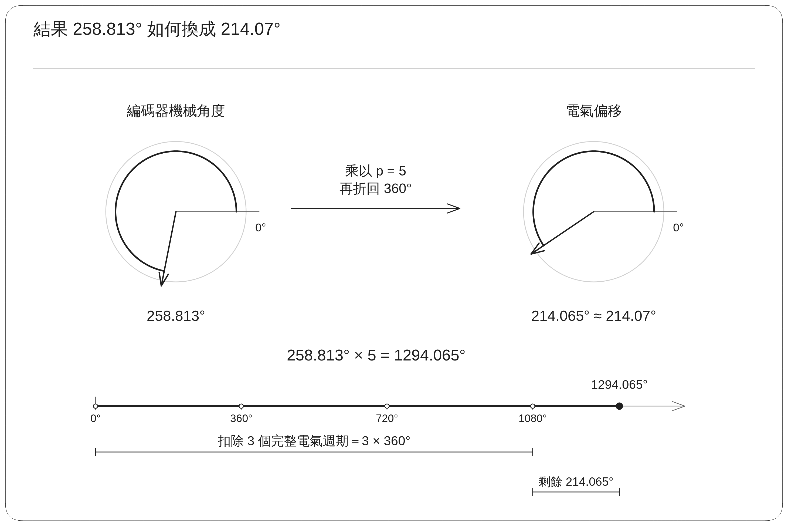

圖左圓是機械讀值，右圓是折回一圈後的電氣偏移；下方刻度尺則把 1294.065° 拆成三圈與剩餘的 214.065°。顯示到小數點後兩位，就是 214.07°。

之後軸若位於同一位置，控制器扣除這個偏移，再折回一圈，便會得到接近電氣 0° 的角度。

### 4.3 實測資料

單一結果只能告訴我們最後得到什麼；沿時間變化的曲線，才能看出軸如何移動、何時慢下來，以及校正前後的設定差異。以下依序閱讀位置、速度與偏移三張圖。

**位置圖：看軸的移動過程**

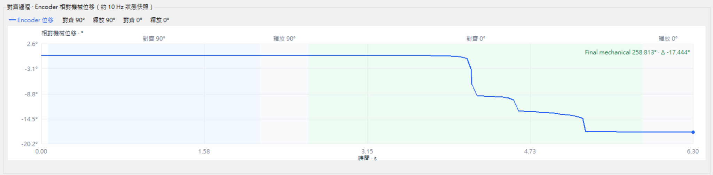

橫軸是時間，縱軸是相對起點的機械位移。主要移動發生在 C：對齊 0° 階段，最後約為 −17.444°。圖中約每 0.1 s 保存一筆狀態，適合觀察整體位移與階段變化，無法呈現所有快速細節。

**速度圖：看移動與停穩**

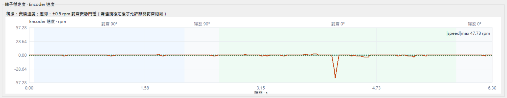

約 4.2 s 附近出現明顯的負向速度峰值，之後回到接近零。47.73 rpm 是移動期間記錄的最大速度大小；前述的 ±0.5 rpm 則用於判斷對齊能否結束，兩者對應不同時段。

## 5. 結果與後續確認

一次校正完成後，仍需要釐清這次資料能支持哪些結論，以及還有哪些項目需要確認。這能幫助我們判斷校正值是否適合持續使用，也讓下一次測試有明確的目的。

這次量測完成了固定磁場對齊、偏移計算與目前設定的更新。控制器使用的電氣偏移由 180.00° 改為 214.07°，全程約 6.305 s。

### 5.1 與其他校正功能的關係

零點對準後，馬達仍可能有其他位置誤差或轉動不平順的原因。

| 功能                           | 主要處理什麼        | 直觀理解                     |
| ---------------------------- | ------------- | ------------------------ |
| 換相偏移校正                       | 編碼器與電氣零點的固定差值 | 找出角度尺的零點應對到哪裡            |
| 編碼器精度校正                      | 不同位置的角度讀值誤差   | 確認角度尺上各段刻度是否準確           |
| 齒槽轉矩補償（Cogging Compensation） | 隨位置變化的磁力不均    | 減少馬達在某些位置特別容易停住或轉動不平順的情況 |

### 5.2 實作對照

| 內容                  | 對應程式                                      |
| ------------------- | ----------------------------------------- |
| 90°／0° 對齊順序、釋放與最終取角 | `r_motor_serial_encoder_vector_manager.c` |
| 電流調整、持續穩定判斷與結果確認    | `con5_motor_test.c`                       |
| 方向配置與偏移有效性          | `motor_commissioning_map.c`               |
