## 1. 功能用途

編碼器可以量到馬達軸的位置，但安裝後的編碼器 0°，通常不會剛好對應控制器定義的馬達電氣零點。控制器若以錯誤角度施加電流，同樣的電流可能無法有效產生轉矩，也可能增加發熱或造成運轉不穩。

**換相偏移校正透過已知方向的磁場，建立轉子與編碼器讀值的對應，再算出正常控制時需要扣除的角度。**「換相」在此指依轉子磁場位置安排三相電流方向；偏移值則是這項安排所需的角度基準。

### 1.1 在整體初始量測中的角色

Commutation Offset Detection 在本系列文件中是馬達初始量測工作的統稱，涵蓋接線、電氣參數、比例、方向及零點。本篇處理其中的換相偏移量測：接線可用、極對數與相序正確後，建立控制器使用的電氣零點。

可以把編碼器想成安裝在軸上的角度尺。極對數告訴控制器這把尺與磁場週期的換算比例，相序確認方向，換相偏移再指出尺上的哪個位置對應電氣 0°。

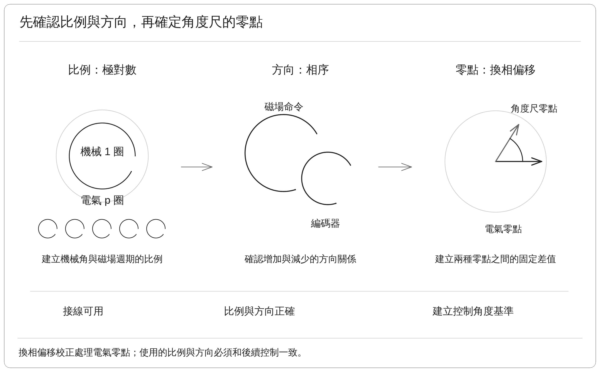

### 1.2 機械角度、電氣角度與偏移

| 名稱 | 定義 | 5 極對馬達的例子 |
| --- | --- | --- |
| 機械角度 | 軸實際旋轉的角度 | 軸轉一圈為 360° |
| 電氣角度 | 控制器描述磁場週期的角度 | 軸轉一圈，電氣角度經過 5 圈 |
| 換相偏移 | 編碼器換算後的電氣角度，與控制基準之間的固定差值 | 第 4 節的 214.07° 是電氣偏移 |

214.07° 是供控制器使用的校正值，不是要求馬達軸移到該角度的位置命令。套用前需先把編碼器機械角度乘上極對數，才能與電氣偏移相減。

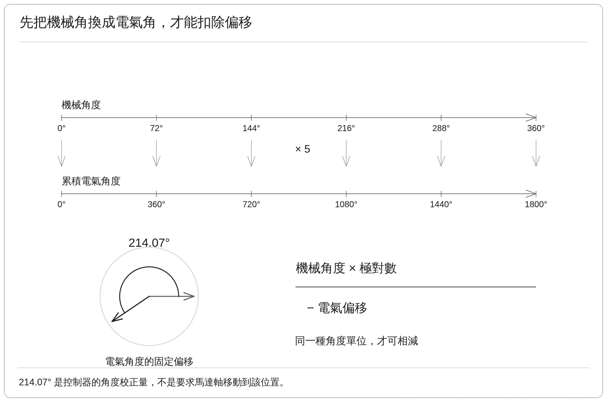

上方採用累積電氣角度顯示倍率；下方的 214.07° 表示要扣除的電氣偏移，與機械位置命令不同。

## 2. 量測原理

### 2.1 用已知磁場找出編碼器零點關係

驅動器建立固定方向的磁場，使轉子受到磁力而靠向該方向。當轉子穩定在已知的電氣 0°，此時的編碼器讀值就能作為零點換算的依據。

此方法的關鍵前提，是轉子確實能靠向磁場方向。如果摩擦、外部負載或機械限制使轉子停在偏離的位置，即使角度讀值很穩定，也可能得到帶有誤差的校正值。因此穩定檢查是必要條件，還需要重複量測與實際運轉來確認校正品質。

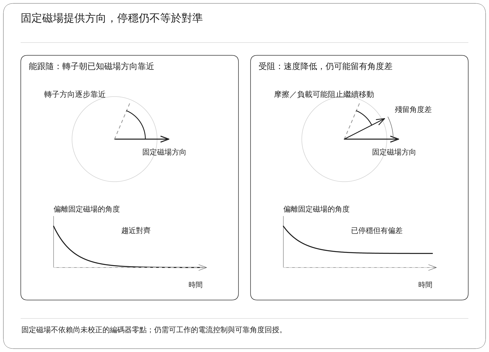

### 2.2 偏移與正常控制角度的計算

以已確認的方向定義表示編碼器角度時，偏移為：

$$
\theta_{\mathrm{offset}}
=\operatorname{wrap}_{360}\left(p\theta_{\mathrm{encoder,align}}\right)
$$

正常控制時使用：

$$
\theta_{\mathrm{control}}
=\operatorname{wrap}_{360}\left(p\theta_{\mathrm{encoder}}-\theta_{\mathrm{offset}}\right)
$$

| 符號 | 說明 |
| --- | --- |
| $p$ | 極對數，即機械轉一圈對應的電氣週期數 |
| $\theta_{\mathrm{encoder,align}}$ | 對齊流程取用的編碼器機械角度 |
| $\theta_{\mathrm{encoder}}$ | 正常控制期間當下的編碼器機械角度 |
| $\theta_{\mathrm{offset}}$ | 要扣除的電氣角度校正值 |
| $\theta_{\mathrm{control}}$ | 控制器之後使用的電氣角度 |
| $\operatorname{wrap}_{360}$ | 去掉完整圈數，將角度整理到 0° 至小於 360° |

這裡的編碼器角度應已符合目前控制配置的方向定義。若系統有設定編碼器反向或軟體相序對應，需一致套用後再計算。改變極對數、方向或安裝關係後，舊偏移通常需要重新確認。

以上公式對應最後磁場基準為電氣 0° 的流程。若未來改用其他基準角度，需要連同該基準納入計算，不能直接沿用同一式子。

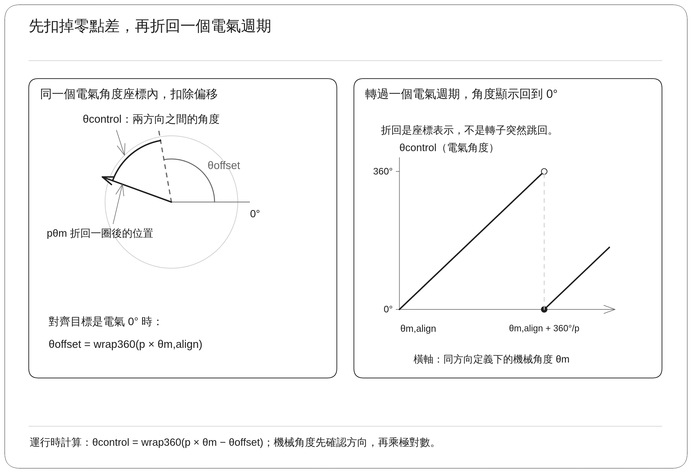

## 3. 實作

### 3.1 開始條件與固定磁場流程

測試平台為 Renesas RZ/T2M 馬達控制評估板（EVK），搭配 Tamagawa TSM3101N2001E020 馬達及馬達端編碼器。PC 工具經 CON5 通訊介面提出校正要求，韌體執行對齊、回授監控與結果套用。

開始前先確認電流與編碼器回授有效、馬達狀態允許測試，且極對數與方向配置已確定。這樣才能確保最後量得的角度對應到之後實際使用的控制座標。

| 階段 | 為什麼需要 | 實際處理 |
| --- | --- | --- |
| 保留目前設定 | 校正失敗時不能接受不完整的新結果 | 保存測試前的偏移，確認測試限制與回授 |
| 對齊 90° | 降低任意起始位置對最後對齊的影響 | 建立 90° 固定磁場，逐步增加電流並等待穩定 |
| 釋放 90° | 避免在有明顯電流時突然改變磁場方向 | 維持方向，將對齊電流命令逐步降回零 |
| 對齊 0° | 建立最後的校正基準 | 建立 0° 固定磁場，再逐步增加電流並等待穩定 |
| 釋放 0° | 完成激勵收尾 | 維持方向，將對齊電流命令降回零 |
| 取角度並計算 | 把編碼器位置換成可使用的電氣偏移 | 讀取角度、乘上極對數並整理至一個電氣週期 |
| 停止並確認套用 | 避免中止或故障後誤用新值 | 停止輸出，確認完成狀態及配置，再更新運行參數 |

90° 與 0° 都是電氣角度。先做 90° 再做 0°，提供一段受控制的重新定位過程，但仍無法保證所有負載與摩擦條件下都精準對齊。

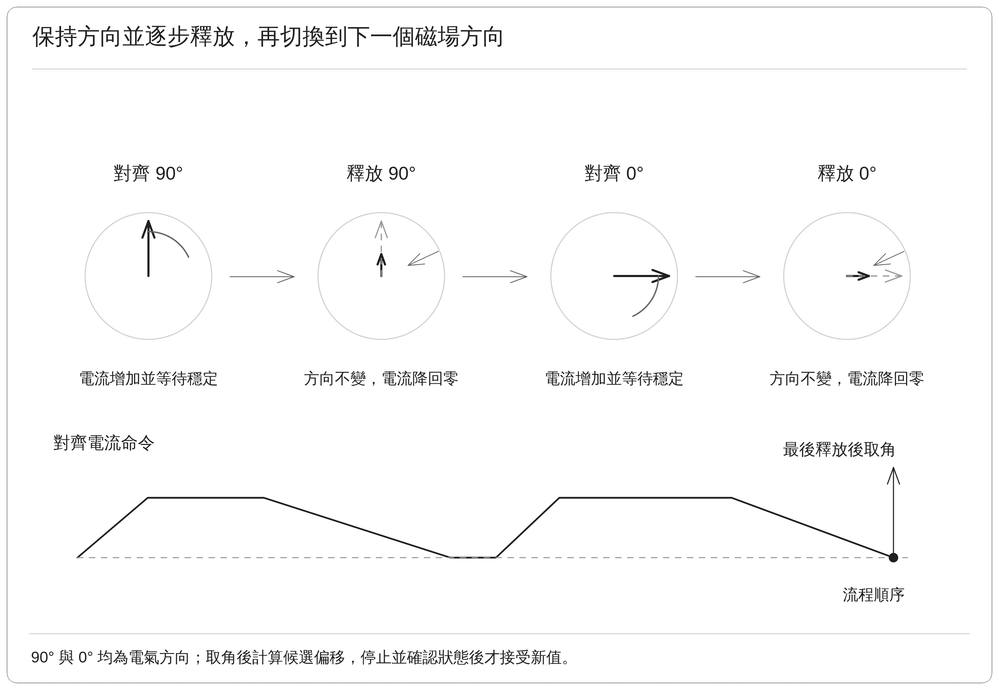

圓圖表示電氣磁場的方向，箭頭長度表示激勵建立與釋放；下方按流程順序標出最後釋放後的取角時點。

### 3.2 電流調整、穩定判斷與取值時點

為減少突然拉動轉子，對齊電流逐步增加；轉子移動過快時，先降低對齊電流。固定磁場對齊不是一般速度控制，因此速度監控與獨立超限停止仍會持續運作。

| 項目 | 可核對的實作方式 | 目的 |
| --- | --- | --- |
| 對齊電流上限 | 不超過額定電流與測試電流上限 80% 之中的較小值 | 在測試限制內建立磁場 |
| 穩定速度 | 轉速絕對值不大於 0.5 rpm | 避免轉子仍在明顯移動時結束對齊 |
| 電流條件 | 對齊電流命令達目標的至少 95% | 確認激勵已建立到預定程度 |
| 持續時間 | 上述條件持續約 150 ms | 排除單一瞬間剛好通過門檻的情況 |
| 全程限制 | 電流、速度、位移、逾時、編碼器與故障狀態 | 異常時結束測試，拒絕接受新校正值 |

穩定判斷使用的是「電流命令已接近目標」，不能僅由此宣稱實測電流已準確追蹤到目標。評估電流控制誤差時，仍須比較同一時刻、相同座標定義下的命令與回授。

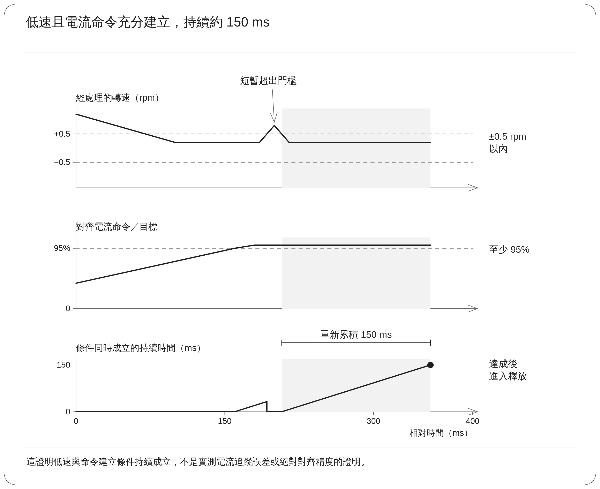

**本文核對的實作在 0° 釋放階段結束後取用編碼器角度，再計算偏移。** 因此公式中的對齊角度，在實作上是這個時點的讀值。若轉子在電流降低後因外力、摩擦或齒槽作用（轉子磁極與定子齒槽間的週期性吸引力）而移動，結果可能受到影響。後續應比較持續對齊與釋放後的角度，確認此取值方式適合受測機構；本篇數據尚未完成這項獨立驗證。

### 3.3 完成、失敗與參數套用

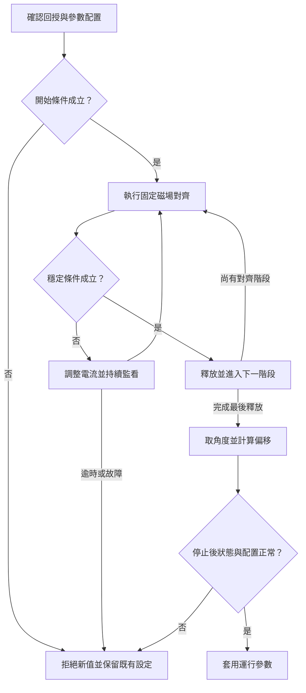

穩定檢查分別用於 90° 與 0° 的對齊階段。流程完成後，韌體還會確認停止狀態、故障與配置是否允許接受新值。失敗或中止時保留測試前的偏移，避免用部分完成的結果覆蓋設定。

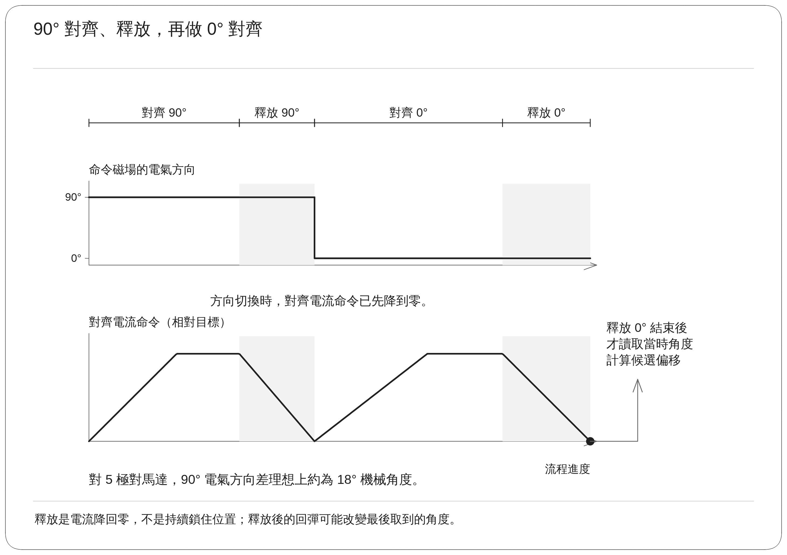

如果極對數或方向已經改變，保留舊偏移只表示沒有接受新值，不表示舊偏移仍然有效；此時仍需依參數配置狀態重新完成校正。

運行中的偏移存放在 RAM，即控制器工作時使用的記憶體。更新 RAM 可使目前控制流程使用新值，但要在斷電後保留，仍需另外的非揮發性儲存與重新上電驗證。

## 4. 實測數據

### 4.1 固定磁場對齊驗證結果

下表保存上述 EVK 與測試馬達的一組完整校正結果，採 90° 對齊、釋放、0° 對齊、釋放的流程。結果摘要未列出精確測試時間、完整韌體版本及所有保護設定，本文只保留有明確數值的項目。

| 項目 | 數值或狀態 | 定義 |
| --- | ---: | --- |
| 執行結果 | PASS，已套用 RAM | 流程完成且運行中的偏移已更新 |
| 校正前偏移 | 180.00° | 測試前採用的電氣角度偏移 |
| 校正後偏移 | 214.07° | 此次得到的電氣角度偏移 |
| 最終編碼器角度 | 258.813° | 計算結果對應的機械角度 |
| 極對數 | 5 | 機械角度轉為電氣角度的倍率 |
| 相對起點的機械位移 | −17.444° | 起終點的淨位移，不是全程累積移動距離 |
| 完成時間 | 6.305 s | 包含對齊、等待穩定與釋放 |
| 保存的最大相電流 | 0.357 A | U、V、W 相電流的峰值統計 |
| 對齊目標電流 | 0.400 A | 對齊控制使用的目標命令 |
| 測試電流上限 | 0.5 A | 限制設定，與 80% 對齊目標相符 |
| 最大轉速絕對值 | 47.73 rpm | 對齊移動過程中記錄的速度峰值大小 |

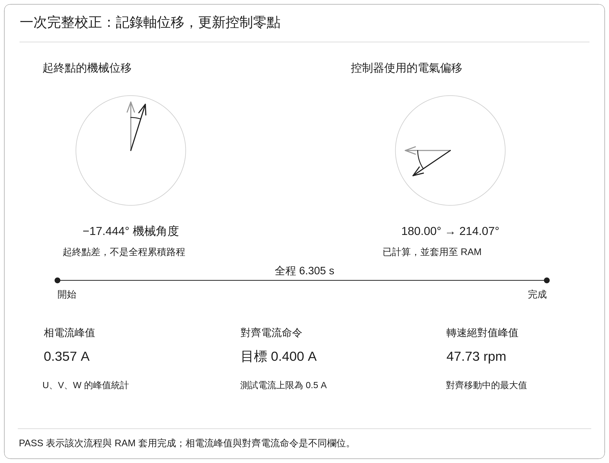

### 4.2 偏移數值的計算核對

使用最終機械角度與極對數：

$$
258.813^\circ\times5=1294.065^\circ
$$

去掉三個完整電氣週期：

$$
1294.065^\circ-3\times360^\circ
=214.065^\circ\approx214.07^\circ
$$

之後軸若位於這個位置，控制器把編碼器機械角度乘上 5，再扣除偏移，便得到接近電氣 0° 的控制角度。

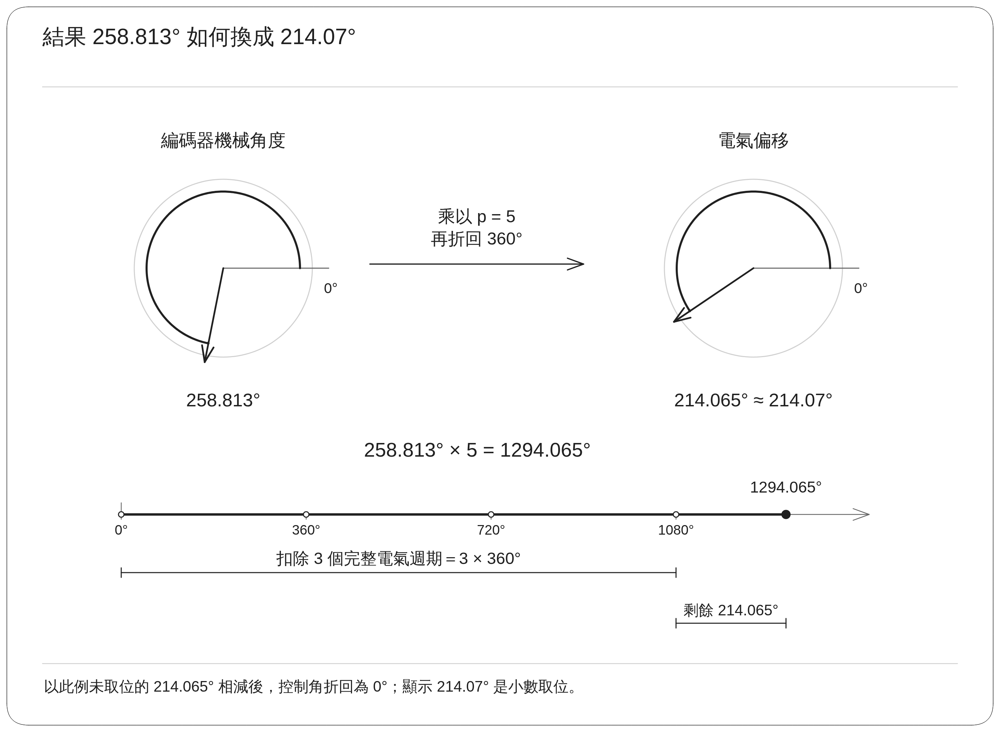

這個核對確認角度換算與保存結果一致。實際對齊精度仍取決於轉子是否真正到達磁場方向，以及取值時是否發生位移。

### 4.3 位置、速度與偏移圖

位置圖的橫軸為時間，縱軸為相對起點的機械位移。主要移動發生在 0° 對齊階段，最後停在約 −17.444°。圖中資料約以 10 Hz 取得狀態快照，也就是約每 0.1 s 保存一筆，適合查看整體過程，無法重建每個 PWM 功率切換週期的動作。

速度圖在約 4.2 s 附近出現明顯負向峰值，之後回到接近零。47.73 rpm 是移動過程中的最大速度絕對值；±0.5 rpm 是允許完成對齊階段的穩定門檻。這兩個數字描述不同時段，速度峰值不能用來判斷是否滿足最後的穩定條件。

此組結果沒有列出速度保護的設定值，因此也不能把 47.73 rpm 直接當成保護門檻或建議設定。

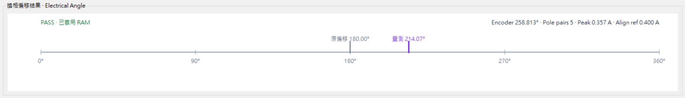

180.00° 與 214.07° 都是電氣角度，差值為 34.07° 電氣角度。它表示控制角度基準的修正，與軸的 −17.444° 機械位移屬於不同定義。

最大相電流 0.357 A 與對齊目標 0.400 A 也屬於不同欄位：前者是相電流統計，後者是對齊電流命令。要評估電流追蹤品質，需要同時取得一致座標下的命令與回授，不能只用兩個摘要值相減。

### 4.4 計算成功、套用與保存的區別

| 狀態 | 能支持的結論 | 此組結果 |
| --- | --- | --- |
| 已算出偏移 | 產生一個可檢查的校正值 | 已確認，214.07° |
| 已套用 RAM | 目前運行參數接受此校正值 | 已確認 |
| 已永久保存 | 關機或重新上電後仍能正確載入 | 尚未提供驗證 |

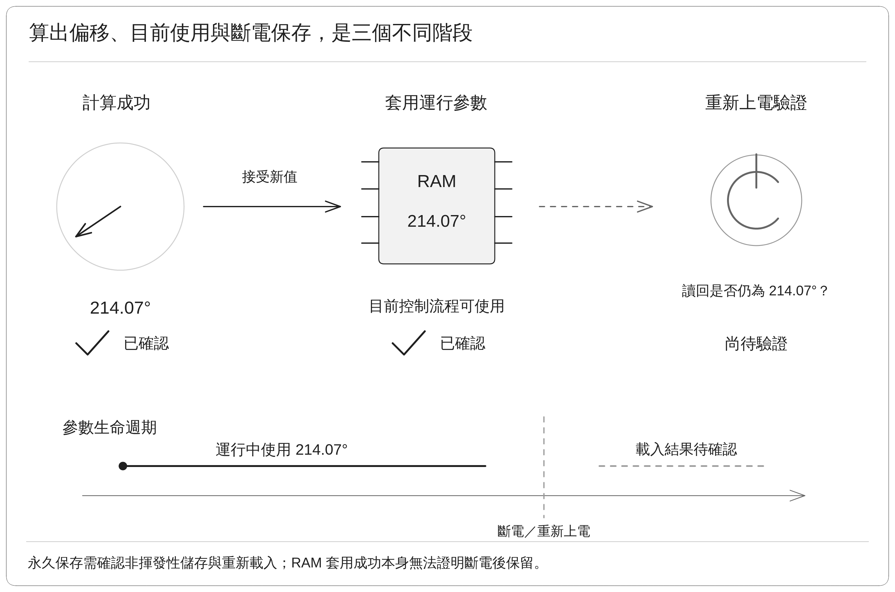

## 5. 結果

### 5.1 已完成的實作與驗證範圍

這組實機結果展示完整固定磁場對齊流程、電氣偏移計算，以及運行中參數的更新。校正值由 180.00° 更新為 214.07°，全程約 6.305 s。

目前尚未取得多次完整校正的分散統計，也未有獨立角度基準確認絕對精度。因此 PASS 的結論限於該次流程與套用條件成立，尚不能延伸為跨起始位置、負載與溫度均已驗證。

### 5.2 與其他校正功能的差異

| 功能 | 修正目標 | 所需的驗證 |
| --- | --- | --- |
| 換相偏移 | 編碼器角度與電氣零點之間的固定對應 | 零點重複性及校正後控制表現 |
| 編碼器精度校正 | 不同角度位置的讀值誤差 | 全圈或指定範圍的角度準確性 |
| Cogging Compensation | 隨位置變化的齒槽轉矩，即磁極與齒槽形成的週期性吸引力 | 位置對應的補償量及補償後效果 |

換相偏移像是確認角度尺的零點裝在哪裡；編碼器精度校正則是確認各段刻度是否準確。214.07° 只處理前者，不包含後兩項功能的完成證明。

### 5.3 後續驗證與接手重點

首先從不同起始位置重複完整校正，記錄偏移值及流程是否成功。比較偏移時要考慮角度週期性，例如 359.9° 與 0.1° 只差 0.2°，不能當成相差 359.8°。

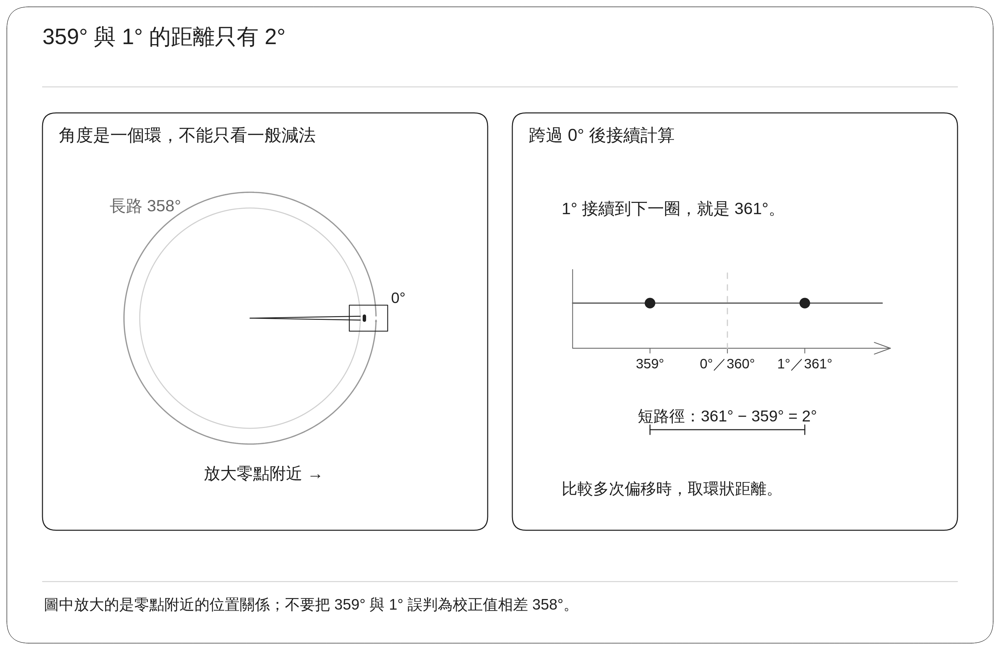

再比較持續對齊與釋放後的編碼器位置，確認目前取值時點不會受到明顯回彈影響。若存在差異，需評估取值位置及對齊條件，而不是直接將多次不同的偏移做普通平均。

完成上述確認後，再比較校正前後的啟動、低速轉動、電流與發熱表現。若產品需要斷電保存，還需驗證儲存、載入及配置一致性。更換極對數、相序、編碼器方向或機械安裝後，應重新確認零點。

### 5.4 實作追溯資訊

固定磁場流程與最終角度取值對照  `r_motor_serial_encoder_vector_manager.c`。電流限制、穩定計時、停止後確認與結果接受邏輯位於 `con5_motor_test.c`，方向配置與偏移有效性管理位於 `motor_commissioning_map.c`。
